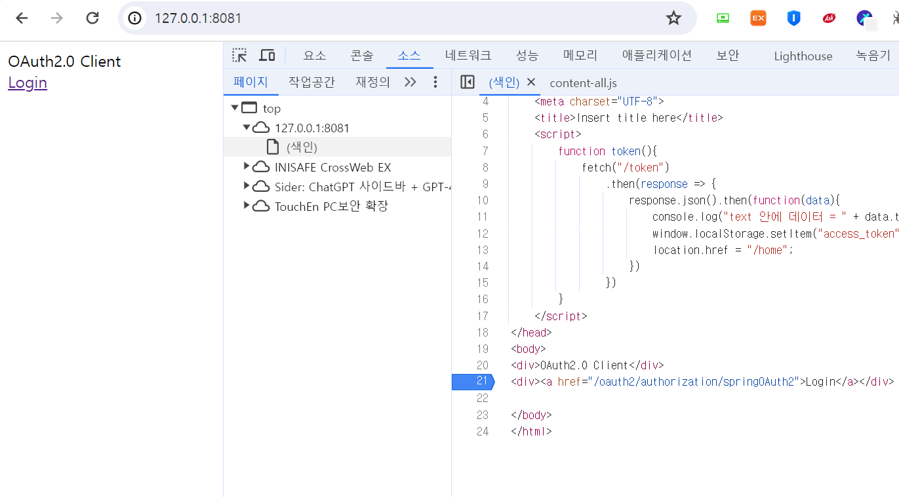
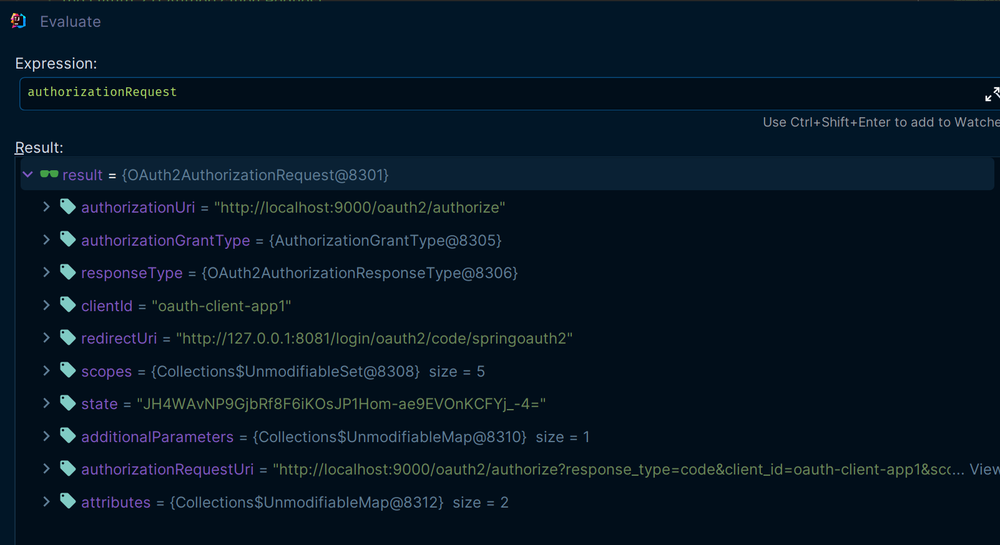
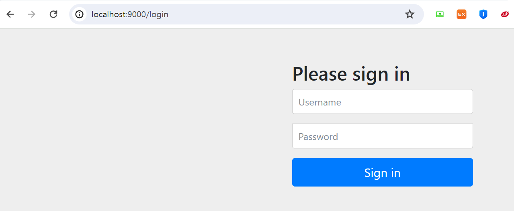
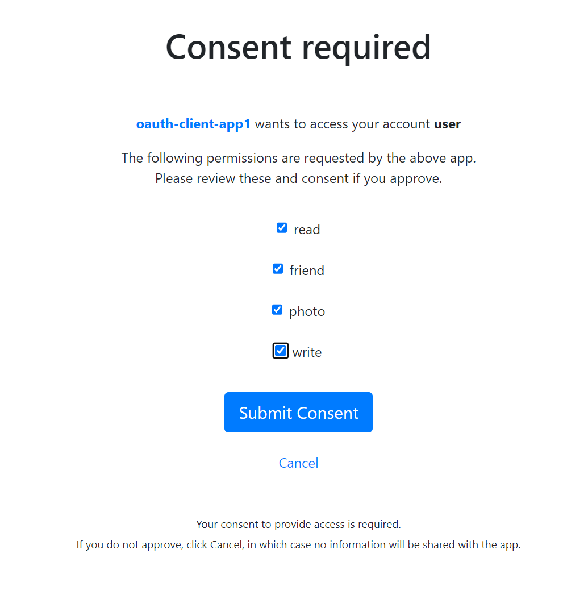
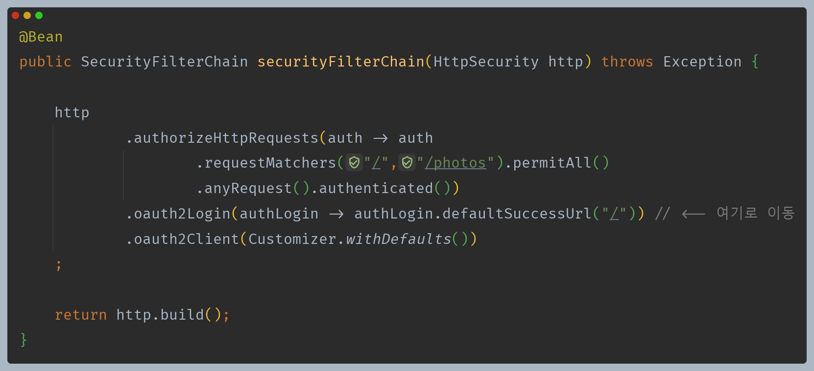
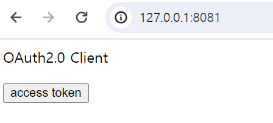
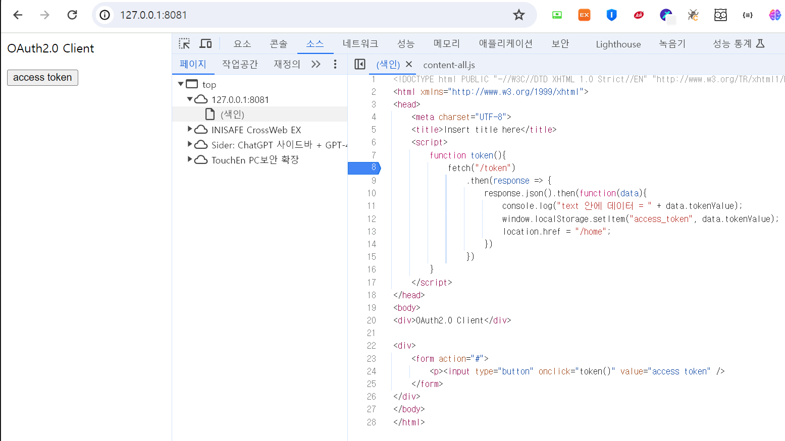
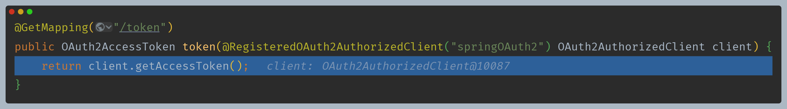
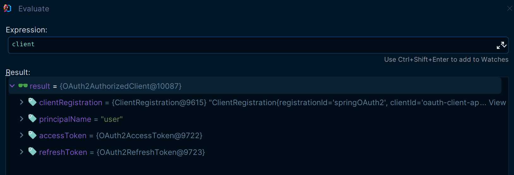
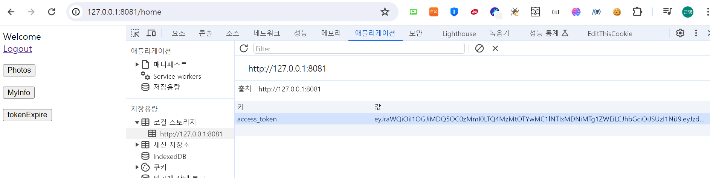

# 로그인 프로세스

### 1. 버튼을 누르면 /oauth2/authorization/{registrationId} 을 처리하는 필터로 이동

### 2. 클라이언트 - [OAuth2AuthorizationRequestRedirectFilter](https://github.com/genesis12345678/TIL/blob/main/Spring/security/oauth/OAuth2Login/Authorization%20Code.md#oauth2login---authorization-code-%EC%9A%94%EC%B2%AD%ED%95%98%EA%B8%B0)

- 임시 코드를 받기 위해 인가 서버와 통신을 한다.

### 3. 인가 서버 - [OAuth2AuthorizationEndpointFilter(사용자 인증 전 단계)](https://github.com/genesis12345678/TIL/blob/main/Spring/security/oauth/SpringServer/Endpoints/AuthorizationServer.md#%ED%9D%90%EB%A6%84-%EB%B0%8F-%EC%95%84%ED%82%A4%ED%85%8D%EC%B2%98)

### 4. 인가 서버 - 사용자 인증을 위해 로그인 페이지로 리다이렉트

### 5. 인가 서버 - [사용자 인증 및 스코프 동의 단계](https://github.com/genesis12345678/TIL/blob/main/Spring/security/oauth/SpringServer/Endpoints/AuthorizationServer.md#2-resourceowner-%EC%9D%B8%EC%A6%9D-%EB%B0%8F-scope-%EB%8F%99%EC%9D%98-%EB%8B%A8%EA%B3%84)

### 6. 인가 서버 - 클라이언트에게 redirect_uri로 code를 전달

### 7. 클라이언트 - [OAuth2LoginAuthenticationFilter](https://github.com/genesis12345678/TIL/blob/main/Spring/security/oauth/OAuth2Login/Access%20Token.md)

- `OidcAuthorizationCodeAuthenticationProvider`를 통해 인가 서버의 토큰 엔드포인트로 통신

### 8. 인가 서버 - [클라이언트 인증(OAuth2ClientAuthenticationFilter)](https://github.com/genesis12345678/TIL/blob/main/Spring/security/oauth/SpringServer/Endpoints/TokenEndpoint.md#%ED%81%B4%EB%9D%BC%EC%9D%B4%EC%96%B8%ED%8A%B8-%EC%9D%B8%EC%A6%9D%ED%95%98%EA%B8%B0)

### 9. 인가 서버 - [OAuth2TokenEndpointFilter](https://github.com/genesis12345678/TIL/blob/main/Spring/security/oauth/SpringServer/Endpoints/TokenEndpoint.md#oauth-20-token-endpoint)에서 액세스 토큰을 클라이언트로 응답

### 10. 클라이언트 - 최종 인증을 마치고 defaultSuccessUrl 로 이동

- 클라이언트 설정을 다음과 같이 했기 때문에 `/`로 이동한다.
- 인증이 된 사용자면 로그인 버튼 대신 `access token` 버튼이 보이도록 했다.

### access token 버튼 클릭

- 이 버튼은 `/token`을 통해 액세스 토큰을 얻어와 로컬 스토리지에 저장한다.

- `/token`은 [@RegisteredOAuth2AuthorizedClient](https://github.com/genesis12345678/TIL/blob/main/Spring/security/oauth/OAuth2Client/%40RegisteredOAuth2AuthorizedClient.md)을 이용해 액세스 토큰을 얻어온다.

- 로컬 스토리지에 액세스 토큰 저장 후 `/home`으로 이동

