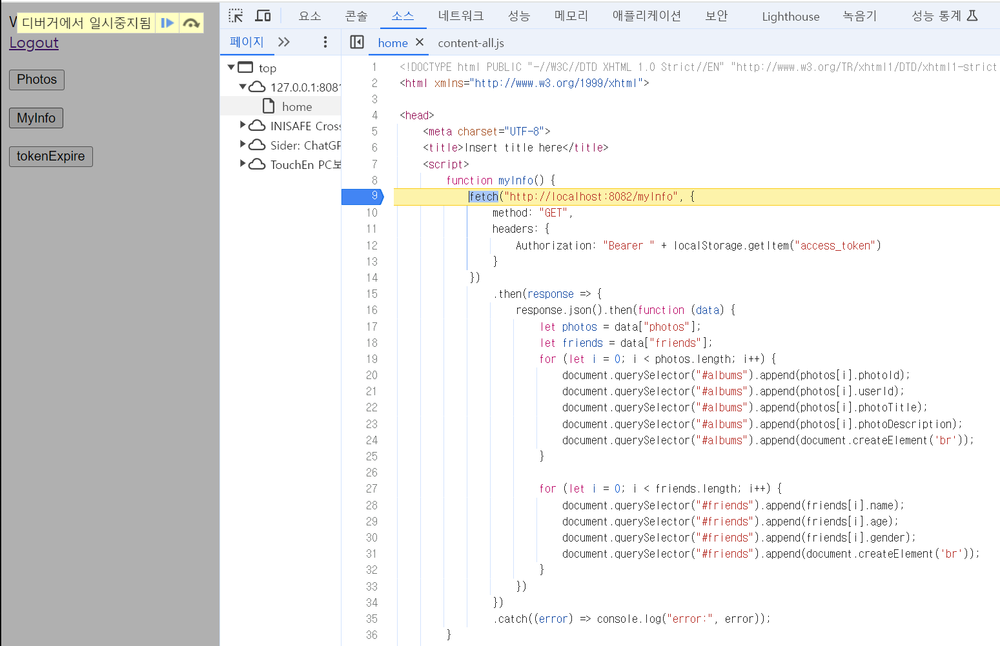
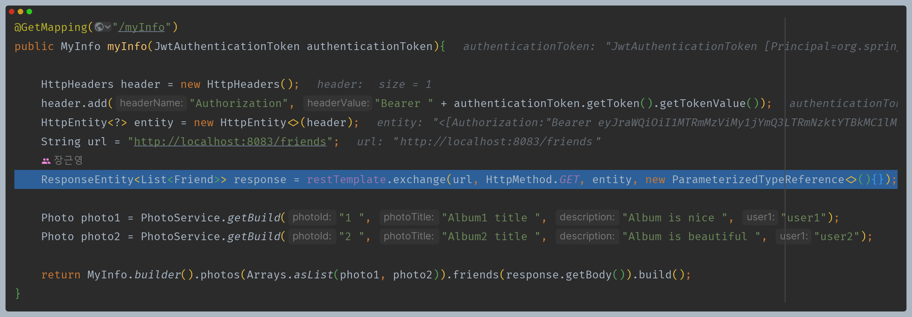
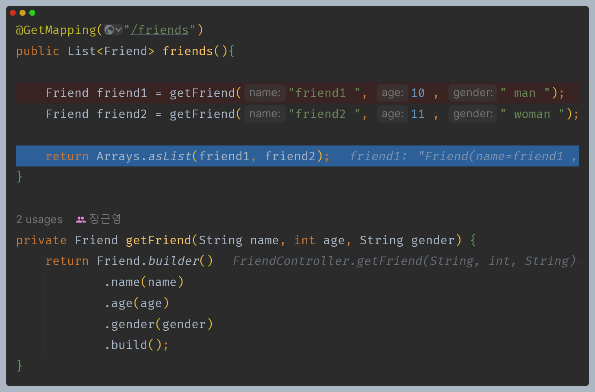
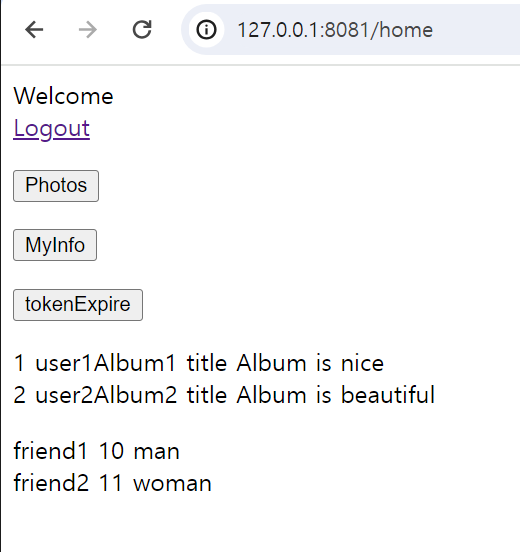

# MyInfo 프로세스

- `MyInfo` 버튼을 클릭하면 리소스 서버(8082)로 요청을 보내는데, 이때 검증을 위해 헤더에 로컬 스토리지에 저장되어 있던
  액세스 토큰과 함께 보내게 된다.

### 1. 리소스 서버(Photo) - [BearerTokenAuthenticationFilter](https://github.com/genesis12345678/TIL/blob/main/Spring/security/oauth/MAC_RSA/BearerTokenAuthenticationFilter.md)

- 인가 서버 `jwk-set-endpoint`로 요청을 보내 `PublicKey`를 얻어 액세스 토큰 검증 시도

### 2. 인가 서버 - [NimbusJwkSetEndpointFilter](https://github.com/genesis12345678/TIL/blob/main/Spring/security/oauth/SpringServer/Endpoints/Metadata.md#oauth2authorizationserverconfigurer)

- `jwkSet` 정보 응답

### 3. 리소스 서버(Photo) - 컨트롤러

- 정상적으로 인증이 완료되어 MVC로 올 수 있다.
- 이 리소스 서버에서는 또 다른 리소스 서버와 통신을 하게 되고, 서버 간 통신에도 인증을 위해서 
    액세스 토큰은 반드시 헤더에 보내야 한다.

### 4. 리소스 서버(Friend) - [BearerTokenAuthenticationFilter](https://github.com/genesis12345678/TIL/blob/main/Spring/security/oauth/MAC_RSA/BearerTokenAuthenticationFilter.md)

- 인가 서버 `jwk-set-endpoint`로 요청을 보내 `PublicKey`를 얻어 액세스 토큰 검증 시도

### 5. 인가 서버 - [NimbusJwkSetEndpointFilter](https://github.com/genesis12345678/TIL/blob/main/Spring/security/oauth/SpringServer/Endpoints/Metadata.md#oauth2authorizationserverconfigurer)

- `jwkSet` 정보 응답

### 6. 리소스 서버(Friend) - 컨트롤러

- 정상적으로 인증이 완료되어 MVC로 올 수 있다.

- 이후 Photo 리소스 서버에서 Friend 리소스 서버에서 보낸 응답을 받아 화면을 출력한다.

