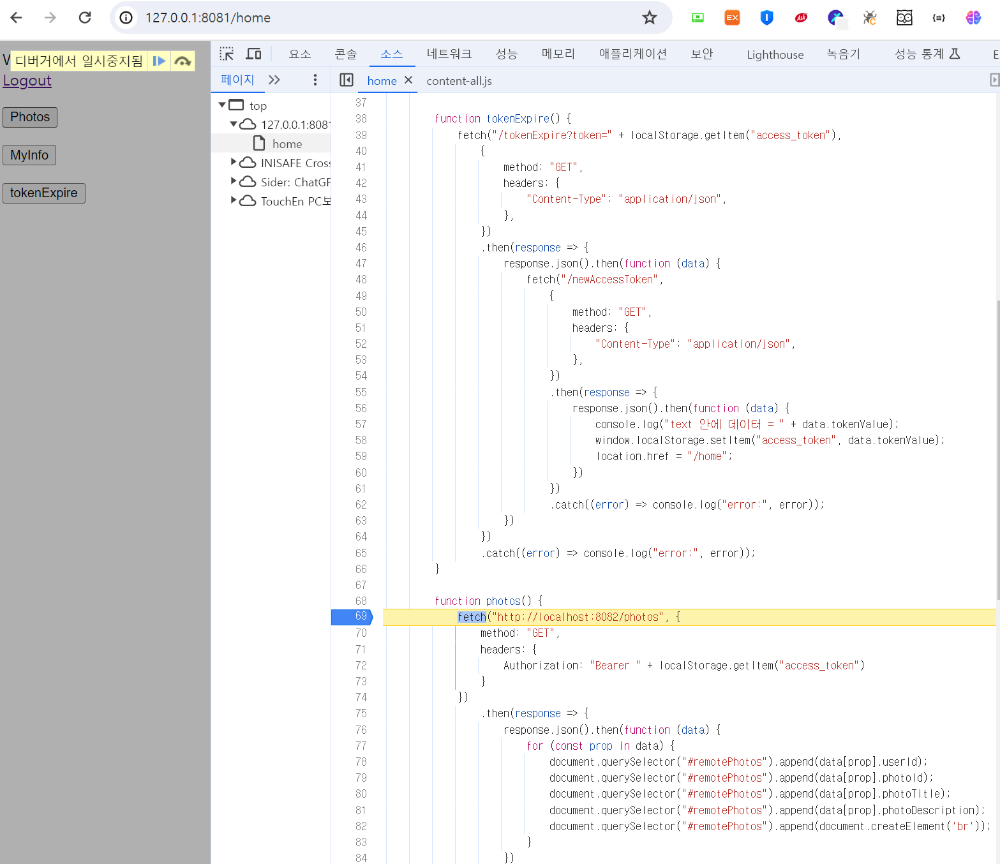
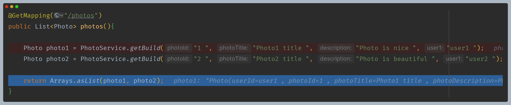
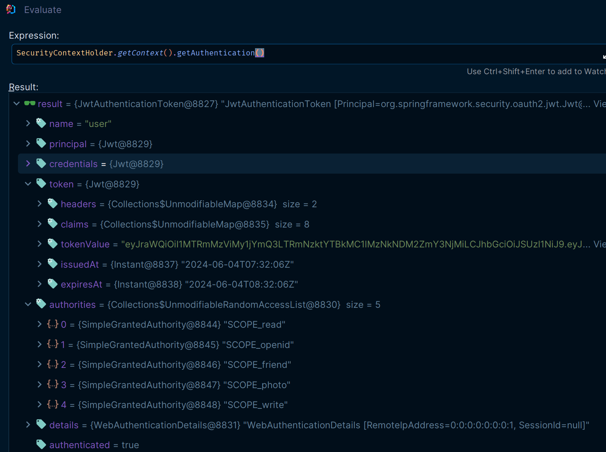
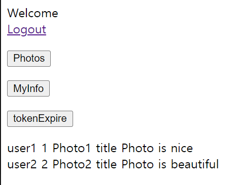

# Photos 프로세스

- `Photos` 버튼을 클릭하면 리소스 서버(8082)로 요청을 보내는데, 이때 검증을 위해 헤더에 로컬 스토리지에 저장되어 있던
    액세스 토큰과 함께 보내게 된다.

### 1. 리소스 서버 - [BearerTokenAuthenticationFilter](https://github.com/genesis12345678/TIL/blob/main/Spring/security/oauth/MAC_RSA/BearerTokenAuthenticationFilter.md)

- 인가 서버 `jwk-set-endpoint`로 요청을 보내 `PublicKey`를 얻어 액세스 토큰 검증 시도 

### 2. 인가 서버 - [NimbusJwkSetEndpointFilter](https://github.com/genesis12345678/TIL/blob/main/Spring/security/oauth/SpringServer/Endpoints/Metadata.md#oauth2authorizationserverconfigurer)

- `jwkSet` 정보 응답

### 3. 리소스 서버 - 컨트롤러

- 정상적으로 인증이 완료되어 MVC로 올 수 있다.

