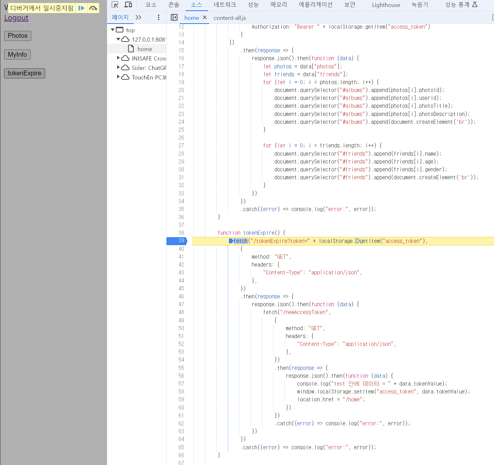
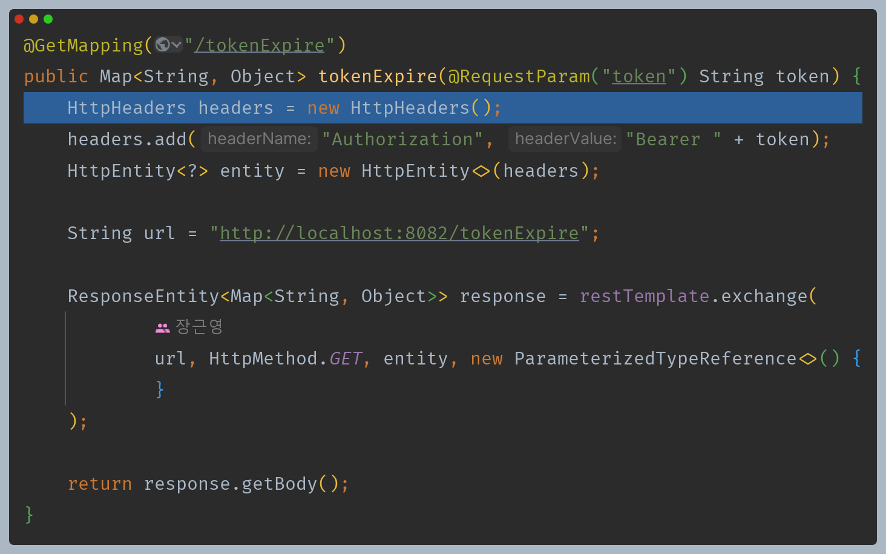
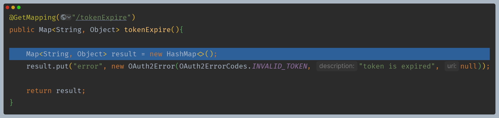
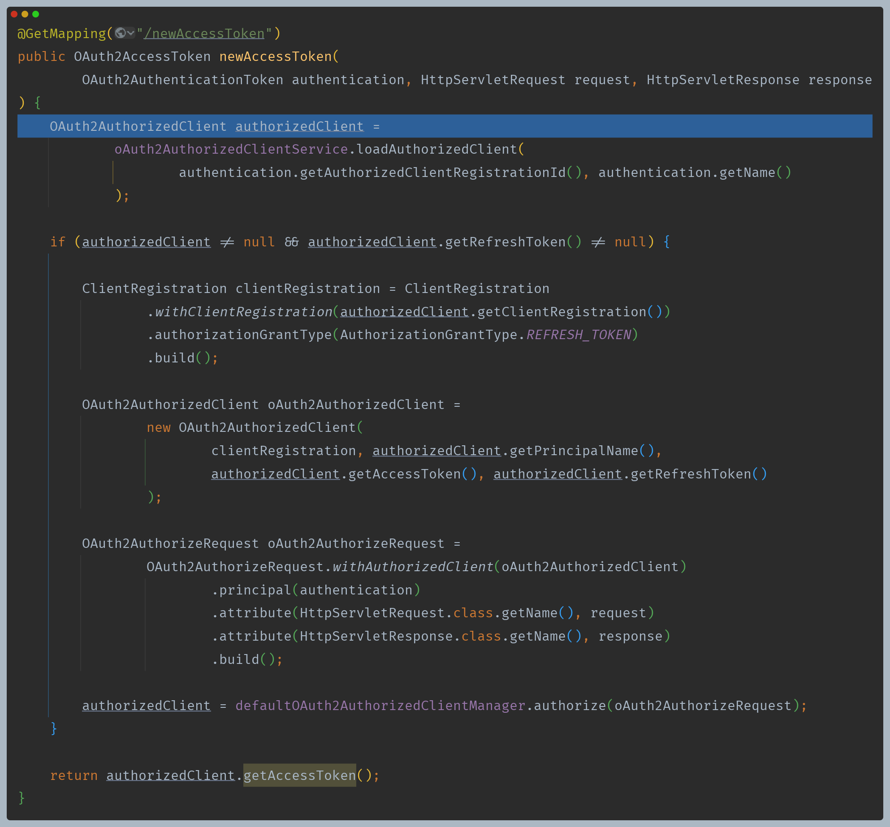

#  Refresh Token 프로세스

- `tokenExpire` 버튼을 클릭하면 요청 안에서 요청을 보내 새로운 액세스 토큰을 얻어 다시 로컬 스토리지에 저장한다.

### 1. 클라이언트 - RestController

- 리소스 서버로 토큰과 함께 요청한다.

### 2. 리소스 서버 (8082)

- `OAuth2Error` 정보를 반환한다.

### 3. 클라이언트 - Controller

- 액세스 토큰을 새로 받기 위해서는 리프레시 토큰이 필요하고, [OAuth2AuthorizedClient](https://github.com/genesis12345678/TIL/blob/main/Spring/security/oauth/OAuth2Client/OAuth2AuthorizedClient.md)에는 액세스 토큰 및 리프레시 토큰 등의 정보가 저장되어 있다.
- 클라이언트 권한 부여 타입을 리프레시 토큰으로 변경하고, 새로운 액세스 토큰 요청을 위해 [defaultOAuth2AuthorizedClientManager](https://github.com/genesis12345678/TIL/blob/main/Spring/security/oauth/OAuth2Client/DefaultOAuth2AuthorizedClientManager.md)에게 위임한다.

### 4. 인가 서버 - [OAuth2TokenEndpointFilter](https://github.com/genesis12345678/TIL/blob/main/Spring/security/oauth/SpringServer/Endpoints/RefreshToken.md)

- `OAuth2TokenEndpointFilter`의 Provider 들 중 `OAuth2RefreshTokenAuthenticationProvider`가 처리를 맡는다.

### 5. 클라이언트에 응답 후 액세스 토큰 갱신

