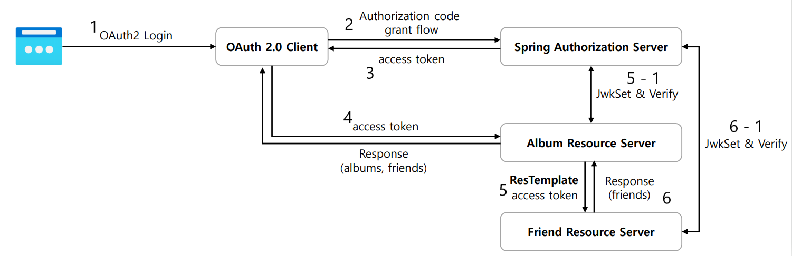
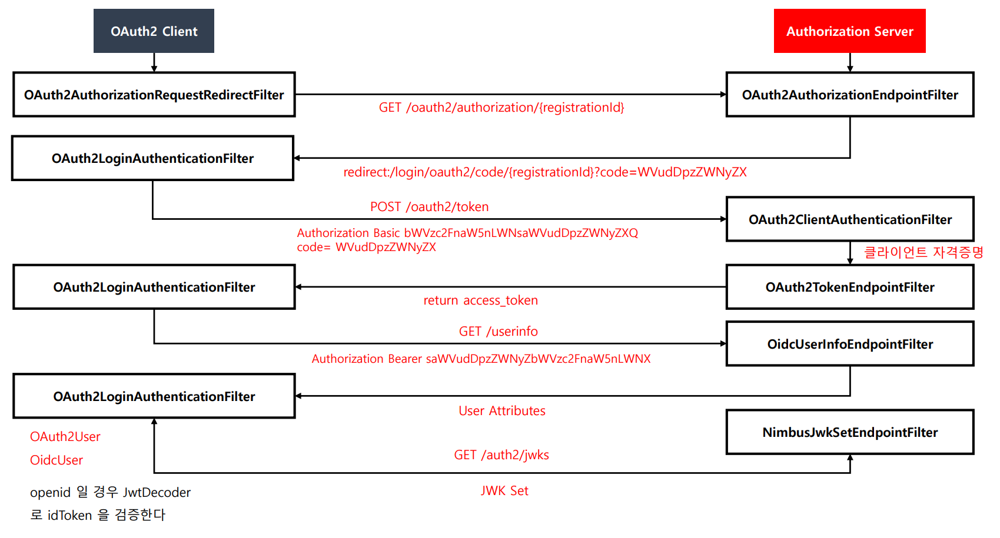
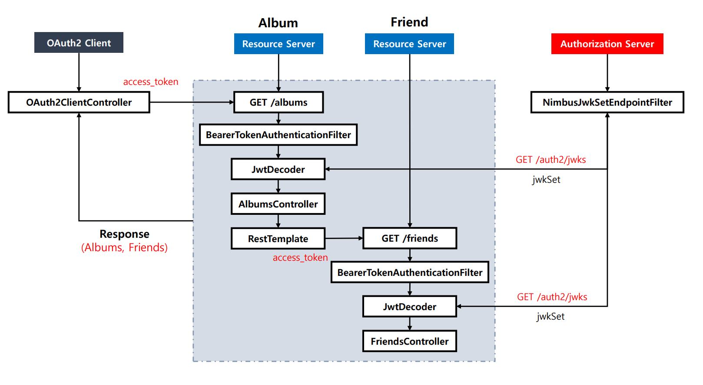
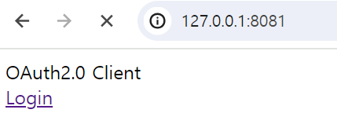
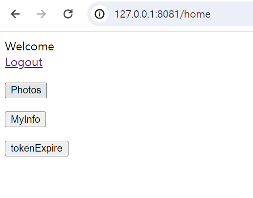
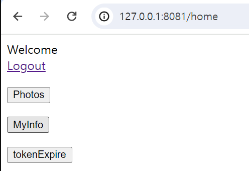
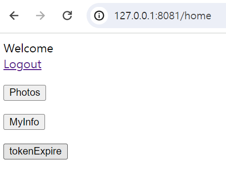

# OAuth 2.0 Client + Resource Server + Authorization Server 연동

- `OAuth 2.0 Client`를 애플리케이션으로, `OAuth 2.0 Resource Server`를 보호된 자원 서버로, `인가 서버`를 Spring Authorization Server 로 실행한다.

**처리 순서**

1. 클라이언트에서 인가 서버로 `Authorization Code Grant` 타입으로 토큰을 발급 받고 이후 사용자 엔드포인트 요청으로 인증을 진행한다.
2. 클라이언트에서 인증에 성공하면 `Album` 리소스 서버로 자원 요청을 한다.
3. `Album` 리소스 서버에서 `Friend` 리소스 서버로 토큰을 가지고 내부 통신을 통해 자원 요청을 한다.
4. 최종적으로 반환받은 `Albums`와 `Friends` 리소스를 클라이언트로 응답한다.

---

## 각 모듈 코드

### [클라이언트 모듈]() - 8081
### [리소스 서버 모듈]() - 8082, 8083
### [인가 서버 모듈]() - 9000

---

## 코드 흐름

### [로그인 과정]()

### [Photos 과정]()

### [MyInfo 과정]()

### [액세스 토큰 재발급 과정]()

