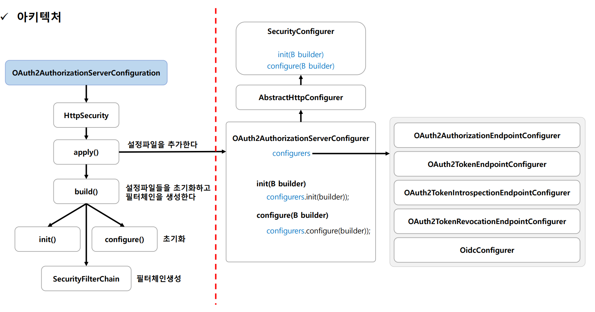
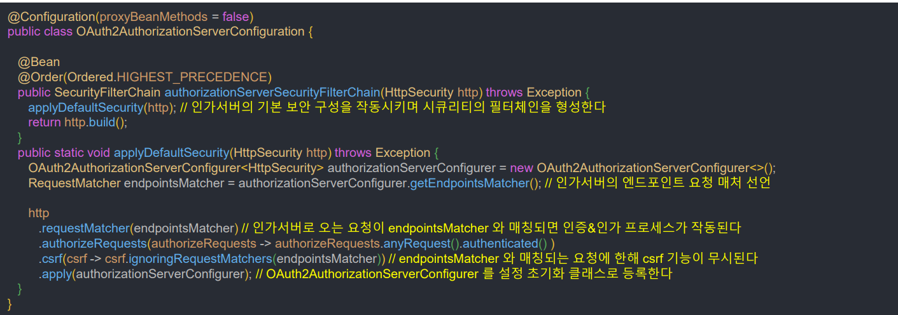
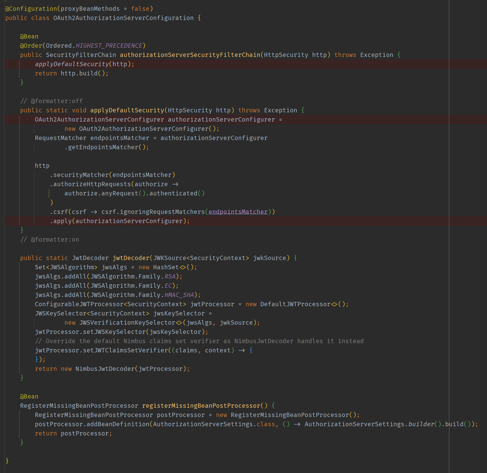
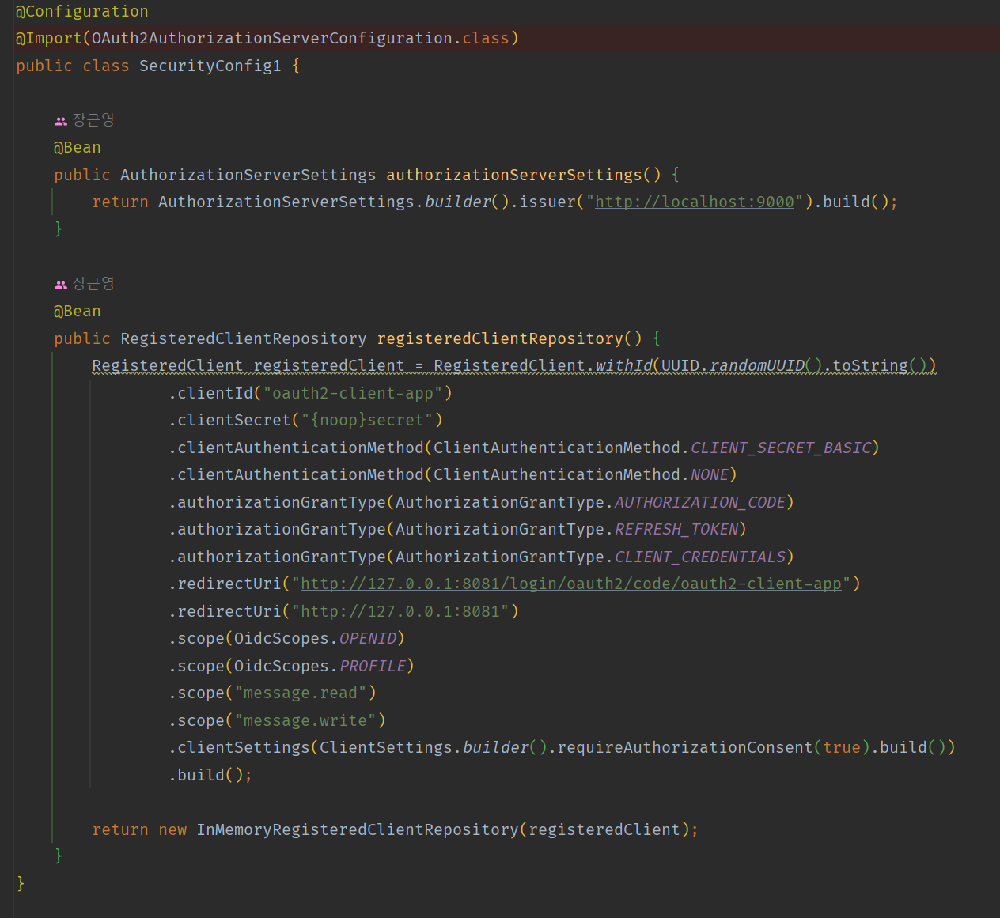
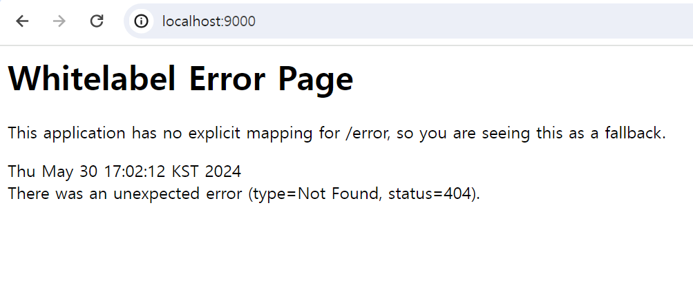
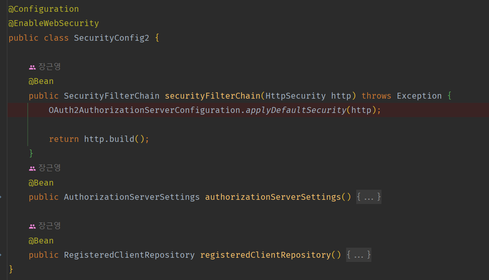
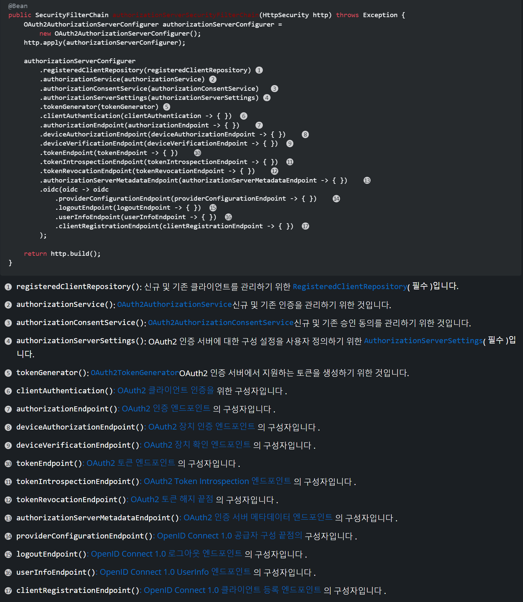
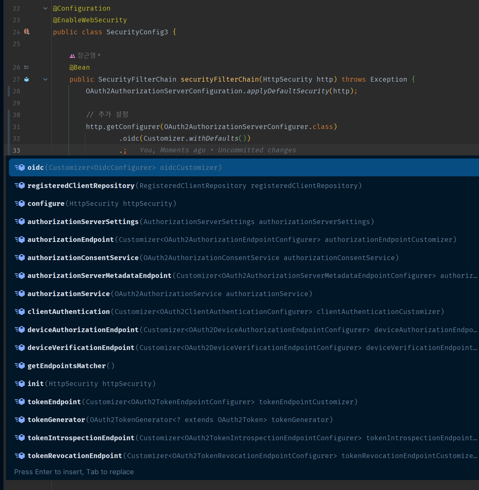

# Spring Authorization Server - 초기화 과정

## OAuth2AuthorizationServerConfiguration

- OAuth2 인가 서버에 대한 최소 기본 구성을 제공하는 설정 클래스
- `OAuth2AuthorizationServerConfigurer` 를 사용하여 기본 구성을 적용하고 OAuth2 인가 서버를 지원하는 모든 인프라 구성 요소로 구성된 `SecurityFilterChain` 빈을 등록한다.

- **OpenID Connect 1.0 UserInfo 엔드포인트** 및 **OpenID Connect 1.0 클라이언트 등록 엔드포인트**를 사용하기 위해서 필수 요소인 `JwtDecoder`를 정의해야 한다.

---

## OAuth2 인가 서버 구성 방식

### 1. @Import

- 기본적으로 제공하는 설정 클래스 `OAuth2AuthorizationServerConfiguration`를 **Import** 한다.
- 그리고 추가적으로 필요한 설정 생성

> - `AuthorizationServerSettings` 는 필수 구성요소 이며, `@Import(OAuth2AuthorizationServerConfiguration.class)` 하면 자동으로
>   `AuthorizationServerSettings`를 빈으로 등록해준다.(정의되지 않은 경우)

**위와 같이 설정하고 루트 페이지에 접속하면 어떻게 될까? `OAuth2AuthorizationServerConfiguration`의 기본 설정은 `anyRequest().authenticated()`
여서 막힐 것 같은데, 접속이 된다.**

- 매핑되는 컨트롤러가 없어서 에러는 나지만, 401 에러가 발생하지는 않는다. 
- **이유는 `OAuth2AuthorizationServerConfiguration`의 기본 설정을 잘 보면 `.securityMatcher(endpointsMatcher)`를 통해 `endpointsMatcher`에 해당하는 
    요청들만 보안 필터가 적용되는 것이다.**

### 2. Static 메서드 호출

- static 메서드 `applyDefaultSecurity()`를 호출하면 기본 설정을 그대로 이어갈 수 있다.

### 3. 사용자 정의 구성

- `OAuth2AuthorizationServerConfigurer`는 OAuth2 인증 서버에 대한 보안 구성을 완전히 사용자 정의하는 기능을 제공한다. 
- 이를 통해 사용할 핵심 구성 요소(예: `RegisteredClientRepository`, `OAuth2AuthorizationService`, `OAuth2TokenGenerator` 및 기타)를 지정할 수 있다. 
- 또한 인증 엔드포인트 , 디바이스 인증 엔드포인트 , 디바이스 검증 엔드포인트 , 토큰 엔드포인트 , 토큰 내부 검사 엔드포인트 등과 같은 프로토콜 엔드포인트에 대한 요청 처리 논리를 사용자 정의할 수 있다 .

`OAuth2AuthorizationServerConfigurer`는 다음 구성 옵션을 제공한다.

**`apply()`는 deprecated 되었기 때문에 다음과 같이 설정 가능하다.**

---

[이전 ↩️ - Spring Authorization Server]()

[메인 ⏫](https://github.com/genesis12345678/TIL/blob/main/Spring/security/oauth/main.md)

[다음 ↪️ - Spring Authorization Server - `OAuth2AuthorizationServerConfigurer`]()