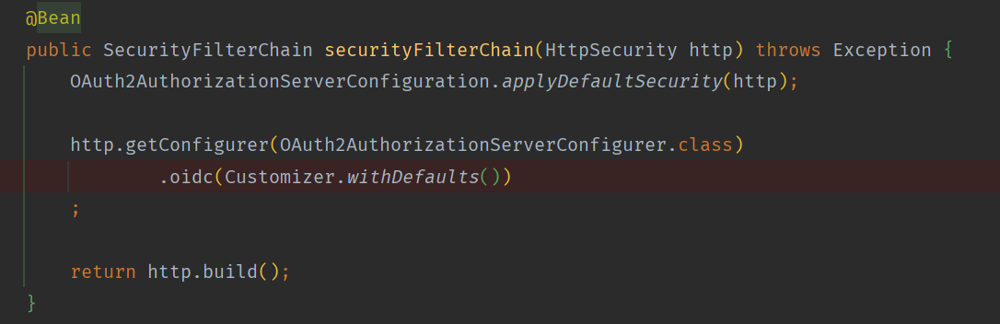
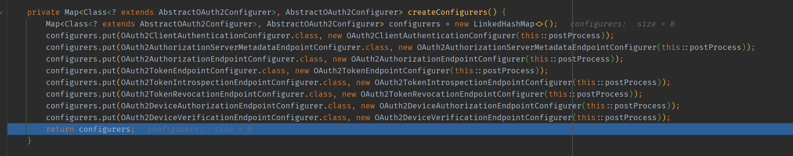
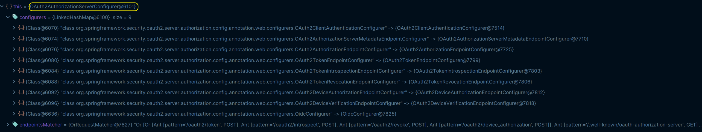
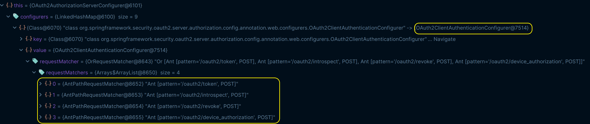
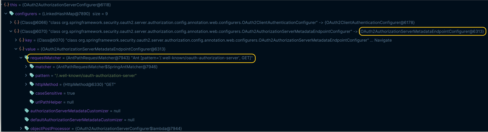
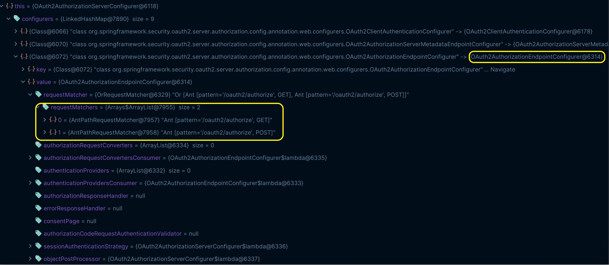
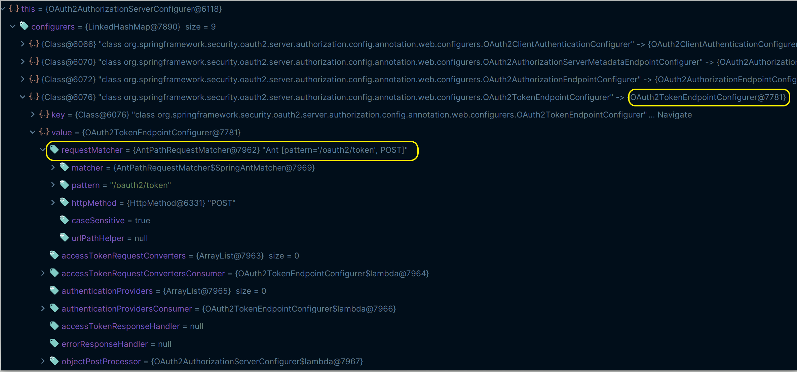
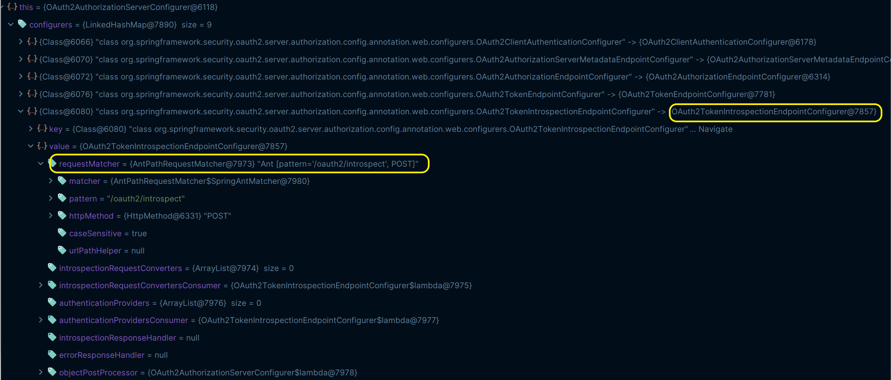
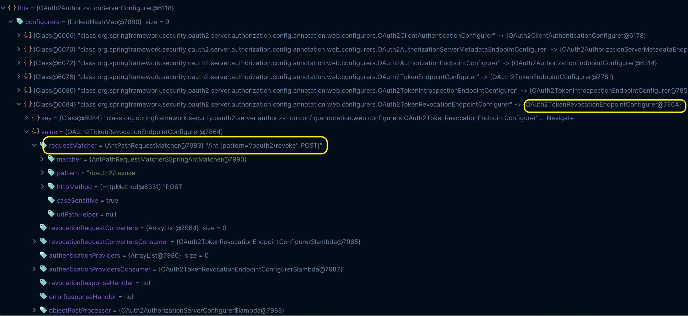
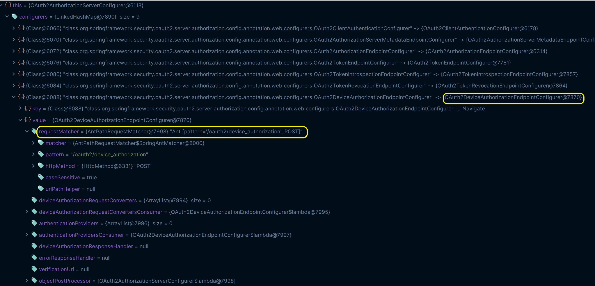

# Spring Authorization Server - 초기화 과정

## OAuth2AuthorizationServerConfigurer

- **OAuth 2.0 Authorization Server** 지원을 위한 설정 클래스로서 사양에 따른 엔드포인트 설정, 필터, 프로바이더 등의 초기화 작업이 이루어진다.

**기본적으로 다음 8개의 설정 클래스들을 초기화 하며, 위와 같이 `Oidc` 설정을 하면 `OidcConfigurer`도 초기화 한다.**

---

## OAuth2ClientAuthenticationConfigurer - 클라이언트 인증 엔드포인트 설정

- `client_id`와 `client_secret`을 통해 클라이언트 자격 증명을 검증하는 필터

**RequestMatcher**

**등록하는 필터 및 프로바이더**
- `OAuth2ClientAuthenticationFilter`
- `JwtClientAssertionAuthenticationProvider`
- `ClientSecretAuthenticationProvider`
- `PublicClientAuthenticationProvider`

---

## OAuth2AuthorizationServerMetadataEndpointConfigurer - 메타데이터 엔드포인트 설정

**RequestMatcher**

**등록하는 필터 및 프로바이더**
- `OAuth2AuthorizationServerMetadataEndpointFilter`

---

## OAuth2AuthorizationEndpointConfigurer - 권한 부여 엔드포인트 설정

**RequestMatcher**

**등록하는 필터 및 프로바이더**
- `OAuth2AuthorizationEndpointFilter`
- `OAuth2AuthorizationCodeRequestAuthenticationProvider`
- `OAuth2AuthorizationConsentAuthenticationProvider`

---

## OAuth2TokenEndpointConfigurer - Token 엔드포인트 설정

**RequestMatcher**

**등록하는 필터 및 프로바이더**
- `OAuth2TokenEndpointFilter`
- `OAuth2AuthorizationCodeAuthenticationProvider`
- `OAuth2RefreshTokenAuthenticationProvider`
- `OAuth2ClientCredentialsAuthenticationProvider`
- `OAuth2DeviceCodeAuthenticationProvider`

---

## OAuth2TokenIntrospectionEndpointConfigurer - Opaque 토큰 검사 엔드포인트 설정

**RequestMatcher**

**등록하는 필터 및 프로바이더**
- `OAuth2TokenIntrospectionEndpointFilter`
- `OAuth2TokenIntrospectionAuthenticationProvider`

---

## OAuth2TokenRevocationEndpointConfigurer - Token 취소 엔드포인트 설정

**RequestMatcher**

**등록하는 필터 및 프로바이더**
- `OAuth2TokenRevocationEndpointFilter`
- `OAuth2TokenRevocationAuthenticationProvider`

---

## OAuth2DeviceAuthorizationEndpointConfigurer

**RequestMatcher**

**등록하는 필터 및 프로바이더**
- `OAuth2DeviceAuthorizationEndpointFilter`
- `OAuth2DeviceAuthorizationRequestAuthenticationProvider`

---

## OAuth2DeviceVerificationEndpointConfigurer

**RequestMatcher**

**등록하는 필터 및 프로바이더**
- `OAuth2DeviceVerificationAuthenticationProvider`
- `OAuth2DeviceAuthorizationConsentAuthenticationProvider`
- `OAuth2DeviceVerificationEndpointFilter`

---

## OidcConfigurer - OpenId Connect 엔드포인트 설정

**RequestMatcher**

`OidcConfigurer`는 다음 3가지 설정 클래스들의 `init()`과 `configure()`를 호출한다.

- **OidcProviderConfigurationEndpointConfigurer**
  - **등록하는 필터 및 프로바이더**
    - `OidcProviderConfigurationEndpointFilter`
- **OidcLogoutEndpointConfigurer**
  - **등록하는 필터 및 프로바이더**
    - `OidcLogoutEndpointFilter`
    - `OidcLogoutAuthenticationProvider`
- **OidcUserInfoEndpointConfigurer**
  - **등록하는 필터 및 프로바이더**
    - `OidcUserInfoEndpointFilter`
    - `OidcUserInfoAuthenticationProvider`

---

[이전 ↩️ - Spring Authorization Server - 초기화 과정(`OAuth2AuthorizationServerConfiguration`)]()

[메인 ⏫](https://github.com/genesis12345678/TIL/blob/main/Spring/security/oauth/main.md)

[다음 ↪️ - Spring Authorization Server - 초기화 과정(`AuthorizationServerContext`)]()