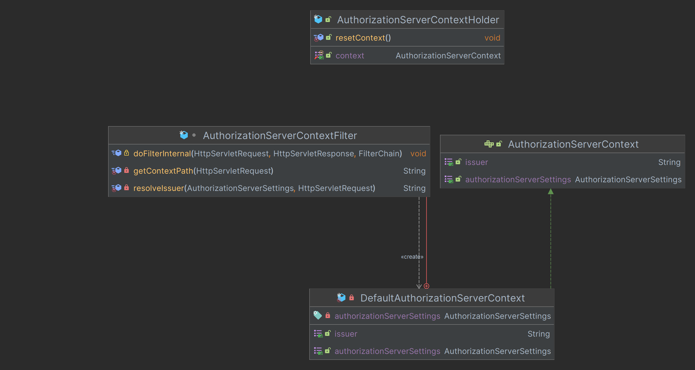
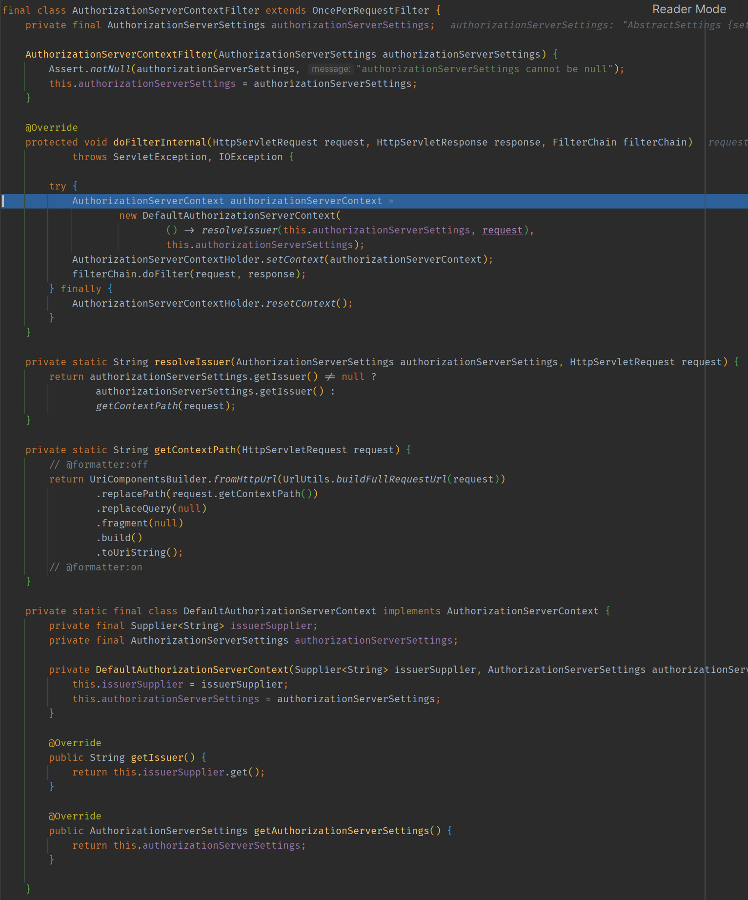
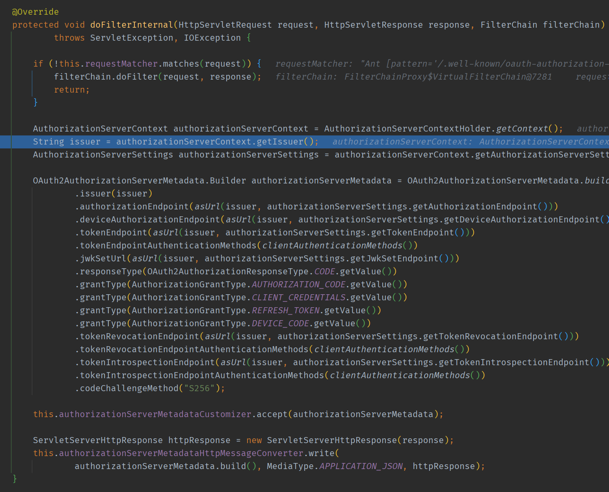

# Spring Authorization Server - 초기화 과정

## `AuthorizationServerContext` (ProviderContext)

- 공급자에 대한 정보를 저장하는 컨텍스트 객체로서 공급자 설정 및 현재 `issuer`에 대한 액세스를 제공한다.

## AuthorizationServerContextHolder (ProviderContextHolder)

- `AuthorizationServerContext`를 가지고 있으며 **ThreadLocal**을 사용하여 현재 요청 스레드와 연결되어 있는 `AuthorizationServerContext`를 접근할 수 있게 한다.

## AuthorizationServerContextFilter (ProviderContextFilter)

- `AuthorizationServerContextHolder`와 `AuthorizationServerContext`를 연결한다.

---

## 요청 흐름

**예를 들어 `http://localhost:9000/.well-known/oauth-authorization-server` 로 요청을 한다면 먼저 `AuthorizationServerContextFilter`에서 요청을 받아서
`AuthorizationServerContext`의 구현체인 `DefaultAuthorizationServerContext`를 `AuthorizationServerContextHolder`에 저장시킨다.**

**이후 각 요청을 처리하는 필터에서 `AuthorizationServerContextHolder`를 통해 `AuthorizationServerContext`를 얻어와 필요한 처리를 이어간다.**

`/.well-known/oauth-authorization-server`에 대한 처리는 `OAuth2AuthorizationServerMetadataEndpointFilter`에서 이루어진다.

**OAuth2AuthorizationServerMetadataEndpointFilter**

---

[이전 ↩️ - Spring Authorization Server - 초기화 과정(`OAuth2AuthorizationServerConfigurer`)]()

[메인 ⏫](https://github.com/genesis12345678/TIL/blob/main/Spring/security/oauth/main.md)

[다음 ↪️ - Spring Authorization Server - 인가 서버 시작]()