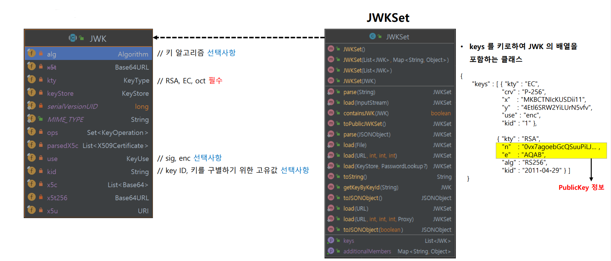
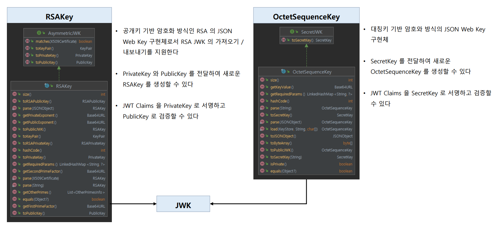
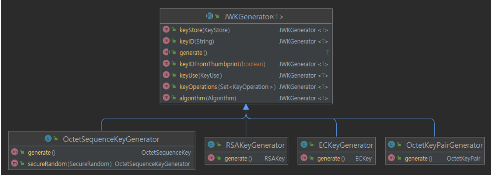

# OAuth 2.0 Resource Server 검증 기초 - JWK

## JWK

- 암호화 키를 저장하는 방식으로 인가 서버에서 발행하는 JWT의 암호화 및 서명에 필요한 암호화 키의 다양한 정보를 담은 JSON 객체 표준이다.
- `JwkSetUri` 정보를 설정하면 인가 서버로부터 JWK 형태의 정보를 다운로드 할 수 있고 JWT를 검증할 수 있다.

### JWK 구조

---

## JWK 확장

- 자바 표준 보안 클래스를 사용하여 대칭키, 비대칭키 방식의 JWT의 암호화 및 전자서명, 이후 검증을 위한 키 생성, 변환 등을 지원한다.
- 구현체로 `RSAKey`, `OctetSequenceKey`, `ECKey`, `OctetKeyPair`가 있다.

---

## JWKGenerator< T extends JWK >

- **암호화 알고리즘 방식에 따라 JWK의 구현체가 있고 각 구현체를 편리하게 생성할 수 있는 클래스가 존재한다.**
  - `RSAKeyGenerator` : 비대칭 암호화 알고리즘 키를 포함하는 JWK 생성기
  - `OctetSequenceKeyGenerator` : 대칭 암호화 알고리즘 키를 포함하는 JWK 생성기
  - `EcKeyGenerator` : 타원곡선 암호화 알고리즘 키를 포함하는 JWK 생성기

---

[이전 ↩️ - OAuth 2.0 Resource Server 검증 기초 - JWT 특징](https://github.com/genesis12345678/TIL/blob/main/Spring/security/oauth/%EA%B2%80%EC%A6%9D%EA%B8%B0%EC%B4%88/JWT.md)

[메인 ⏫](https://github.com/genesis12345678/TIL/blob/main/Spring/security/oauth/main.md)