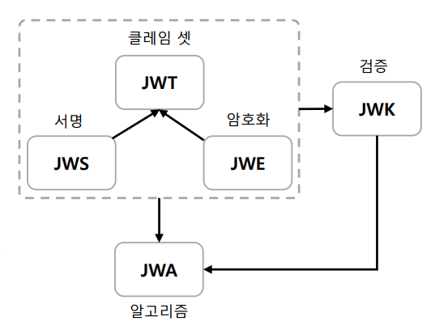
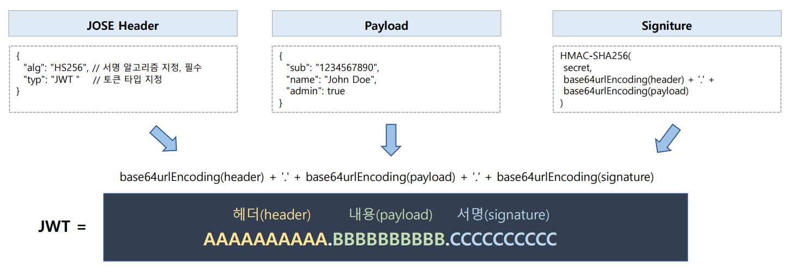
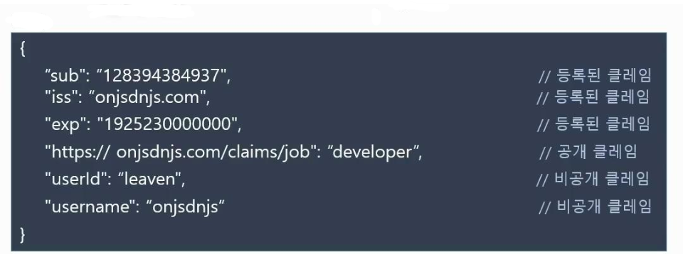

# OAuth 2.0 Resource Server 검증 기초 - JWT 특징

## JOSE (JSON Object Signing and Encryption)

- **JSON 데이터의 컨텐츠를 암호화 또는 서명의 형태로 나타내기 위해 IETF 에서 표준화 한 소프트웨어 기술 세트**
- 기술에는 다음 사양이 포함된다.

### 1. JWT (JSON Web Token)

- 클레임 기반 보안 값을 나타내는 방법으로 두 당사자 간에 안전하게 전달되는 클레임을 표현하기 위한 개방형 표준
- **JWT**는 인증, 권한 부여 및 정보 교환에 사용된다.
- `JWS` 또는 `JWE` 방식으로 구현된다.

### 2. JWS (JSON Web Signature)

- JSON 을 사용하여 디지털 서명 또는 `MAC`으로 보안된 콘텐츠를 표현하는 방법
- 대부분 이 방법을 사용

### 3. JWE (JSON Web Encryption)

- JSON을 사용하여 의도한 수신자만 읽을 수 있도록 암호화된 데이터(토큰)를 나타내는 형식

### 4. JWK (JSON Web Key)

- `HMAC`이나 타원 곡선 또는 `RSA` 알고리즘을 사용하여 공개 키 세트를 JSON 객체로 나타내는 JSON 구조

### 5. JWA (JSON Web Algorithm)

- `JWS`, `JWK` 및 `JWE`에 필요한 알고리즘 목록으로 `JWS` 헤더 및 `JWS` 페이로드의 내용을 서명하는 데 사용된다.

---

## JWS 구조

### JOSE Header

- 일반적으로 JWT 인 토큰 유형과 `HMAC SHA256` 또는 `RSA`와 같은 서명 알고리즘의 두 부분으로 구성된다.
- Base64Url 로 인코딩되어 JSON 웹 토큰의 첫 번째 부분을 형성한다.

### Payload

- 토큰에 포함할 내용은 클레임을 포함하는 페이로드로서 표준 필드인 7개의 등록 클레임 이름(`Registered Claim Names`) 및 사용자 지정 클레임 등으로 구성한다.
- Base64Url 로 인코딩되어 JSON 웹 토큰의 두 번째 부분을 형성한다.

### Signature

- 서명은 Base64Url 인코딩을 이용하여 헤더와 페이로드를 인코딩하고, 이 둘을 점(`.`) 구분자로 함께 연결시킴으로써 계산되어 토큰을 안전하게 확인한다.

### Claims

- 클레임(`claim`)은 주장하고자 하는 정보를 나타내는 것으로 이 정보를 모두 가지고 있는 바디 부분을 `Claim Set` 이라고 부른다.
- `Claim Set`은 키 부분은 **Claim Name**과 값 부분인 **Claim Value**의 여러 쌍으로 이루어져 있다.
- JWT에는 여러 개의 클레임들을 넣을 수 있다.

**등록된 클레임(Registered Claims)**
- IANA 에 이미 등록된 표준 클레임이며, 필수가 아닌 선택적으로 작성 가능하다.
- 공통으로 사용하기 위한 기본값이 이미 정해져 있다.
  - **iss** : 토큰을 발급한 발급자(`issuer`)
  - **sub** : 토큰의 주제 혹은 제목(`subject`)
  - **aud** : 토큰을 사용할 수신자(`audience`)
  - **exp** : 토큰 만료 시간(`expiration Time`), 언제나 현재 시간보다 이후로 설정 되어 있어야 한다.
  - **nbf** : `not before`, 이 시간 이전에는 토큰을 처리하지 않아야 함을 의미한다.
  - **iat** : 토큰이 발급된 시간(`issued at`)
  - **jti** : JWT의 고유 식별자로서 중복 방지를 위해 사용하며, 일회용 토큰(Access Token 등)에 사용한다.

**공개 클레임(Public Claims)**
- 공개된 이름으로 충돌을 방지된 이름을 가지고 있어야 한다.
- 클레임 이름을 URI 형식으로 짓는다.

**비공개 클레임(Private Claims)**
- 등록된 클레임이나 공개 클레임이 아닌 당사자 간에(클라이언트와 서버) 협의 하에 사용되는 클레임 이름들이다.
- 공개 클레임과는 달리 이름이 중복되어 충돌이 될 수 있으니 사용에 유의해야 한다.

**예시**

### 데이터 무결성과 취약점

- `Payload`의 클레임 값을 변조하여 토큰을 생성한 후 전달하더라도 서명에서 해시된 값과 변조된 값이 해시된 값이 서로 일치하지 않기 때문에 검증이 실패하여 데이터의 안전성을 보장한다.
- `SecretKey`를 탈취 당했을 경우에는 중요한 정보가 도난 당할 수 있는 취약점이 발생하기 때문에 `SecretKey`를 주기적으로 변경하도록 하는 **key rotation(key rolling)** 정책이 필요할 수 있다.

---

[이전 ↩️ - OAuth 2.0 Resource Server 검증 기초 - 대칭키 & 비대칭키]()

[메인 ⏫](https://github.com/genesis12345678/TIL/blob/main/Spring/security/oauth/main.md)

[다음 ↪️ - OAuth 2.0 Resource Server 검증 기초 - JWK]()