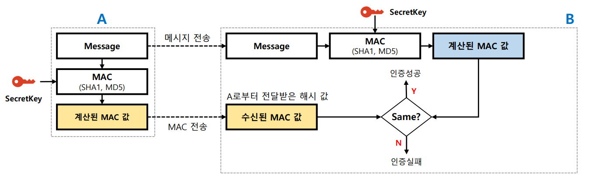
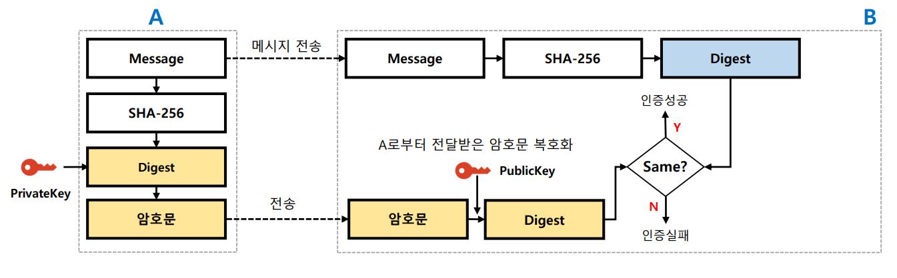
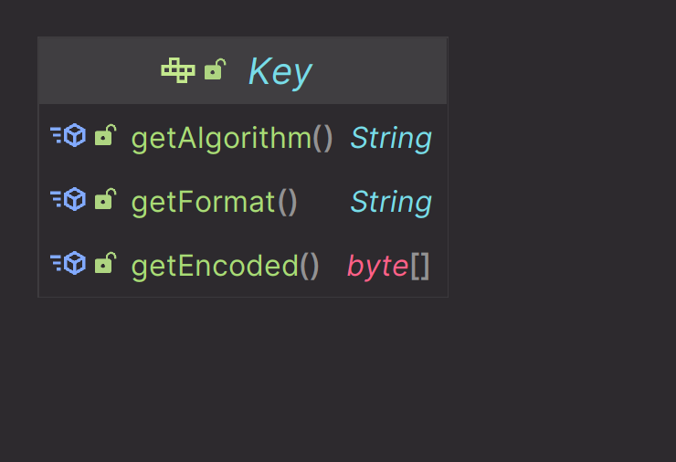
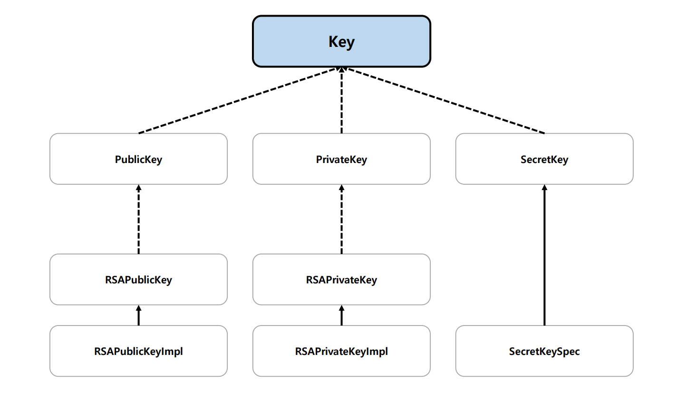
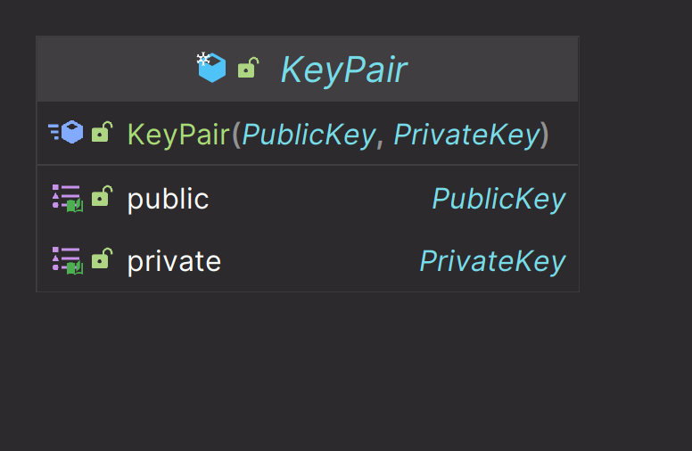
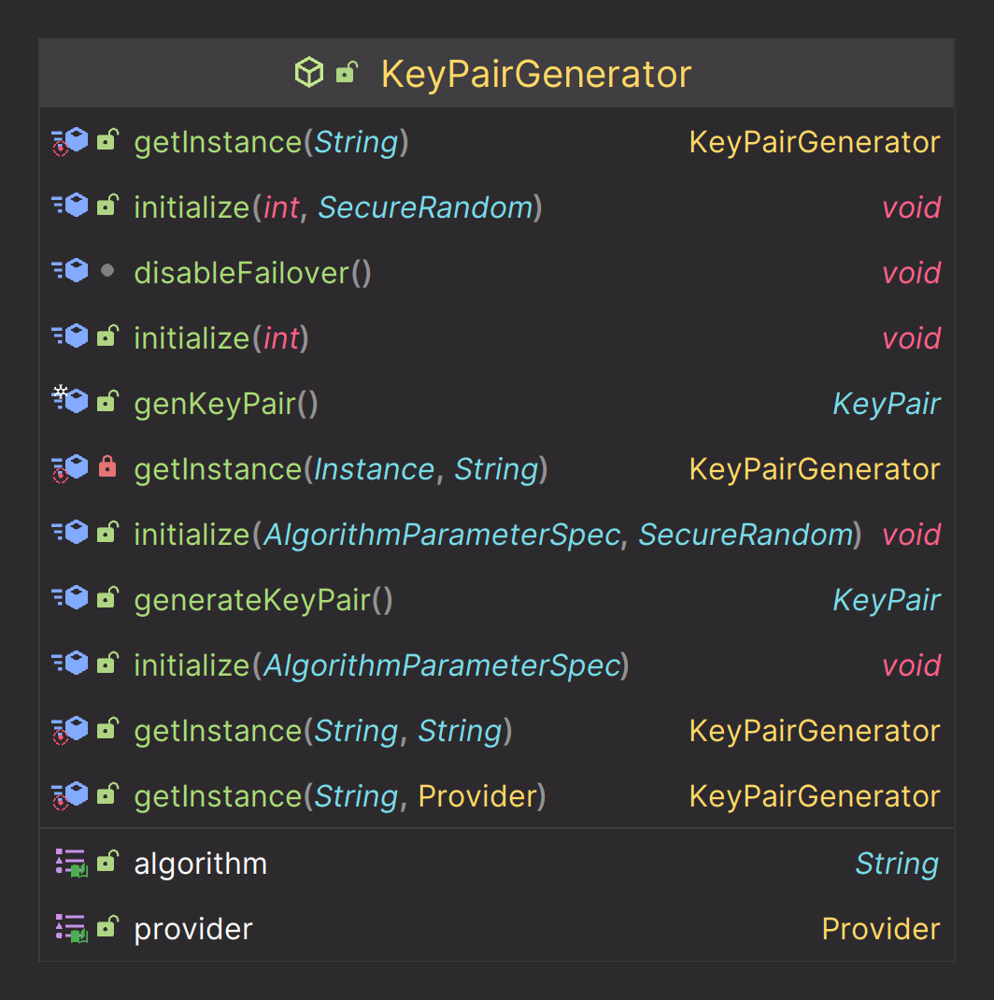

# OAuth 2.0 Resource Server 검증 기초 - 대칭키 & 비대칭키

## 대칭키 암호 (symmetric-key algorithm)

- 암호화 알고리즘의 한 종류로, 암호화와 복호화에 **같은 암호 키**를 쓰는 알고리즘을 의미한다.
- 대칭 키 암호에서는 암호화를 하는 쪽과 복호화를 하는 쪽이 같은 암호 키를 공유해야 한다.
- 비대칭 키 암호에서 공개 키와 비밀 키를 별도로 가지는 것과 구별되며, 대부분의 대칭 키 암호는 비대칭 키 암호화 비교하여 계산 속도가 빠르다는 장점을 가진다.

### MAC (Message Authentication Code)

- **메시지 인증 코드**는 데이터가 변조(삽입, 삭제, 수정 등) 되었는지를 **검증**할 수 있도록 데이터에 덧붙이는 코드
- 해시 값을 생성한다는 점에서 메시지 다이제스트와 비슷하지만, 초기화 시 비밀키(`SecretKey`, 대칭키)를 요구한다는 점에서 다르다.
- 메시지 다이제스트는 받는 쪽에서 누구든 무결성 검사가 가능하지만, **MAC**은 오직 동일한 비밀 키를 가진 쪽에서만 전달받은 메시지의 무결성을 검사할 수 있다.
- 암호화 해시 함수(`MD5`, `SHA256` 등)를 기반으로 하는 **MAC**이 잘 알려진 **HMAC**이다.
- **HMAC**은 메시지 다이제스트 알고리즘과 공유된 비밀 키의 조합으로 가능하며 데이터의 무결성과 기밀성, 송수신자간 인증을 보증하기 위한 암호화 기법이다.

---

## 비대칭 키 암호 (asymmetric-key algorithms)

- 암호화 알고리즘의 한 종류로, 암호화와 복호화에 **다른 암호 키**를 쓰는 알고리즘을 의미한다.
- 외부에 절대 노출되어서는 안되는 개인 키(`Private Key`)와 공개적으로 개방되어 있는 공개 키(`Public Key`)를 쌍으로 이룬 형태이다.
  - A의 공개 키를 이용하여 암호화된 데이터는 A의 개인 키로만 복호화가 가능하다.
  - A의 개인 키를 이용하여 암호화된 데이터는 A의 공개 키로만 복호화가 가능하다.
- 비대칭 키를 사용하여 두 가지 암호학적 문제를 해결할 수 있다.
  - **데이터 보안** : 송신자 공개 키로 암호화 -> 송신자 개인 키로 복호화를 통해 데이터를 안전하게 전송할 수 있는 보안 관점
  - **인증** : 송신자 개인 키로 암호화 -> 송신자 공개 키로 복호화를 통해 메시지를 인증하는 것이 목적(부인 방지)

### RSA 

- 현재 `SSL/TLS` 에 가장 많이 사용되는 공개 키 암호화 알고리즘으로 전세계 대부분의 인터넷 뱅킹(대한민국 포함)이 이 `RSA-2048` 암호화를 사용한다.

---

## Key 생성 모델

### Key

- **JCA**에서 지원하는 모든 종류의 키에 대한 최상위 인터페이스

- `getAlgorithm()`
  - 키 알고리즘은 보통 대칭 키 암호 방식(`AES`, `DSA` 등) 또는 비대칭 키 연산 알고리즘(`RSA`)이다.
- `getEncoded()`
  - 기본 인코딩된 형식의 키를 반환
- `getFormat()`
  - 이 키의 기본 인코딩 형식의 이름을 반환

### KeyPair

- 키 쌍(공개 키와 개인 키)을 보관하고 접근할 수 있는 기능만 제공한다.

### KeyPairGenerator

- 공개 키 및 개인 키 쌍을 생성하는 데 완전히 새로운 객체를 생성한다.

### KeyFactory

- 어떤 키 데이터 객체를 다른 타입의 키 데이터 객체로 전환하는 데 사용한다.

---

[이전 ↩️ - OAuth 2.0 Resource Server 검증 기초 - JCA & JCE 구조](https://github.com/genesis12345678/TIL/blob/main/Spring/security/oauth/%EA%B2%80%EC%A6%9D%EA%B8%B0%EC%B4%88/JCAJCE.md)

[메인 ⏫](https://github.com/genesis12345678/TIL/blob/main/Spring/security/oauth/main.md)

[다음 ↪️ - OAuth 2.0 Resource Server 검증 기초 - JWT 특징](https://github.com/genesis12345678/TIL/blob/main/Spring/security/oauth/%EA%B2%80%EC%A6%9D%EA%B8%B0%EC%B4%88/JWT.md)