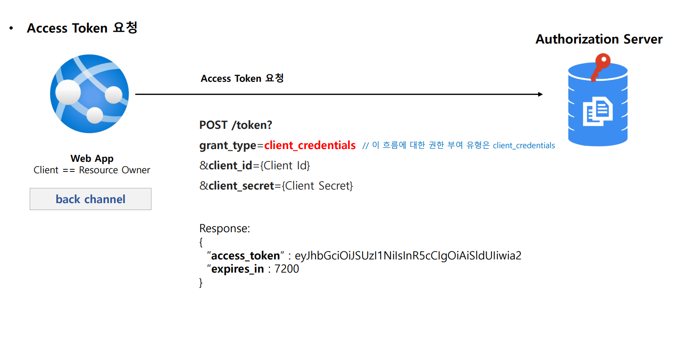
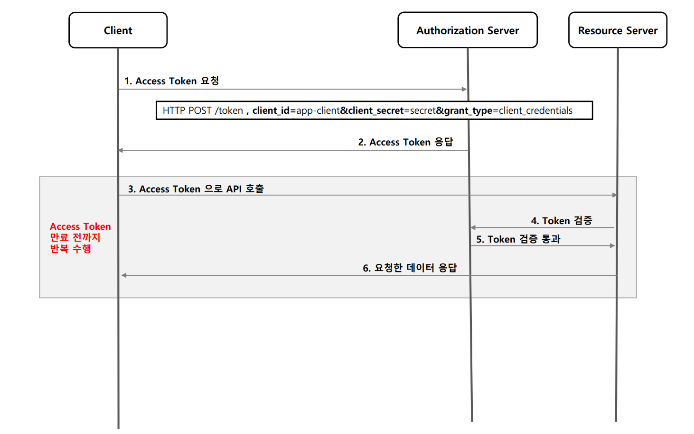

# OAuth 2.0 권한 부여 유형 - 클라이언트 자격증명 승인 방식

---

## Client Credentials Grant

### 1. 흐름 및 특징

- 애플리케이션이 리소스 소유자인 동시에 클라이언트의 역할을 한다.
- 리소스 소유자에게 권한을 위임 받아서 리소스에 접근하는 것이 아니라 자기 자신이 애플리케이션을 사용할 목적으로 사용하는 것이다.
- 서버 대 서버 간의 통신에서 사용할 수 있으며 IOT 와 같은 장비 애플리케이션과의 통신을 위한 인증으로도 사용할 수 있다.
- `Client Id`와 `Client Secret`을 통해 액세스 토큰을 바로 발급받을 수 있기 때문에 `Refresh Token`을 제공하지 않는다.
- Client 정보를 기반으로 하기 때문에 사용자 정보를 제공하지 않는다.

### 권한 부여 승인 요청 시 매개변수

- **필수**
  - `grant_type=client_credentials`
  - `client_id`
  - `client_secret`
- **선택 사항**
  - `scope`

---

## 흐름

---

---

[이전 ↩️ - OAuth 2.0 권한부여 유형 - 패스워드 자격증명 승인 방식](https://github.com/genesis12345678/TIL/blob/main/Spring/security/oauth/%EA%B6%8C%ED%95%9C%EB%B6%80%EC%97%AC/Password.md)

[메인 ⏫](https://github.com/genesis12345678/TIL/blob/main/Spring/security/oauth/main.md)

[다음 ↪️ - OAuth 2.0 권한부여 유형 - 리프레시 토큰 승인 방식](https://github.com/genesis12345678/TIL/blob/main/Spring/security/oauth/%EA%B6%8C%ED%95%9C%EB%B6%80%EC%97%AC/RefreshToken.md)