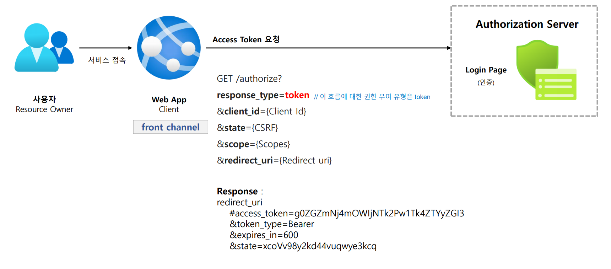
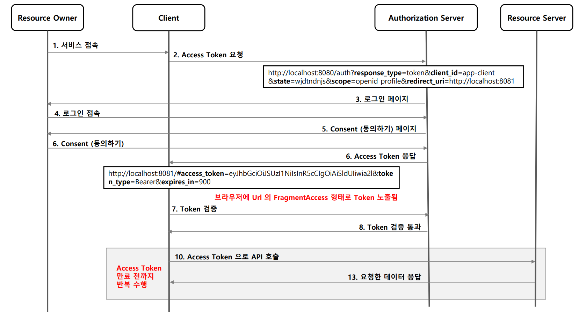

# OAuth 2.0 권한 부여 유형 - 암묵적 승인 방식

---

## Implicit Grant

### 1. 흐름 및 특징

- 클라이언트에서 Javascript 및 HTML 소스 코드를 다운로드한 후 브라우저는 서비스에 직접 API 요청을 한다.
- 코드 교환 단계를 건너뛰고 대신 액세스 토큰이 쿼리 문자열로 클라이언트에 즉시 반환된다.
- 이 유형은 **back channel**이 없으므로 `refresh token`을 사용하지 못한다.
- 토큰 만료 시 애플리케이션이 새로운 `access token`을 얻으려면 다시 OAuth 승인 과정을 거쳐야 한다.

### 2. 권한 부여 승인 요청 시 매개변수
- **필수**
  - `response_type=token`, `id_token`
  - `client_id`
  - `redirect_uri`
- **선택사항**
  - `scope`
  - `state`

---

## 흐름

---

---

[이전 ↩️ - OAuth 2.0 권한부여 유형 - 권한 부여 코드 승인 방식](https://github.com/genesis12345678/TIL/blob/main/Spring/security/oauth/%EA%B6%8C%ED%95%9C%EB%B6%80%EC%97%AC/Authorization.md)

[메인 ⏫](https://github.com/genesis12345678/TIL/blob/main/Spring/security/oauth/main.md)

[다음 ↪️ - OAuth 2.0 권한부여 유형 - 패스워드 자격증명 승인 방식](https://github.com/genesis12345678/TIL/blob/main/Spring/security/oauth/%EA%B6%8C%ED%95%9C%EB%B6%80%EC%97%AC/Password.md)