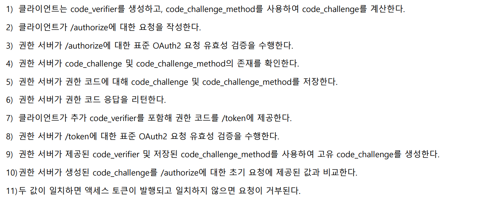
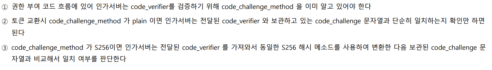
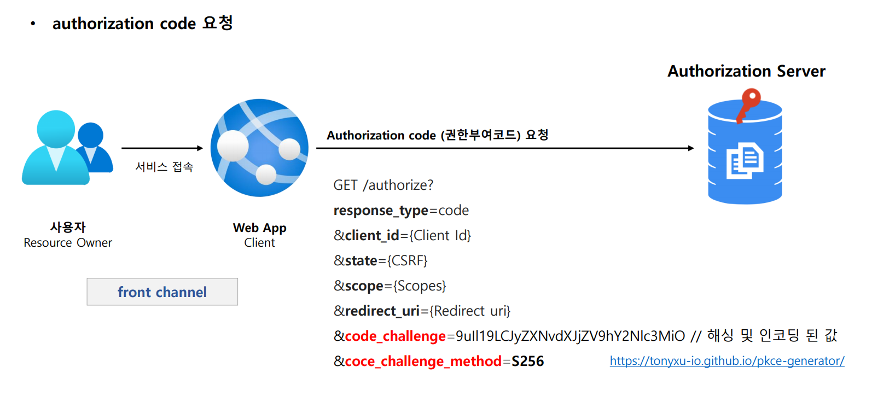
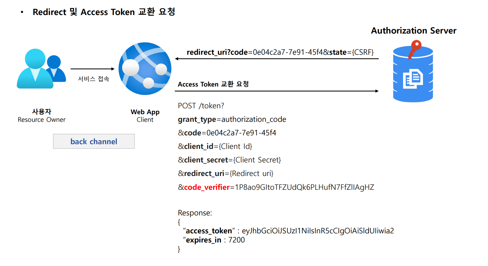

# OAuth 2.0 권한 부여 유형 - PKCE 권한부여 코드 승인 방식

---

## PKCE - enhanced Authorization Code Grant

### PKCE (Proof Key for Code Exchange)

- 코드 교환을 위한 증명 키로서 CSRF 및 권한 부여 코드 삽입 공격을 방지하기 위한 **Authorization Code Grant Flow** 의 확장 버전이다.
- 권한 부여 코드 요청 시 `Code Verifier`와 `Code Challenge`를 추가하여 만약 **Authorization Code Grant Flow**에서 `Authorization Code`가 탈취 당했을 때
    `Access Token`을 발급하지 못하도록 차단한다.
- **PKCE**는 원래 모바일 앱에서 **Authorization Code Grant Flow**를 보호하도록 설계 되었으며, 나중에는 단일 페이지 앱에서도 사용하도록 권장된다. 그리고
    모든 유형의 OAuth2 클라이언트, 심지어 클라이언트 암호를 사용하는 웹 서버에서 실행되는 앱에도 유용하다.

### 코드 생성

#### 1. Code Verifier

1. 권한 부여 코드 요청 전에 앱이 원래 생성한 PKCE 요청에 대한 코드 검증기
2. 48 ~ 128 글자수를 가진 무작위 문자열
3. `A-Z` `a-z` `0-9` `-._~`의 **ASCII** 문자들로만 구성된다.

#### 2. Code Challenge

1. 선택한 Hash 알고리즘으로 `Code Verifier`를 Hashing 한 후 `Base64` 인코딩 한 값
   - ex) `Base64Encode(Sha256(ASCII(Code Verifier)))`

#### 3. Code Challenge Method

1. `plain` : `Code Verifier`가 특정한 알고리즘을 사용하지 않도록 설정
2. `S256` : `Code Verifier`가 해시 알고리즘을 사용하도록 설정

---

## 처리 흐름

> - 1 ~ 6 의 과정이 `code`를 발급받기 위한 과정이다.
> - 7 ~ 11 의 과정이 `Access Token`을 교환하기 위한 과정이다.

---

## code_challenge_method 검증

---

## 흐름

---

[이전 ↩️ - OAuth 2.0 권한부여 유형 - 리프레시 토큰 승인 방식 ](https://github.com/genesis12345678/TIL/blob/main/Spring/security/oauth/%EA%B6%8C%ED%95%9C%EB%B6%80%EC%97%AC/RefreshToken.md)

[메인 ⏫](https://github.com/genesis12345678/TIL/blob/main/Spring/security/oauth/main.md)