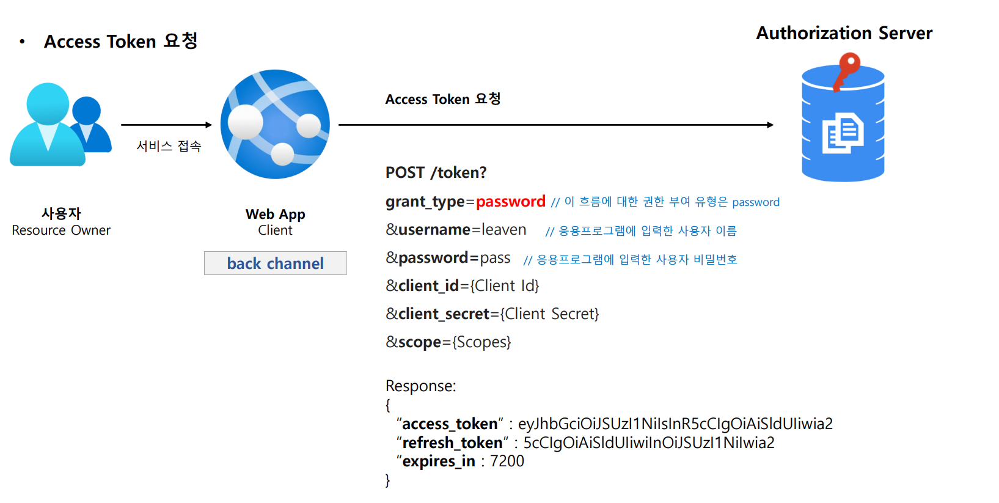
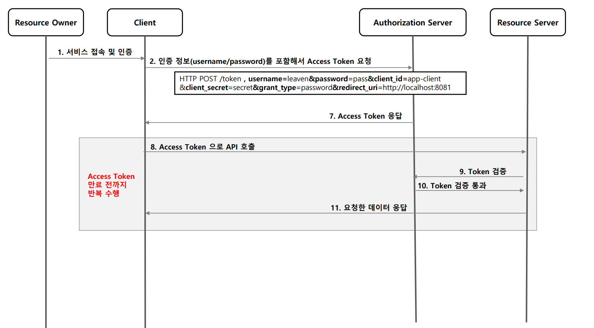

# OAuth 2.0 권한 부여 유형 - 패스워드 자격증명 승인 방식

---

## Resource Owner Password Credential Grant

### 1. 흐름 및 특징

- 애플리케이션(클라이언트)이 사용자 이름과 암호를 액세스 토큰으로 교환할 때 사용된다.
- 타사 애플리케이션이 이 권한을 사용하도록 허용해서는 안되고 고도의 신뢰할 자사 애플리케이션 에서만 사용해야 한다.

### 2. 권한 부여 승인 요청 시 매개변수

- **필수**
  - `grant_type=password`
  - `username`
  - `password`
  - `client_id`
  - `client_secret`
- **선택사항**
  - `scope`

---

## 흐름

---

---

[이전 ↩️ - OAuth 2.0 권한부여 유형 - 암묵적 승인 방식](https://github.com/genesis12345678/TIL/blob/main/Spring/security/oauth/%EA%B6%8C%ED%95%9C%EB%B6%80%EC%97%AC/Implicit.md)

[메인 ⏫](https://github.com/genesis12345678/TIL/blob/main/Spring/security/oauth/main.md)

[다음 ↪️ - OAuth 2.0 권한부여 유형 - 클라이언트 자격증명 승인 방식](https://github.com/genesis12345678/TIL/blob/main/Spring/security/oauth/%EA%B6%8C%ED%95%9C%EB%B6%80%EC%97%AC/Client.md)