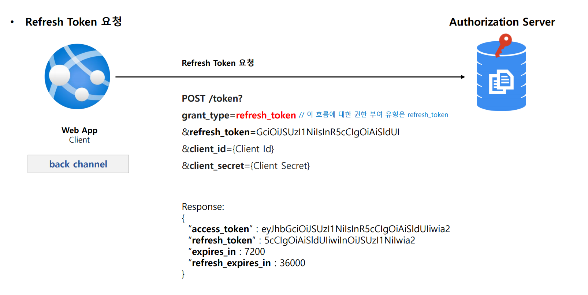
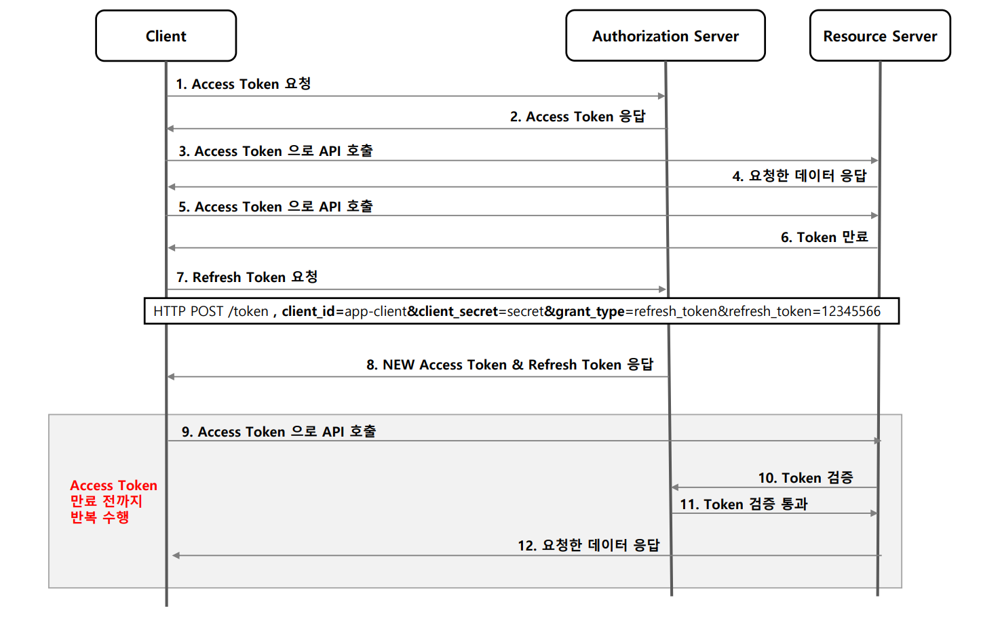

# OAuth 2.0 권한 부여 유형 - 리프레시 토큰 승인 방식

---

## Refresh Token Grant

### 1. 흐름 및 특징

- 액세스 토큰이 발급될 때 함께 제공되는 토큰으로서 액세스 토큰이 만료되더라도 함께 발급받았던 리프레시 토큰이 유효하다면
    인증 과정을 처음부터 반복하지 않아도 액세스 토큰을 재발급 받을 수 있다.
- 한 번 사용된 리프레시 토큰은 폐기되거나 재사용 할 수 있다.

### 2. 권한 부여 승인 요청 시 매개변수

- **필수**
  - `grant_type=refresh_token`
  - `refresh_token`
  - `client_id`
  - `client_secret`

---

## 흐름

---

---

[이전 ↩️ - OAuth 2.0 권한부여 유형 - 클라이언트 자격증명 승인 방식]()

[메인 ⏫](https://github.com/genesis12345678/TIL/blob/main/Spring/security/oauth/main.md)

[다음 ↪️ - OAuth 2.0 권한부여 유형 - PKCE 권한부여 코드 승인 방식]()