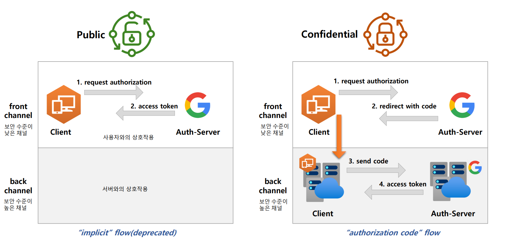

# OAuth 2.0 용어 이해 - OAuth 2.0 Client Types

- 인증 서버에 클라이언트를 등록할 때 클라이언트 자격 증명인 클라이언트 아이디와 클라이언트 암호를 받는다.
- 클라이언트 암호는 비밀이고 그대로 유지되어야 하는 반면 클라이언트 아이디는 공개이다.
- 이 자격 증명은 인증 서버에 대한 클라이언트 ID를 증명한다.

### 기밀 클라이언트 (Confidential Clients)
- 기밀 클라이언트는 `client_secret`의 기밀성을 유지할 수 있는 클라이언트를 의미한다.
- 일반적으로 사용자가 소스 코드에 액세스 할 수 없는 서버에서 실행되는 응용 프로그램으로 `.NET`, `Java`, `PHP` 및 `Node.JS`와 같은 서버 측 언어로 작성된다.
- 이러한 유형의 애플리케이션은 대부분 웹 서버에서 실행되기 때문에 일반적으로 **웹 앱**이라고 한다.

### 공개 클라이언트 (Public Clients)
- 공개 클라이언트는 `client_secret`의 기밀을 유지할 수 없으므로 이러한 앱에는 `secret`이 사용되지 않는다.
- 브라우저(SPA)에서 실행되는 `Javascript` 애플리케이션, Android 또는 iOS 모바일 앱, 데스크톱 에서 실행되는 기본 앱뿐만 아니라 IoT/임베디드 장치에서 실행되는 애플리케이션 등이 있다.
- Chrome 개발자 콘솔이나 디스어셈블러와 같은 디버깅 도구를 사용하여 바이너리/실행 코드에서 기밀 정보를 추출할 수 있기 때문에 공개로 간주된다.
- 서버측이 아닌 리소스 소유자가 사용하는 장치에서 실행되는 모든 클라이언트는 공개 클라이언트로 간주되어야 한다.

---

[이전 ↩️ - OAuth 2.0 용어 이해 - OAuth 2.0 Roles](https://github.com/genesis12345678/TIL/blob/main/Spring/security/oauth/%EC%9A%A9%EC%96%B4%EC%9D%B4%ED%95%B4/Roles.md)

[메인 ⏫](https://github.com/genesis12345678/TIL/blob/main/Spring/security/oauth/main.md)

[다음 ↪️ - OAuth 2.0 용어 이해 - OAuth 2.0 Token Types](https://github.com/genesis12345678/TIL/blob/main/Spring/security/oauth/%EC%9A%A9%EC%96%B4%EC%9D%B4%ED%95%B4/TokenTypes.md)
