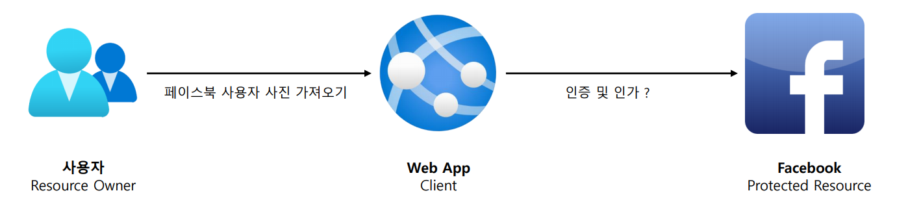
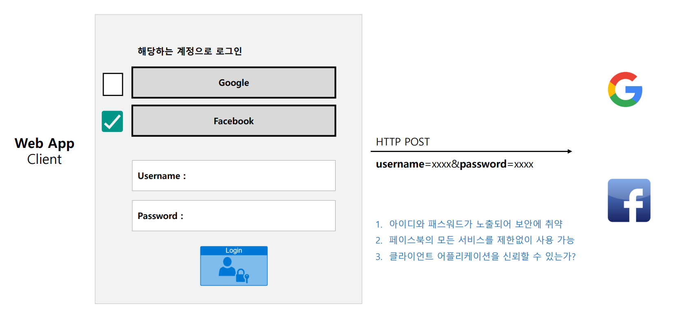
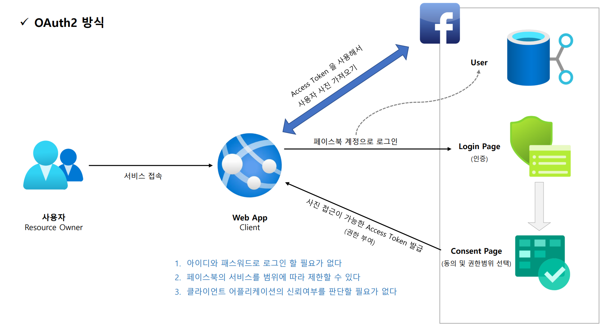

# OAuth 2.0 소개

- **OAuth** = **O**pen + **Auth**orization
  - `OAuth 2.0` 인가 프레임워크는 애플리케이션이 사용자를 대신하여 사용자의 자원에 대한 제한된 액세스를 얻기 위해 승인 상호 작용 함으로써
    애플리케이션이 자체적으로 액세스 권한을 얻도록 한다.
  - 즉, 사용자가 속한 사이트의 보호된 자원(`Protected Resource`)에 대하여 애플리케이션의 접근을 허용하도록 승인하는 것을 의미한다.
- **OAuth**는 애플리케이션이 사용자의 데이터에 접근하도록 권한을 부여하기 때문에 **위임 인가 프레임워크(Delegated authorization framework)** 라고도 부를 수 있다.

---

## 등장 배경

### OAuth 2 이전 방식

### OAuth 2 방식

---

[메인 ⏫]()

[다음 ↪️ - OAuth 2.0 용어 이해 - OAuth 2.0 Roles]()