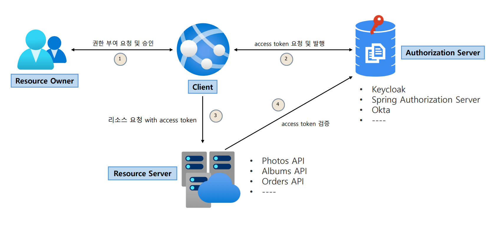

# OAuth 2.0 용어 이해 - OAuth 2.0 Roles

**OAuth 2.0 메커니즘은 다음 네 가지 종류의 역할을 담당하는 주체들에 의해 이루어지는 권한부여 체계이다.**

1. **Resource Owner(자원 소유자)**
   - 보호된 자원에 대한 접근 권한을 부여할 수 있는 주체, 사용자로서 계정의 일부에 대한 접근 권한을 부여하는 사람
   - 사용자를 대신하여 작동하려는 모든 클라이언트는 먼저 사용자의 허가를 받아야 한다.
2. **Resource Server(보호자원 서버)**
   - 타사 애플리케이션에서 접근하는 사용자의 자원이 포함된 서버를 의미한다.
   - 액세스 토큰을 수락 및 검증할 수 있어야 하며 권한 체계에 따라 요청을 승인할 수 있어야 한다.
3. **Authorization Server(인가 서버)**
   - 클라이언트가 사용자 계정에 대한 동의 및 접근을 요청할 때 상호 작용하는 서버로서 클라이언트의 권한 부여 요청을 승인하거나 거부하는 서버
   - 사용자가 클라이언트에게 권한 부여 요청을 승인한 후 `access token`을 클라이언트에게 부여하는 역할
4. **Client(클라이언트)**
   - 사용자를 대신하여 권한을 부여받아 사용자의 리소스에 접근하려는 애플리케이션
   - 사용자를 권한 부여 서버로 안내하거나 사용자의 상호 작용 없이 권한 부여 서버로부터 직접 권한을 얻을 수 있다.

---

[이전 ↩️ - OAuth 2.0 용어 이해 - OAuth 2.0 소개]()

[메인 ⏫]()

[다음 ↪️ - OAuth 2.0 용어 이해 - OAuth 2.0 Client Types]()
