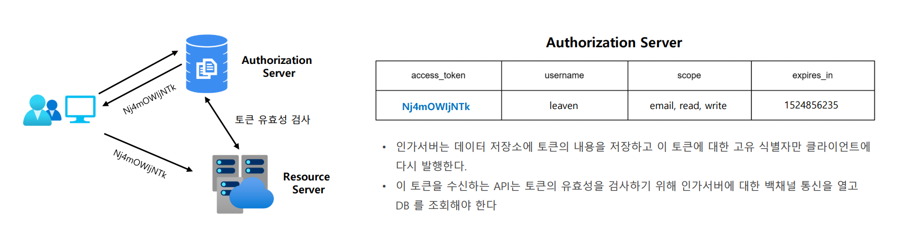
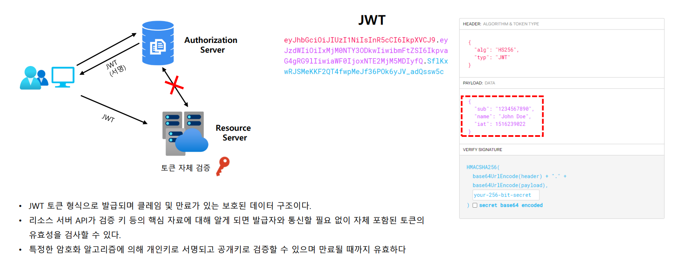

# OAuth 2.0 용어 이해 - OAuth 2.0 Token Types

1. **Access Token**
   - **클라이언트에서 사용자의 보호된 리소스에 접근하기 위해 사용하는 일종의 자격 증명**으로서 역할을 하며, 리소스 소유자가 클라이언트에게 부여한 권한 부여의 표현이다.
   - 일반적으로 JWT 형식을 취하지만 사양에 따라 그럴 필요는 없다.
   - 토큰에는 해당 액세스 기간, 범위 및 서버에 필요한 기타 정보가 있다.
   - 타입에는 **식별자 타입**과 **자체 포함 타입**이 있다.
2. **Refresh Token**
   - **액세스 토큰이 만료된 후 새 액세스 토큰을 얻기 위해 클라이언트 응용 프로그램에서 사용하는 자격 증명**
   - 액세스 토큰이 만료되는 경우 클라이언트는 권한 부여 서버로 인증하고 `Refresh Token`을 전달한다.
   - 인증 서버는 `Refresh Token`의 유효성을 검사하고 새 액세스 토큰을 발급한다.
   - `Refresh Token`은 액세스 토큰과 달리 권한 서버 토큰 엔드 포인트에만 보내지고 리소스 서버에는 보내지 않는다.
3. **ID Token**
   - [OpenID Connect]()
4. **Authorization Code**
   - **권한 부여 코드 흐름에서 사용**되며 이 코드는 **클라이언트가 액세스 토큰과 교환할 임시 코드**이다.(일회용)
   - 사용자가 클라이언트가 요청하는 정보를 확인하고 인가 서버로부터 리다이렉트 되어 받아온다.

---

## Access Token 유형

### 식별자 타입 (Identifier Type)

### 자체 포함 타입 (Self-contained Type)

---

[이전 ↩️ - OAuth 2.0 용어 이해 - OAuth 2.0 Client Types](https://github.com/genesis12345678/TIL/blob/main/Spring/security/oauth/%EC%9A%A9%EC%96%B4%EC%9D%B4%ED%95%B4/ClientTypes.md)

[메인 ⏫](https://github.com/genesis12345678/TIL/blob/main/Spring/security/oauth/main.md)
