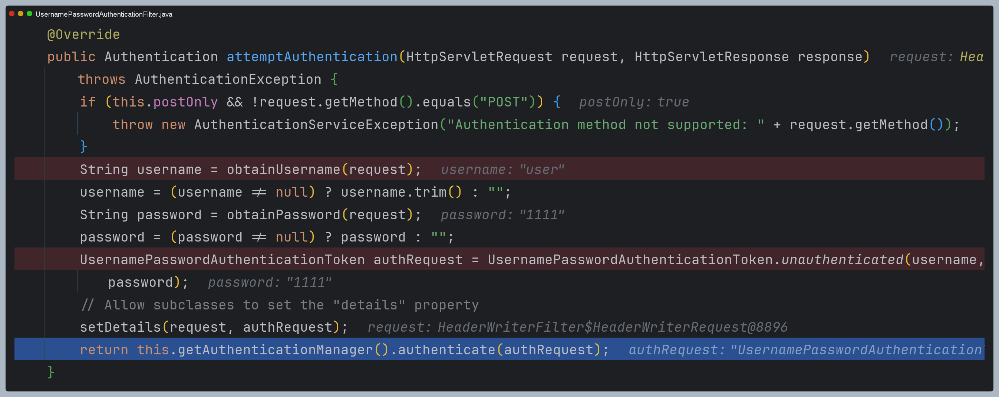

# 인증

---

## Authentication

- **인증**은 특정 자원에 접근하려는 사람의 신원을 확인하는 방법을 의미한다.
- 사용자 인증의 일반적인 방법은 사용자 이름과 비밀번호를 입력하게 하는 것으로, 인증이 수행되면 신원을 알고 권한 부여를 할 수 있다.
- `Authentication`은 사용자의 인증 정보를 저장하는 토큰 개념의 객체로 활용되며 인증 이후 `SecurityContext`에 저장되어 **전역적으로** 참조가 가능하다.

- `getPrincipal()` : 인증 주체를 의미하며 인증 요청의 경우 사용자 이름을, 인증 후에는 `UserDetails` 타입의 객체가 될 수 있다.
- `getCredentials()` : 인증 주체가 올바른 것을 증명하는 자격 증명으로서 보통 비밀번호를 의미한다.
- `getAuthorities()` : 인증 주체(`principal`)에게 부여된 권한을 나타낸다.
- `getDetails()` : 인증 요청에 대한 추가적인 세부 사항을 저장한다.(IP 주소, 인증서 일련 번호 등이 될 수 있음)
- `isAuthenticated()` : 인증 상태를 반환
- `setAuthenticated()` : 인증 상태를 설정

---

---

# 인증 과정 디버깅 (예: 폼 인증)

## 1. UsernamePasswordAuthenticationFilter

- 인증 처리 전 `Authentication` 객체를 생성하고 `AuthenticationManager`에게 전달한다.

## 2. ProviderManager

- `AuthenticationManager` 구현체 중 하나인 `ProviderManager`에게 인증 처리 수행을 요청한다.
- `ProviderManager`는 자신이 갖고 있는 `AuthenticationProvider` 중 처리할 수 있는 클래스에게 인증 처리를 위임한다.
- 인증 처리 후 완성된 `Authentication` 객체를 다시 반환한다.

## 3. AbstractUserDetailsAuthenticationProvider

- 각각의 인증 방식을 처리할 수 있는 `AuthenticationProvider`가 자신의 방식대로 인증 과정을 수행한다.
  - 예를 들어 폼 인증의 경우 `AbstractUserDetailsAuthenticationProvider`가 인증 과정을 수행
- 최종적으로 인증 처리가 된 `Authentication` 객체를 생성해 반환하는 것을 확인할 수 있다.

---

[메인 ⏫](https://github.com/genesis12345678/TIL/blob/main/Spring/security/security/main.md)

[다음 ↪️ - 인증 컨텍스트(`SecurityContext & SecurityContextHolder`)](https://github.com/genesis12345678/TIL/blob/main/Spring/security/security/AuthenticationArchitecture/SecurityContext.md)