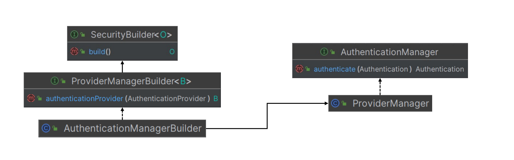
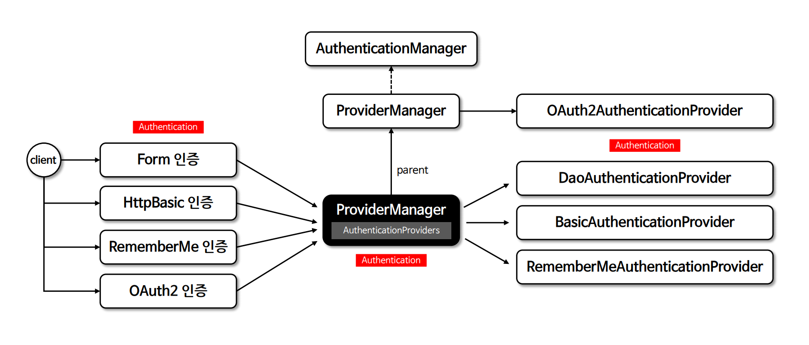
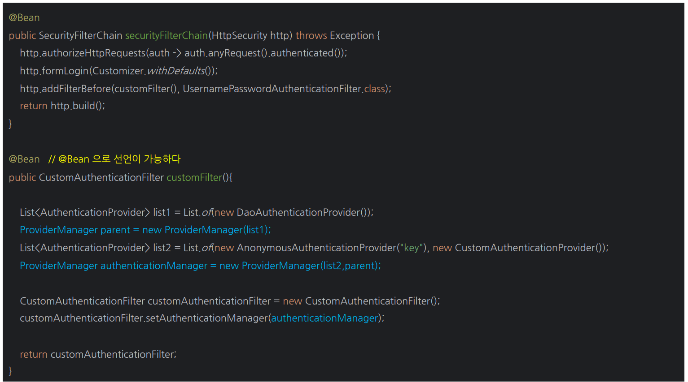

# 인증 관리자


---

## AuthenticationManager

- 인증 필터로부터 `Authentication` 객체를 전달 받아 인증을 시도하며 인증에 성공할 경우 사용자 정보, 권한 등을 포함한 완전히 채워진 `Authentication` 객체를 반환한다.
- `AuthenticationManager`는 여러 `AuthenticationProvider` 들을 관리하며 `AuthenticationProvider` 목록을 순차적으로 순회하며 인증 요청을 처리한다.
- `AuthenticationProvider` 목록 중에서 인증 처리 요건에 맞는 적절한 `AuthenticationProvider` 를 찾아 인증처리를 위임한다.
- `AuthenticationMangerBuilder`에 의해 객체가 생성되며 주로 사용하는 구현체로 `ProviderManager`가 제공된다.

---

## AuthenticationManagerBuilder

- `AuthenticationManager` 객체를 생성하며 `UserDetailsService` 및 `AuthenticationProvder` 를 추가할 수 있다.
- `HttpSecurity.getSharedObject(AuthenticationManagerBuilder.class)`를 통해 객체를 참조할 수 있다.



---

## AuthenticationManager 흐름



- 선택적으로 부모 `AuthenticationManager`를 구성할 수 있으며 이 부모는 `AuthenticationProvider`가 인증을 수행할 수 없는 경우에 추가적으로 탐색할 수 있다.
- 일반적으로 `AuthenticationProvider`로부터 `null`이 아닌 응답을 받을 때까지 차례대로 시도하며 응답을 받지 못하면 `ProviderNotFoundException`과 함께 인증이 실패한다.

---

## AuthenticationManager - HttpSecurity 사용


```java
@Configuration
@EnableWebSecurity
public class SecurityConfig {

    @Bean
    public SecurityFilterChain securityFilterChain(HttpSecurity http) throws Exception {

        AuthenticationManagerBuilder builder = http.getSharedObject(AuthenticationManagerBuilder.class);
        AuthenticationManager authenticationManager = builder.build();
        AuthenticationManager authenticationManager1 = builder.getObject();

        http
                .authorizeHttpRequests(auth -> auth
                        .requestMatchers("/", "/api/login").permitAll()
                        .anyRequest().authenticated()
                )
                .authenticationManager(authenticationManager)
                .addFilterBefore(customAuthenticationFilter(http, authenticationManager),
                                    UsernamePasswordAuthenticationFilter.class)
        ;

        return http.build();
    }

    public CustomAuthenticationFilter customAuthenticationFilter(HttpSecurity http, AuthenticationManager authenticationManager) {
        CustomAuthenticationFilter customAuthenticationFilter = new CustomAuthenticationFilter(http);
        customAuthenticationFilter.setAuthenticationManager(authenticationManager);

        return customAuthenticationFilter;
    }
}
```
```java
public class CustomAuthenticationFilter extends AbstractAuthenticationProcessingFilter {

    private final ObjectMapper objectMapper = new ObjectMapper();

    public CustomAuthenticationFilter(HttpSecurity http) {
        super(new AntPathRequestMatcher("/api/login", "GET"));
        setSecurityContextRepository(getSecurityContextRepository(http));
    }

    private SecurityContextRepository getSecurityContextRepository(HttpSecurity http) {
        SecurityContextRepository securityContextRepository = http.getSharedObject(SecurityContextRepository.class);
        if (securityContextRepository == null) {
            securityContextRepository = new DelegatingSecurityContextRepository(
                    new RequestAttributeSecurityContextRepository(), new HttpSessionSecurityContextRepository()
            );
        }
        return securityContextRepository;
    }


    @Override
    public Authentication attemptAuthentication(HttpServletRequest request, HttpServletResponse response) throws AuthenticationException, IOException, ServletException {
        String username = request.getParameter("username");
        String password = request.getParameter("password");

        UsernamePasswordAuthenticationToken token = new UsernamePasswordAuthenticationToken(username, password);

        return this.getAuthenticationManager().authenticate(token);
    }
}
```

요청 URL : `localhost:8080/api/login?username=user&password=1111`

---

## AuthenticationManager - 직접 생성



```java

@Configuration
@EnableWebSecurity
public class SecurityConfig2 {

    @Bean
    public SecurityFilterChain securityFilterChain(HttpSecurity http) throws Exception {

        http
                .authorizeHttpRequests(auth -> auth
                        .requestMatchers("/", "/api/login").permitAll()
                        .anyRequest().authenticated()
                )
                .addFilterBefore(customAuthenticationFilter(http),
                        UsernamePasswordAuthenticationFilter.class)
        ;

        return http.build();
    }

    public CustomAuthenticationFilter customAuthenticationFilter(HttpSecurity http) {
        List<AuthenticationProvider> list1 = List.of(new DaoAuthenticationProvider());
        ProviderManager parent = new ProviderManager(list1);

        List<AuthenticationProvider> list2 = List.of(new AnonymousAuthenticationProvider("key"), new CustomAuthenticationProvider());
        ProviderManager providerManager = new ProviderManager(list2, parent);

        CustomAuthenticationFilter customAuthenticationFilter = new CustomAuthenticationFilter(http);
        customAuthenticationFilter.setAuthenticationManager(providerManager);

        return customAuthenticationFilter;
    }
}
```
```java
public class CustomAuthenticationProvider implements AuthenticationProvider {
    @Override
    public Authentication authenticate(Authentication authentication) throws AuthenticationException {
        String loginId = authentication.getName();
        String password = (String) authentication.getCredentials();

        return new UsernamePasswordAuthenticationToken(loginId, null, List.of(new SimpleGrantedAuthority("ROLE_USER")));
    }

    @Override
    public boolean supports(Class<?> authentication) {
        return authentication.isAssignableFrom(UsernamePasswordAuthenticationToken.class);
    }
}
```

요청 URL : `localhost:8080/api/login?username=user&password=1111`

---

[이전 ↩️ - 인증 컨텍스트(`SecurityContext & SecurityContextHolder`)](https://github.com/genesis12345678/TIL/blob/main/Spring/security/security/AuthenticationArchitecture/security/securityContext.md)

[메인 ⏫](https://github.com/genesis12345678/TIL/blob/main/Spring/security/security/main.md)

[다음 ↪️ - 인증 제공자(`AuthenticationProvider`)](https://github.com/genesis12345678/TIL/blob/main/Spring/security/security/AuthenticationArchitecture/AuthenticationProvider.md)