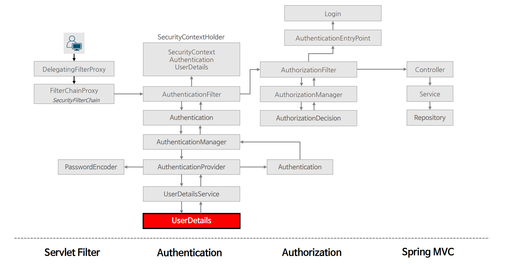
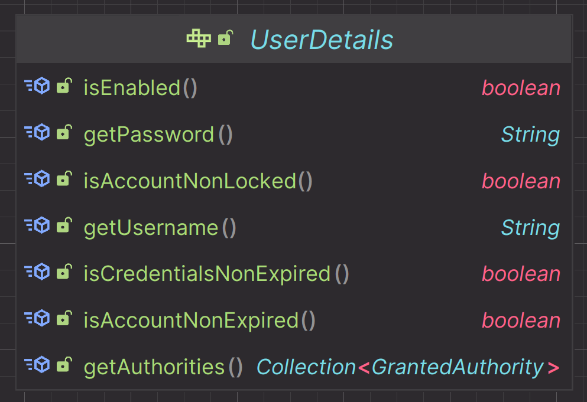

# 사용자 상세



---

## UserDetails

- 사용자의 기본 정보를 저장하는 인터페이스로 **Spring Security**에서 사용하는 사용자 타입이다.
- 저장된 사용자 정보는 추후에 인증 절차에서 사용되기 위해 `Authentication` 객체에 포함되며 구현체로서 `User` 클래스가 제공된다.



- `isEnabled()` : 사용자가 활성화되었는지 비활성화되었는지를 나타내며 비활성화된 사용자는 인증할 수 없다.
- `getPassword()` : 사용자 인증에 사용된 비밀번호를 반환한다.
- `isAccountNonLocked()` : 사용자가 잠겨 있는지 아닌지를 나타내며 잠긴 사용자는 인증할 수 없다.
- `getUsername()` : 사용자 인증에 사용된 사용자 이름을 반환하며 `null`을 반환활 수 없다.
- `isCredentialsNonExpired()` : 사용자의 비밀번호가 유효 기간이 지났는지를 확인하며 유효 기간이 지난 비밀번호는 인증할 수 없다.
- `isAccountNonExpired()` : 사용자 계정의 유효 기간이 지났는지를 나타내며 기간이 만료된 계정은 인증할 수 없다.
- `getAuthorities()` : 사용자에게 부여된 권한을 반환하며 `null`을 반환할 수 없다.


---

```java

@Getter
@AllArgsConstructor
public class AccountDto {
    private String username;
    private String password;
    private Collection<GrantedAuthority> authorities;
}
```
```java
public class CustomUserDetails implements UserDetails {

    private final AccountDto accountDto;

    public CustomUserDetails(AccountDto accountDto) {
        this.accountDto = accountDto;
    }

    @Override
    public Collection<? extends GrantedAuthority> getAuthorities() {
        return accountDto.getAuthorities();
    }

    @Override
    public String getPassword() {
        return accountDto.getPassword();
    }

    @Override
    public String getUsername() {
        return accountDto.getUsername();
    }

    @Override
    public boolean isAccountNonExpired() {
        return true;
    }

    @Override
    public boolean isAccountNonLocked() {
        return true;
    }

    @Override
    public boolean isCredentialsNonExpired() {
        return true;
    }

    @Override
    public boolean isEnabled() {
        return true;
    }
}
```
```java
public class CustomUserDetailsService implements UserDetailsService {
    @Override
    public UserDetails loadUserByUsername(String username) throws UsernameNotFoundException {
        AccountDto accountDto =
                new AccountDto("user", "{noop}1111", List.of(new SimpleGrantedAuthority("ROLE_USER")));
        return new CustomUserDetails(accountDto);
    }
}
```

---

[이전 ↩️ - 사용자 상세 서비스(`UserDetailsService`)](https://github.com/genesis12345678/TIL/blob/main/Spring/security/AuthenticationArchitecture/UserDetailsService.md)

[메인 ⏫](https://github.com/genesis12345678/TIL/blob/main/Spring/security/main.md)