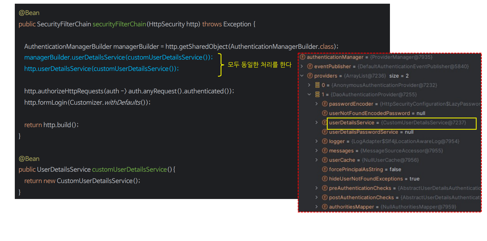

# 사용자 상세 서비스


---

## UserDetailsService

- `UserDetailsService`의 주요 기능은 사용자와 관련된 상세 데이터를 로드하는 것이며 사용자의 신원, 권한, 자격 증명 등과 같은 정보를 포함할 수 있다.
- 이 인터페이스를 사용하는 클래스는 주로 `AuthenticationProvider`이며 사용자가 시스템에 존재하는지 여부와 사용자 데이터를 검색하고 인증 과정을 수행한다.


- 사용자의 이름을 통해 사용자 데이터를 검색하고, 해당 데이터를 `UserDetails` 객체로 반환한다.


---



- `UserDetailsService`만 커스터 마이징 할 경우 위와 같이 적용하면 된다.
- `AuthenticationProvider`와 함께 커스터 마이징 할 경우 `AuthenticaitonProvider`에 직접 주입해서 사용한다.

---

```java
public class CustomUserDetailsService implements UserDetailsService {
    @Override
    public UserDetails loadUserByUsername(String username) throws UsernameNotFoundException {
        return User.withUsername("user")
                .password("{noop}1111")
                .roles("USER")
                .build();
    }
}
```
```java
@Configuration
@EnableWebSecurity
public class SecurityConfig {

    @Bean
    public SecurityFilterChain securityFilterChain(HttpSecurity http) throws Exception {
        http
                .authorizeHttpRequests(auth -> auth
                        .anyRequest().authenticated())
                .formLogin(Customizer.withDefaults());
        
        return http.build();
    }

    @Bean
    public UserDetailsService userDetailsService() {
        return new CustomUserDetailsService();
    }
    
}
```
```java
@Component
@RequiredArgsConstructor
public class CustomAuthenticationProvider implements AuthenticationProvider {

    private final UserDetailsService userDetailsService;

    @Override
    public Authentication authenticate(Authentication authentication) throws AuthenticationException {
        String loginId = authentication.getName();
        String password = (String) authentication.getCredentials();

        UserDetails user = userDetailsService.loadUserByUsername(loginId);
        if (user == null) {
            throw new UsernameNotFoundException("UsernameNotFoundException");
        }

        return new UsernamePasswordAuthenticationToken(
                user.getUsername(), user.getPassword(), user.getAuthorities()
        );
    }

    @Override
    public boolean supports(Class<?> authentication) {
        return authentication.isAssignableFrom(UsernamePasswordAuthenticationToken.class);
    }
}
```

---

[이전 ↩️ - 인증 제공자(`AuthenticationProvider`)](https://github.com/genesis12345678/TIL/blob/main/Spring/security/security/AuthenticationArchitecture/AuthenticationProvider.md)

[메인 ⏫](https://github.com/genesis12345678/TIL/blob/main/Spring/security/security/main.md)

[다음 ↪️ - 사용자 상세(`UserDetails`)](https://github.com/genesis12345678/TIL/blob/main/Spring/security/security/AuthenticationArchitecture/UserDetails.md)