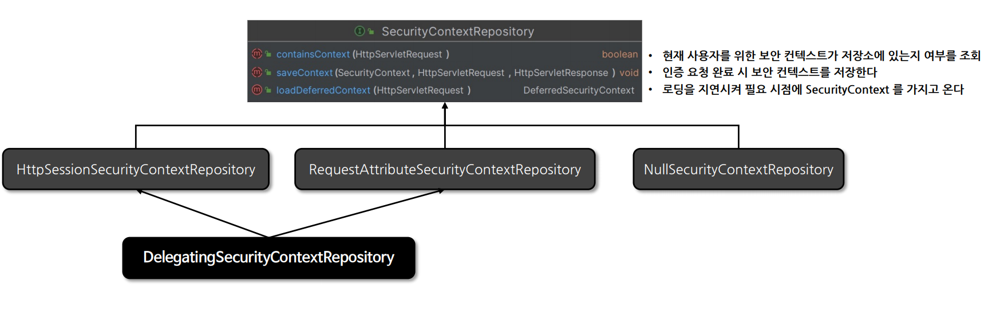
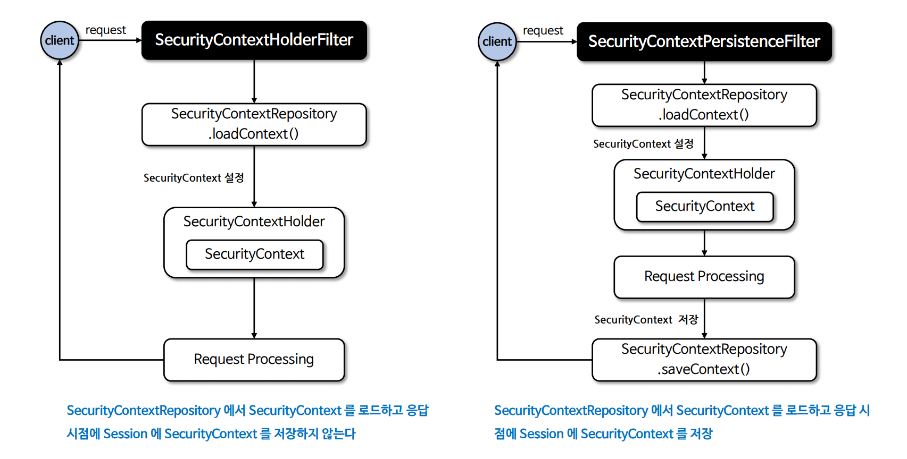

# 인증 상태 영속성

---

## SecurityContextRepository

- 스프링 시큐리티에서 사용자가 인증을 한 이후 요청에 대해 계속 사용자의 인증을 유지하기 위해 사용되는 클래스다.
- 인증 상태의 영속 메커니즘은 사용자가 인증을 하게 되면 해당 사용자의 인증 정보와 권한이 `SecurityContext`에 저장되고 `HttpSession`을 통해 요청 간 영속이 이루어지는 방식이다.




- **HttpSessionSecurityContextRepository** : 요청 간에 `HttpSession`에 보안 컨텍스트를 저장한다. 후속 요청 시 컨텍스트 영속성을 유지한다.
- **RequestAttributeSecurityContextRepository** : `ServletRequest`에 보안 컨텍스트를 저장한다. 후속 요청 시 컨텍스트 영속성을 유지할 수 없다.
- **NullSecurityContextRepository** : 세션을 사용하지 않는 인증(JWT, OAuth2 등)일 경우 사용하며 컨텍스트 관련 아무런 처리를 하지 않는다.
- **DelegatingSecurityContextRepository** : `RequestAttributeSecurityContextRepository`와 `HttpSessionSecurityContextRepository`를 동시에 사용할 수 있도록
    위임된 클래스로서, 초기화 시 기본으로 설정된다.

---

## SecurityContextHolderFilter

- `SecurityContextRepository`를 사용하여 **SecurityContext**를 얻고 이를 `SecurityContextHolder`에 설정하는 필터 클래스이다.
- 이 필터 클래스는 `SecurityContextRepository.saveContext()`를 강제로 실행시키지 않고 사용자가 명시적으로 호출해야 `SecurityContext`를 저장할 수 있는데 이는 `SecurityContextPersistenceFilter`(**Deprecated**)와 다른 점이다.
- 인증이 지속되어야 하는지를 각 인증 매커니즘이 독립적으로 선택할 수 있게 하여 더 나은 유연성을 제공하고 `HttpSession`이 필요할 때만 저장함으로써 성능을 향상시킨다.
- 이 필터 클래스의 궁극적인 목표는 다른 필터에서 참조할 수 있도록 `SecurityContextHolder`에 **SecurityContext(Authentication)** 를 설정하는 것이다.

---

## SecurityContext 생성, 저장, 삭제

1. **익명 사용자**
   - `SecurityContextRepository`를 사용하여 새로운 **SecurityContext** 객체를 생성하여 `SecurityContextHolder`에 저장 후 다음 필터로 전달
   - `AnonymousAuthenticationFilter`에서 `AnonymousAuthenticationToken` 객체를 **SecurityContext**에 저장
2. **인증 요청**
   - `SecurityContextRepository`를 사용하여 새로운 **SecurityContext** 객체를 생성하여 `SecurityContextHolder`에 저장 후 다음 필터로 전달
   - `UsernamePasswordAuthenticationFilter`에서 인증 성공 후 **SecurityContext**에 `UsernamePasswordAuthentication` 객체를 **SecurityContext**에 저장
   - `SecurityContextRepository`를 사용하여 `HttpSession`에 **SecurityContext**를 저장
3. **인증 후 요청**
   - `SecurityContextRepository`를 사용하여 `HttpSession`에서 **SecurityContext**를 꺼내어 `SecurityContextHolder`에 저장 후 다음 필터로 전달
   - **SecurityContext** 안에 `Authentication` 객체가 존재하면 계속 인증을 유지한다.
4. **클라이언트 응답 시 공통**
   - `SecurityContextHolder.clearContext()`로 컨텍스트를 삭제한다.
   - 스레드 풀의 스레드일 경우 반드시 필요하다.

---

## SecurityContextHolderFilter 흐름


---

## SecurityContextHolderFilter & SecurityContextPersistenceFilter



--- 

## securityContext()


- 현재 `SecurityContextPersistenceFilter`는 **Deprecated** 되었기 때문에 레거시 시스템 외에는 `SecurityContextHolderFilter`를 사용하면 된다.

---

## CustomAuthenticationFilter & SecurityContextRepository

- 커스텀 인증 필터를 구현할 경우 인증이 완료된 후 **SecurityContext**를 `SecurityContextHolder`에 설정한 후 `securityContextRepository`에 저장하기 위한 코드를 명시적으로 작성해야 한다.
```java
securityContextHolderStrategy.setContext(context);
securityContextRepository.saveContext(context, request, response);
```
- `securityContextRepository`는 **HttpSessionSecurityContextRepository** 또는 **DelegatingSecurityContextRepository**를 사용하면 된다.

---

```java
@Configuration
@EnableWebSecurity
public class SecurityConfig {

    @Bean
    public SecurityFilterChain securityFilterChain(HttpSecurity http) throws Exception {

        AuthenticationManagerBuilder builder = http.getSharedObject(AuthenticationManagerBuilder.class);
        AuthenticationManager authenticationManager = builder.build();


        http
                .authorizeHttpRequests(auth -> auth
                        .requestMatchers("/api/login").permitAll()
                        .anyRequest().authenticated())
                .formLogin(Customizer.withDefaults())
                .securityContext(securityContext -> securityContext.requireExplicitSave(false))
                .authenticationManager(authenticationManager)
                .addFilterBefore(customAuthenticationFilter(http, authenticationManager),
                        UsernamePasswordAuthenticationFilter.class)
        ;

        return http.build();
    }

    public CustomAuthenticationFilter customAuthenticationFilter(HttpSecurity http, AuthenticationManager authenticationManager) {
        CustomAuthenticationFilter customAuthenticationFilter = new CustomAuthenticationFilter(http);
        customAuthenticationFilter.setAuthenticationManager(authenticationManager);

        return customAuthenticationFilter;
    }
}
```
```java
public class CustomAuthenticationFilter extends AbstractAuthenticationProcessingFilter {

    private final ObjectMapper objectMapper = new ObjectMapper();

    public CustomAuthenticationFilter(HttpSecurity http) {
        super(new AntPathRequestMatcher("/api/login", "GET"));
        setSecurityContextRepository(getSecurityContextRepository(http));
    }

    private SecurityContextRepository getSecurityContextRepository(HttpSecurity http) {
        SecurityContextRepository securityContextRepository = http.getSharedObject(SecurityContextRepository.class);
        if (securityContextRepository == null) {
            securityContextRepository = new DelegatingSecurityContextRepository(new HttpSessionSecurityContextRepository(),
                                                                                new RequestAttributeSecurityContextRepository());
        }

        return securityContextRepository;
    }

    @Override
    public Authentication attemptAuthentication(HttpServletRequest request, HttpServletResponse response) throws AuthenticationException, IOException, ServletException {
        String username = request.getParameter("username");
        String password = request.getParameter("password");

        UsernamePasswordAuthenticationToken token = new UsernamePasswordAuthenticationToken(username, password);

        return this.getAuthenticationManager().authenticate(token);
    }
}
```

---

[메인 ⏫](https://github.com/genesis12345678/TIL/blob/main/Spring/security/main.md)

[다음 ↪️ - 스프링 MVC 로그인 구현](https://github.com/genesis12345678/TIL/blob/main/Spring/security/AuthenticationPersistence/MVCLogin.md)