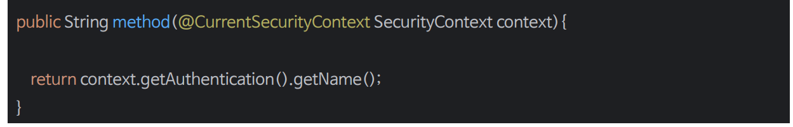

# 익명 사용자

- 스프링 시큐리티에서 **익명으로 인증된 사용자**와 **인증되지 않은 사용자** 간에 실제 개념적 차이는 없으며 단지 액세스 제어 속성을 구성하는 더 편리한 방법을 제공한다고 볼 수 있다.
- `SecurityContextHolder`가 항상 `Authentication` 객체를 포함하고 `null`을 포함하지 않는다는 것을 규칙을 세우게 되면 클래스를 더 견고하게 작성할 수 있다.
- 인증 사용자와 익명 인증 사용자를 구분해서 어떤 기능을 수행하고자 할 때 유용할 수 있으며 익명 인증 객체를 세션에 저장하지 않는다.
- 익명 인증 사용자의 권한을 별도로 운영할 수 있다. 즉 인증 된 사용자가 접근할 수 없도록 구성이 가능하다.


- 기본적으로는 `AnonymousAuthenticationFilter`에서 `AnonymousAuthenticationToken`을 생성해 `principal`을 **anonymousUser**로, `authorities`를 **ROLE_ANONYMOUS**로 지정한다.
- 사용자 정의로 직접 지정할 수도 있다.

---

## 스프링 MVC 익명 인증 사용

- 스프링 MVC가 **HttpServletRequest**의 `getPrincipal()`을 사용하여 파라미터를 해결한다.
- 요청이 익명일 때 이 값은 `null`이다.


- 만약 익명 요청에서 `Authentication`을 얻고 싶다면 `@CurrentSecurityContext`를 사용하면 된다.
- **CurrentSecurityContextArgumentResolver**에서 요청을 가로채어 처리한다.



---

## AnonymousAuthenticationFilter
- `SecurityContextHolder`에 `Authentication` 객체가 없을 경우(`null`) 감지하고 필요한 경우 새로운 `Authentication` 객체로 채운다.


---

```java
@Configuration
@EnableWebSecurity
public class SecurityConfig {
    @Bean
    public SecurityFilterChain securityFilterChain(HttpSecurity http) throws Exception {
        http
                .authorizeHttpRequests(auth -> auth
                        .requestMatchers("/anonymous").hasRole("GUEST")
                        .requestMatchers("/anonymousContext", "/authentication").permitAll()
                        .anyRequest().authenticated()
                )
                .formLogin(Customizer.withDefaults())
                .anonymous(anonymous -> anonymous
                        .principal("GUEST")
                        .authorities("ROLE_GUEST")

                );

        return http.build();
    }
}
```
```java
@GetMapping("/authentication")
public String authentication(Authentication authentication) {
    if (authentication instanceof AnonymousAuthenticationToken) {
        return "anonymous";
    } else {
        return "not anonymous";
    }
}

@GetMapping("/anonymousContext")
public String anonymousContext(@CurrentSecurityContext SecurityContext context) {

    return context.getAuthentication().getName();
}
```
- `/anonymous`는 익명 사용자(인증받지 않은 사용자)만 접근할 수 있다.
- 익명 사용자가 `/authentication`에 접근하면 파라미터 `authentication`은 `null`이다. `not anonymous`를 반환한다.
- 익명 사용자가 `/anonymousContext`에 접근하면 `@CurrentSecurityContext`가 적용되어 시큐리티 설정 클래스에서 지정한 `principal`을 반환할 수 있다.

---

[이전 ↩️ - 기억하기 인증(rememberMe())](https://github.com/genesis12345678/TIL/blob/main/Spring/security/security/AuthenticationProcess/RememberMe.md)

[메인 ⏫](https://github.com/genesis12345678/TIL/blob/main/Spring/security/security/main.md)

[다음 ↪️ - 로그아웃(logout())](https://github.com/genesis12345678/TIL/blob/main/Spring/security/security/AuthenticationProcess/Logout.md)