# 폼 인증

- HTTP 기반의 폼 로그인 인증 메커니즘을 활성화하는 API로, 사용자 인증을 위한 사용자 정의 로그인 페이지를 쉽게 구현할 수 있다.
- 기본적으로 스프링 시큐리티가 제공하는 기본 로그인 페이지를 사용하며 사용자 이름과 비밀번호 필드가 포함된 간단한 로그인 양식을 제공한다.
- 사용자는 웹 폼을 통해 자격 증명(사용자 이름과 비밀번호)을 제공하고 `Spring Security`는 **HttpServletRequest**에서 이 값을 읽어온다.


---
## formLogin()

- `FormLoginConfigurer` 설정 클래스를 통해 여러 API들을 설정할 수 있다.
- 내부적으로 `UsernamePasswordAuthenticationFilter`가 생성되어 폼 방식의 인증 처리를 담당하게 된다.


```java
@Configuration
@EnableWebSecurity
public class SecurityConfig {

    @Bean
    public SecurityFilterChain securityFilterChain(HttpSecurity http) throws Exception {
        http
                .authorizeHttpRequests(auth -> auth.anyRequest().authenticated())
                .formLogin(form -> form
                        .loginPage("/loginPage")
                        .loginProcessingUrl("/loginProc")
                        .defaultSuccessUrl("/", true)
                        .failureUrl("/failed")
                        .usernameParameter("userId")
                        .passwordParameter("passwd")
                        .successHandler((request, response, authentication) -> {
                            log.info("authentication = {}", authentication);
                            response.sendRedirect("/home");
                        })
                        .failureHandler((request, response, exception) -> {
                            log.error("exception = {}", exception.getMessage());
                            response.sendRedirect("/login");
                        })
                        .permitAll()
                );

        return http.build();
    }
}
```
- `defaultSuccessUrl`과 `failureUrl`보다 `successHandler`와 `failureHandler`가 더 우선적이다.
- 위와 같이 설정하면 `loginPage`에 대한 뷰를 제공해야 하며, `form` 태그의 action을 `loginProc`으로, 아이디와 비밀번호에 해당하는 `input` 태그의 name을 각각 `userId`와 `passwd`로 지정해야 한다.

---

# 초기화 과정 디버깅

## 1. `HttpSecurity`

- `HttpSecurity`에 `formLogin()`을 시작으로 초기화 과정을 시작한다.

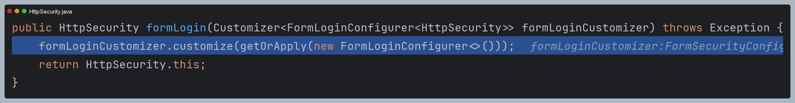

## 2. `FormLoginConfigurer`

- `FormLoginConfigurer`을 생성할 때 부모 클래스에 폼 인증 필터를 생성한다.
- 그리고 인증 매개변수 값을 기본값으로 설정한다.

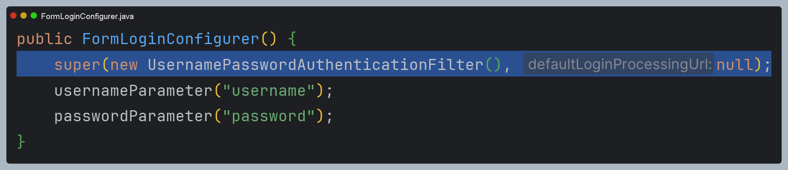

## 3. `AbstractAuthenticationFilterConfigurer`

- 스프링 시큐리티 설정 클래스에서 `http.build()`를 호출하면 이 클래스에서 `init()`과 `configure()` 메서드가
호출되어 초기화 과정을 수행한다.

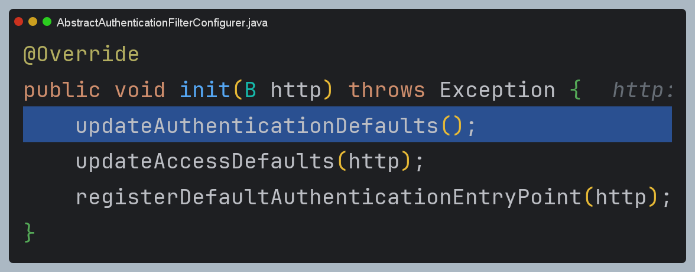

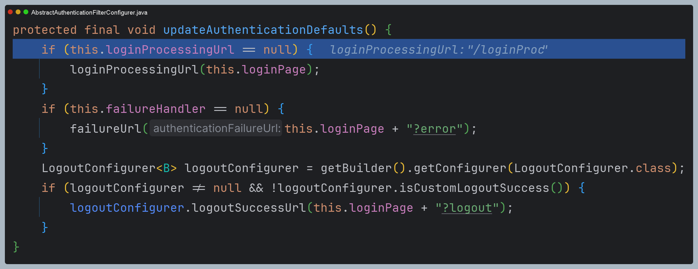

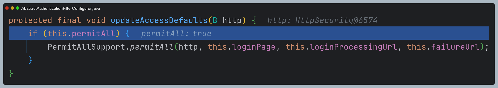

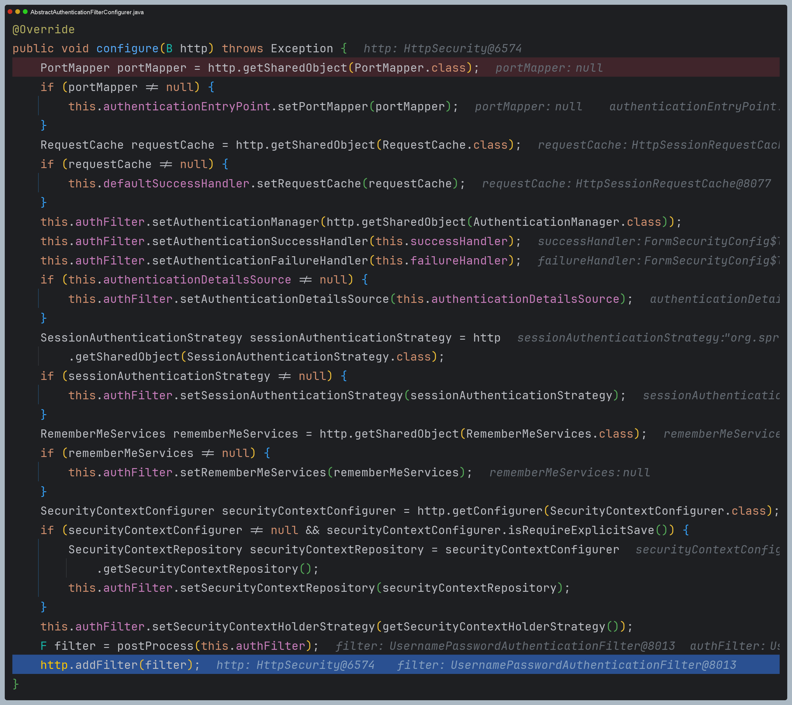

---
## 폼 인증 필터 - UsernamePasswordAuthenticationFilter

- 스프링 시큐리티는 **AbstractAuthenticationProcessingFilter** 클래스를 사용자의 자격 증명을 인증하는 기본 필터로 사용한다.
- `UsernamePasswordAuthenticationFilter`는 **AbstractAuthenticationProcessingFilter** 를 확장한 클래스로, `HttpServletRequest`에서 제출된 사용자 이름과 비밀번호로부터 인증을 수행한다.
- 인증 프로세스가 초기화 될 때 로그인 페이지와 로그아웃 페이지 생성을 위한 `DefaultLoginPageGeneratingFilter` 및 `DefaultLogoutGeneratingFilter`가 초기화 된다.


- 커스텀 구현하려면 **AbstractAuthenticationProcessingFilter** 의 `attemptAuthentication()` 메서드를 재정의 해야 한다. 


---

# 인증 과정 디버깅

## 1. `AbstractAuthenticationProcessingFilter`

- `AbstractAuthenticationProcessingFilter`에서 먼저 요청을 받고, 현재 요청이 인증이 필요한 요청인지 확인한다.
- 인증이 필요하지 않으면 바로 다음 필터로 넘어가고, 인증이 필요한 요청이면 `UsernamePasswordAuthenticationFilter`에서 재정의한
  `attemptAuthentication()` 메서드를 호출한다.

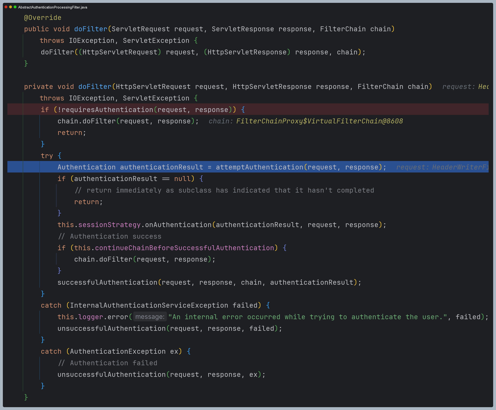

## 2. `UsernamePasswordAuthenticationFilter`

- 파라미터 정보에서 `username`과 `password`를 추출한 뒤, `Authentication`을 생성한다. (`UsernamePasswordAuthenticationToken`)
- 그리고 부모 클래스에 있는 `AuthenticationManger`를 가져와 이후 인증 과정을 수행한다.

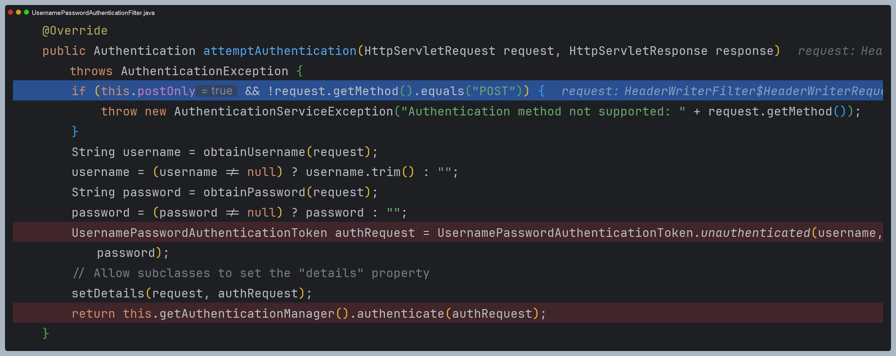

## 3. `AbstractAuthenticationProcessingFilter`

- 인증 과정이 모두 수행되면 다시 부모 클래스로 돌아와 이후 과정을 수행한다.

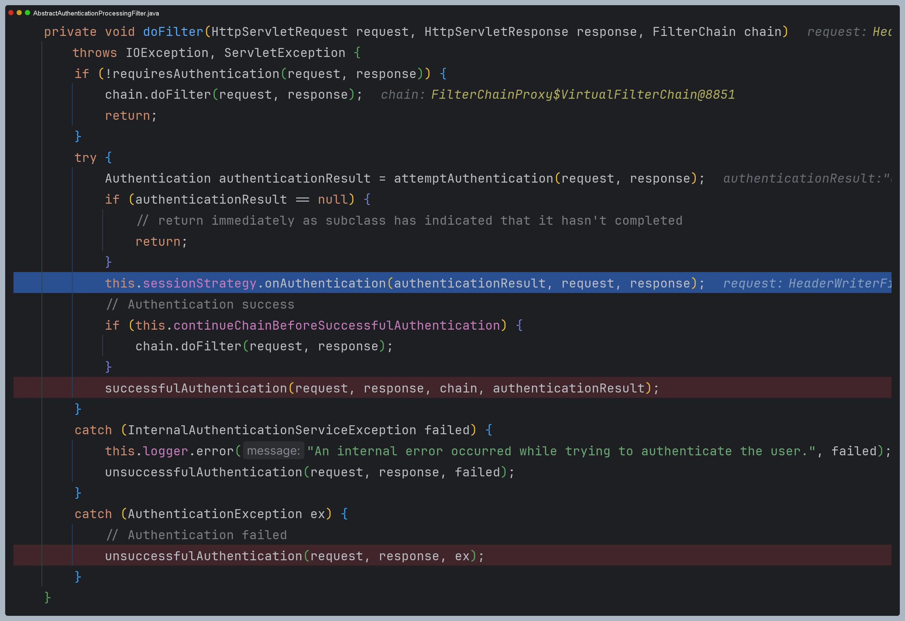

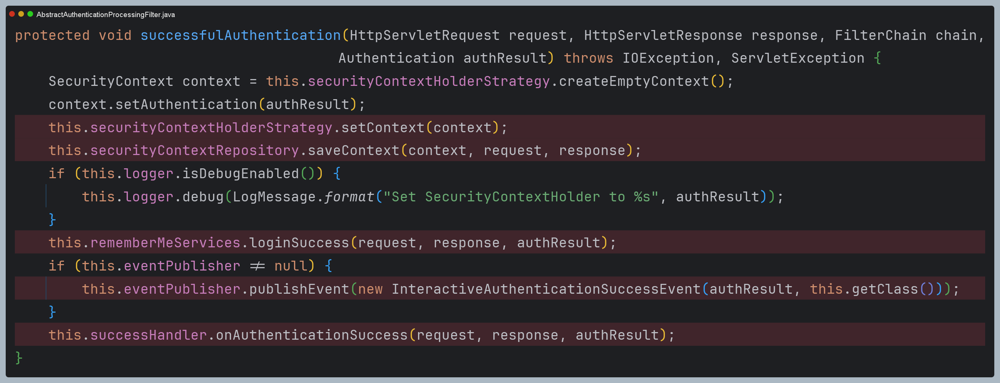

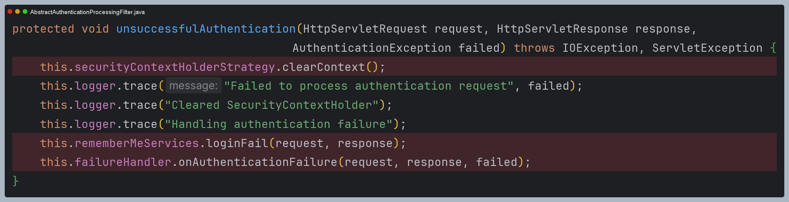

---

[메인 ⏫](https://github.com/genesis12345678/TIL/blob/main/Spring/security/security/main.md)

[다음 ↪️ - 기본 인증(httpBasic())](https://github.com/genesis12345678/TIL/blob/main/Spring/security/security/AuthenticationProcess/HttpBasic.md)