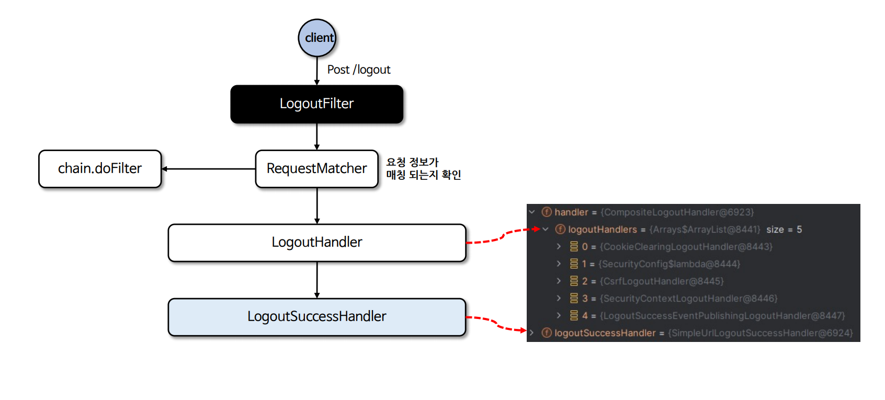

# 로그아웃

- 스프링 시큐리티는 기본적으로 `DefaultLogoutPageGeneratingFilter`를 통해 로그아웃 페이지를 제공하며 **`GET` /logout** URL로 접근이 가능하다.
- 로그아웃 실행은 기본적으로 **`POST` /logout** 으로만 가능하다 CSRF 기능을 비활성화 할 경우 또는 `RequestMatcher`를 사용할 경우 `GET`, `PUT`, `DELETE` 모두 가능하다.
- 로그아웃 필터를 거치지 않고 스프링 MVC 에서 커스텀하게 구현할 수 있으며 로그인 페이지가 커스텀하게 생성될 경우 로그아웃 기능도 커스텀하게 구현해야 한다.

---

## logout()


---

## LogoutFilter



---

```java
@Configuration
@EnableWebSecurity
public class SecurityConfig {

    @Bean
    public SecurityFilterChain securityFilterChain(HttpSecurity http) throws Exception {
        http
                .authorizeHttpRequests(auth -> auth
                        .requestMatchers("/logoutSuccess").permitAll()
                        .anyRequest().authenticated()
                )
                .csrf(csrf -> csrf.disable())
                .formLogin(Customizer.withDefaults())
                .logout(logout -> logout
                        .logoutUrl("/logout")
                        .logoutRequestMatcher(new AntPathRequestMatcher("/logout", "POST"))
                        .logoutSuccessUrl("/logoutSuccess")
                        .logoutSuccessHandler((request, response, authentication) ->
                                response.sendRedirect("/logoutSuccess"))

                        .deleteCookies("JSESSIONID", "remember-me")
                        .invalidateHttpSession(true)
                        .clearAuthentication(true)
                        .addLogoutHandler((request, response, authentication) -> {
                            HttpSession session = request.getSession();
                            session.invalidate();
                            SecurityContextHolder.getContextHolderStrategy().getContext().setAuthentication(null);
                            SecurityContextHolder.getContextHolderStrategy().clearContext();
                        })
                        .permitAll()
                );


        return http.build();
    }
}
```

---

[이전 ↩️ - 익명 인증 사용자(anonymous())](https://github.com/genesis12345678/TIL/blob/main/Spring/security/security/AuthenticationProcess/Anonymous.md)

[메인 ⏫](https://github.com/genesis12345678/TIL/blob/main/Spring/security/security/main.md)

[다음 ↪️ - 요청 캐시(RequestCache & SavedRequest)](https://github.com/genesis12345678/TIL/blob/main/Spring/security/security/AuthenticationProcess/RequestCache.md)