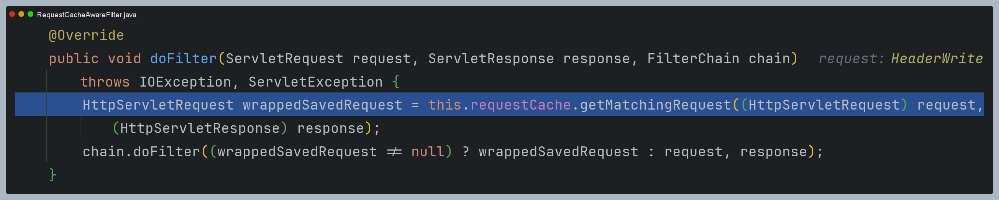
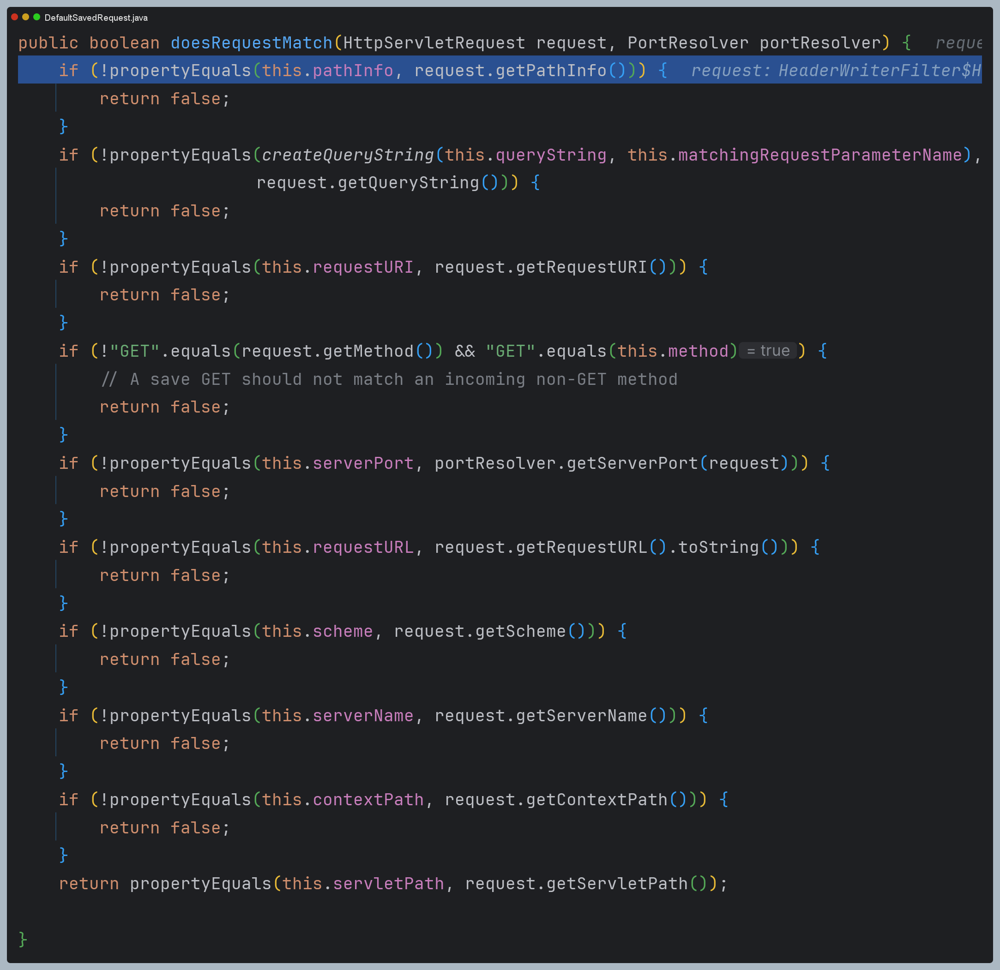

# 요청 캐시

---

## RequestCache

- 인증 절차 문제로 리다이렉트 된 후에 이전에 했던 요청 정보를 담고 있는 `SavedRequest` 객체를 쿠키 또는 세션에 저장하고 필요 시 다시 가져와 실행하는 캐시 메커니즘


- 구현체로 `CookieRequestCache`, `HttpSessionRequestCache`, `NullRequestCache`가 있다.

---

## SavedRequest

- 로그인과 같은 인증 절차 후 사용자를 인증 이전의 원래 페이지로 안내하여 이전 요청과 관련된 여러 정보를 저장한다.


- 구현체로 `DefaultSavedReqeust`와 `SimpleSavedRequest`가 있다.

---


---

## requestCache()

- 다음과 같이 설정 하면 요청 URL에 쿼리 스트링으로 `customParam=y`라는 값이 있을 때만 `HttpSession`에 저장된 `SavedRequest` 를 꺼내오도록 설정할 수 있다.(기본값은 `continue`)


- 요청을 저장하지 않도록 하려면 `NullRequestCache` 구현을 사용한다.


---

## RequestCacheAwareFilter

- 이전에 저장했던 웹 요청(`SavedRequest`)을 다시 불러오는 역할을 한다.
- `SavedRequest`가 현재 Request와 일치하면 이 요청을 필터 체인의 `doFilter` 메서드에 전달하고, `SavedRequest`가 없으면 필터는 원래 Request를 그대로 진행시킨다.


---

```java
@Configuration
@EnableWebSecurity
public class SecurityConfig {

    @Bean
    public SecurityFilterChain securityFilterChain(HttpSecurity http) throws Exception {

        HttpSessionRequestCache requestCache = new HttpSessionRequestCache();
        requestCache.setMatchingRequestParameterName("customParam=y");

        http
                .authorizeHttpRequests(auth -> auth
                        .requestMatchers("/logoutSuccess").permitAll()
                        .anyRequest().authenticated()
                )
                .formLogin(form -> form
                        .successHandler((request, response, authentication) -> {
                            SavedRequest savedRequest = requestCache.getRequest(request, response);
                            String redirectUrl = savedRequest.getRedirectUrl();
                            response.sendRedirect(redirectUrl);
                        }))

                .requestCache(cache -> cache.requestCache(requestCache));

        return http.build();
    }
}
```
```java
@GetMapping("/")
public String index(@RequestParam("customParam") String customParam) {
    if (customParam != null) {
        return "customPage";
    } else {
        return "index";
    }
}
```

---

# 인증 과정 디버깅

## 1. ExceptionTranslationFilter

- 인증이 필요한 요청에 익명 사용자가 요청을 하면 이 필터로 넘어온다.
- 이 필터에서는 인증으로 인해 실패한 요청을 `RequestCache`에 저장한다. 기본적으로 `HttpSessionRequestCache` 구현체를 사용한다.
- 그리고 `AuthenticationEntryPoint`에서 인증을 수행할 수 있는 URL로 리다이렉트한다.


## 2. HttpSessionRequestCache

- `SavedRequest`의 구현체인 `DefaultSavedRequest`를 세션에 저장하는 것을 확인할 수 있다.


## 3. AbstractAuthenticationProcessingFilter

- 인증을 하게 되면 이 필터에서 `successHandler`를 호출한다.


## 4. SavedRequestAwareAuthenticationSuccessHandler

- 기본적으로 사용되는 핸들러인 이 클래스에서 로직을 수행한다.
- `RequestCahce`에서 인증하기 전에 요청에서 세션에 저장한 `SavedRequest`를 받아온다. 그리고 해당 요청 URL로
다시 리다이렉트 하는 것을 확인할 수 있다.
- 필요시 이 로직은 `successHandler`를 재정의하여 커스터마이징 할 수 있다.


## 5. RequestCacheAwareFilter

- 이 필터는 모든 요청마다 항상 거치게 되는 필터이다.
- 이 필터의 목적은 인증이 필요해서 리다이렉트된 경우, 인증 성공 후 원래 요청을 다시 수행할 수 있도록 한다.
- `RequestCache.getMatchingRequest()`를 호출해 현재 요청과 일치하는 저장된 요청이 있는지 확인한다.
- 일치하는 저장된 요청이 없다면 해당 필터로 넘어온 `ServletRequest`를 그대로 다음 필터로 넘기는 것을 확인할 수 있다.






---

[이전 ↩️ - 로그아웃(logout())](https://github.com/genesis12345678/TIL/blob/main/Spring/security/security/AuthenticationProcess/Logout.md)

[메인 ⏫](https://github.com/genesis12345678/TIL/blob/main/Spring/security/security/main.md)