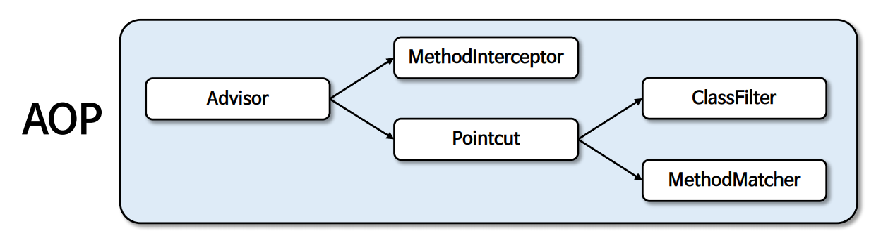
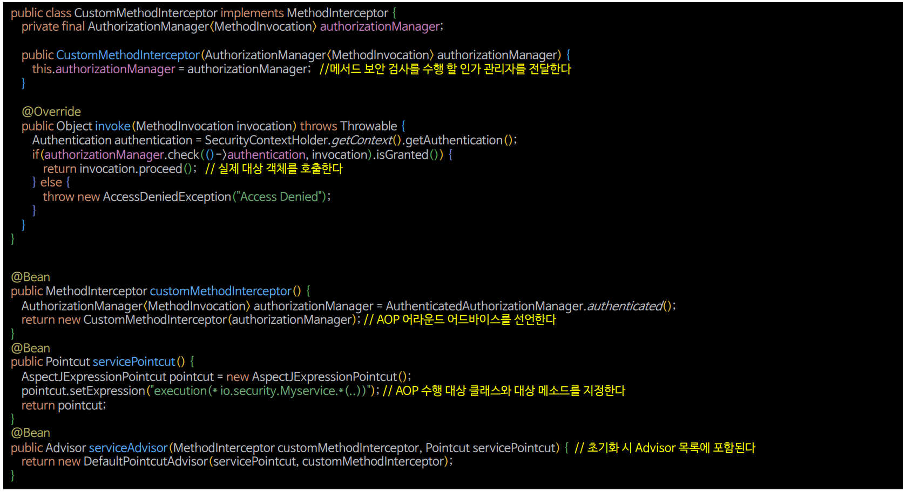

# AOP 메서드 보안

- `MethodInterceptor`, `Pointcut`, `Advisor`, `AuthorizationManager` 등을 커스텀하게 생성하여 AOP 메서드 보안을 구현할 수 있다.

---

## AOP 요소

- **Advisor**
  - `AOP Advice`와 **Advice 적용 가능성을 결정하는 포인트컷**을 가진 기본 인터페이스이다. 
- **MethodInterceptor(Advice)**
  - 대상 객체를 호출하기 전과 후에 추가 작업을 수행하기 위한 인터페이스로서 수행 이후 실제 대상 객체의 조인포인트 호출(메서드 호출)을 위해 `Joinpoint.proceed()`를 호출한다.
- **Pointcut**
  - AOP에서 `Advice`가 적용될 메서드나 클래스를 정의하는 것으로서 어드바이스가 실행되어야 하는 **적용 지점**이나 **조건**을 지정한다.
  - `ClassFilter`와 `MethodMatcher`를 사용해서 어떤 클래스 및 어떤 메서드에 `Advice`를 적용할 것이지 결정한다.



---

## AOP 초기화




---

```java
import org.aopalliance.intercept.MethodInterceptor;
import org.aopalliance.intercept.MethodInvocation;
import org.springframework.security.access.AccessDeniedException;
import org.springframework.security.authorization.AuthorizationManager;
import org.springframework.security.core.Authentication;
import org.springframework.security.core.context.SecurityContextHolder;

public class CustomMethodInterceptor implements MethodInterceptor {

    private final AuthorizationManager<MethodInvocation> authorizationManager;

    public CustomMethodInterceptor(AuthorizationManager<MethodInvocation> authorizationManager) {
        this.authorizationManager = authorizationManager;
    }

    @Override
    public Object invoke(MethodInvocation invocation) throws Throwable {

        Authentication authentication = SecurityContextHolder.getContextHolderStrategy().getContext().getAuthentication();
        if (authorizationManager.check(() -> authentication, invocation).isGranted()) {
            return invocation.proceed();
        }

        throw new AccessDeniedException("Access Denied");
    }
}
```
```java
@Configuration
@EnableMethodSecurity(prePostEnabled = false)
public class MethodSecurityConfig {

    @Bean
    public MethodInterceptor methodInterceptor() {
        AuthorizationManager<MethodInvocation> authorizationManager = new AuthenticatedAuthorizationManager<>();
        return new CustomMethodInterceptor(authorizationManager);
    }

    @Bean
    public Pointcut pointcut() {
        AspectJExpressionPointcut pointcut = new AspectJExpressionPointcut();
        pointcut.setExpression("execution(* io.security.springsecuritymaster.DataService.*(..))");
        return pointcut;
    }

    @Bean
    public Advisor serviceAdvisor() {
        return new DefaultPointcutAdvisor(pointcut(), methodInterceptor());
    }
}
```

---

[이전 ↩️ - 포인트컷 메서드 보안](https://github.com/genesis12345678/TIL/blob/main/Spring/security/AuthorizationProcess/Pointcut.md)

[메인 ⏫](https://github.com/genesis12345678/TIL/blob/main/Spring/security/main.md)