# 요청 기반 인가 관리자

- 스프링 시큐리티는 요청 기반의 인증된 사용자 및 특정 권한을 가진 사용자의 자원 접근 허용여부를 결정하는 인가 관리자 클래스들을 제공한다.
- 대표적으로 `AuthorityAuthorizationManger`, `AuthenticatedAuthorizationManager`와 대리자인 `RequestMatcherDelegatingAuthorizationManager`가 있다.

**스프링 시큐리티 인가처리**


> [참고 - 스프링 시큐리티 공식 문서](https://docs.spring.io/spring-security/reference/servlet/authorization/authorize-http-requests.html#request-authorization-architecture)

---

## AuthenticatedAuthorizationManager 구조

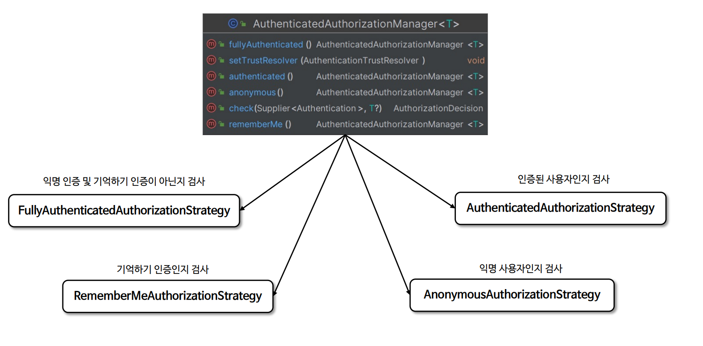

- `AuthenticatedAuthorizationManager`는 내부적으로 네 개의 `AbstractAuthorizationStrategy` 구현을 통해 인증 여부 확인 전략을 세운다.

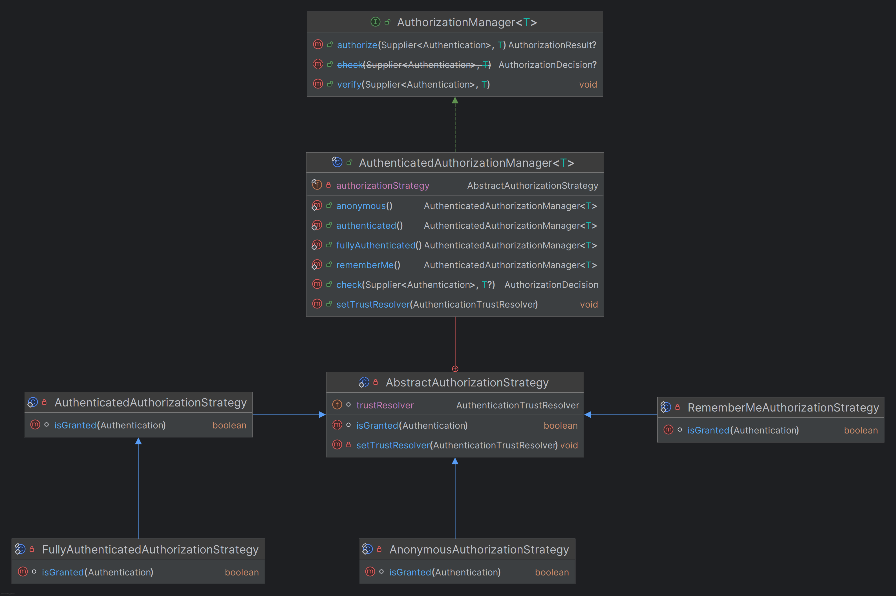

---

## AuthenticatedAuthorizationManager 매핑


---

## AuthenticatedAuthorizationManager 흐름도


---

## AuthorityAuthorizationManger 구조


- `AuthorityAuthorizationManger`는 내부적으로 `AuthoritiesAuthorizationManger` 를 사용하여 권한 여부 결정을 위임한다.

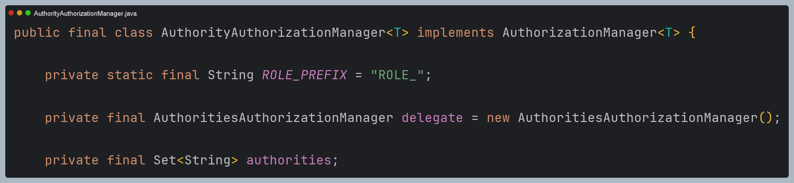

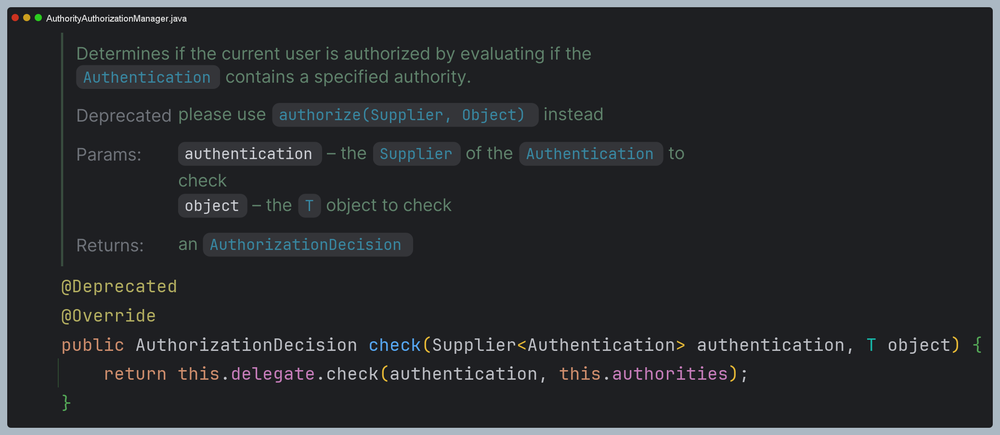

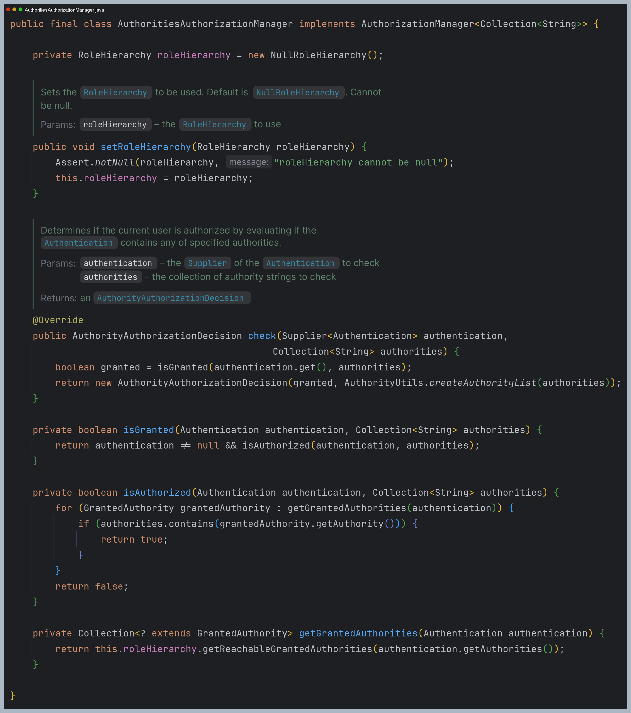

---

## AuthorityAuthorizationManger 매핑

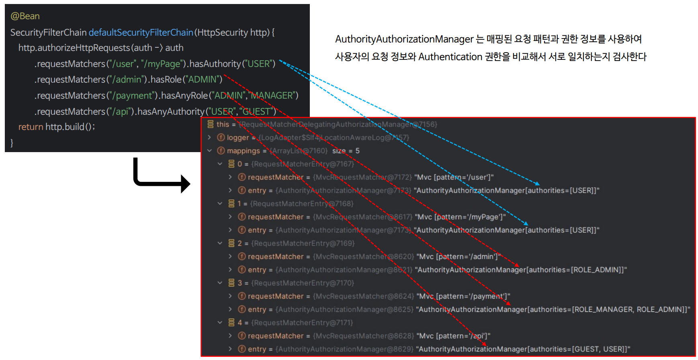

---

## AuthorityAuthorizationManger 흐름도

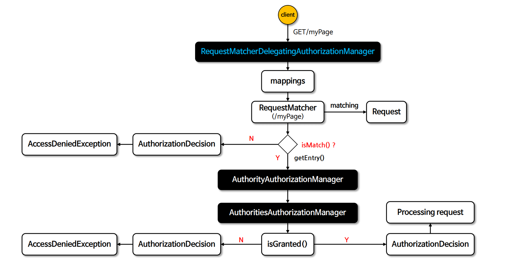

---

# 초기화 과정 디버깅

- `authorizeHttpRequests()` 메서드에 람다식에서 정의한대로 최종 `RequestMatcherDelegatingAuthorizationManager`의
`mappings` 속성에 저장된다.
- 현재 설정 클래스는 4개의 `RequestMatcherEntry`를 저장한다.

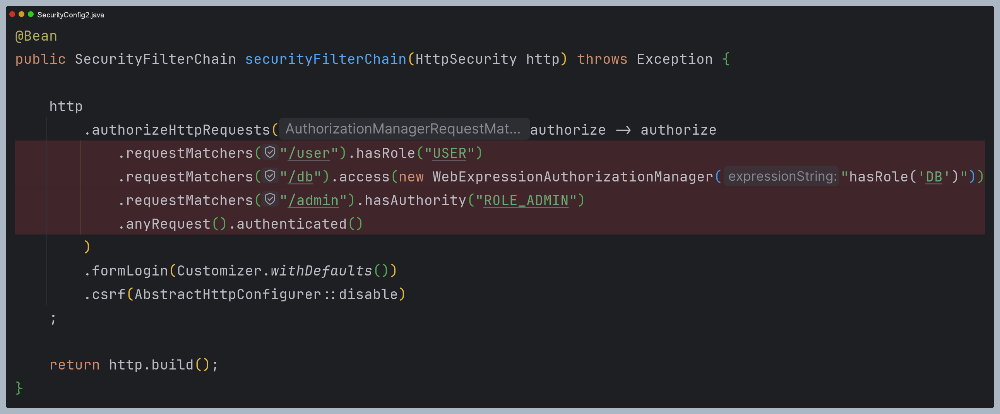

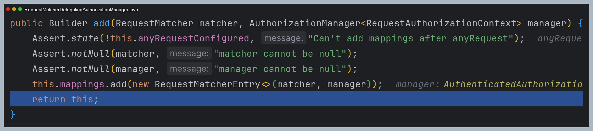

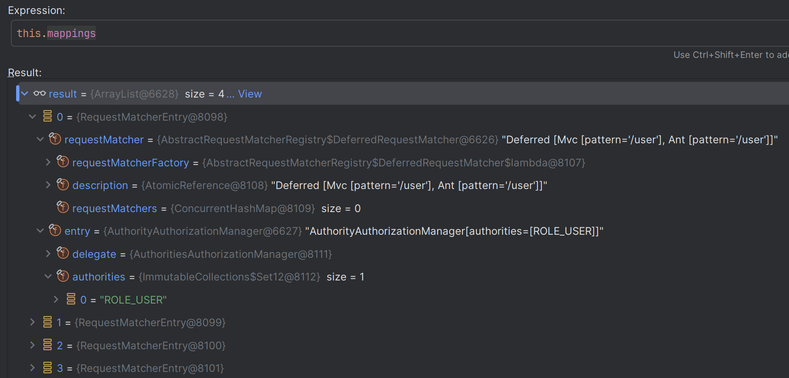

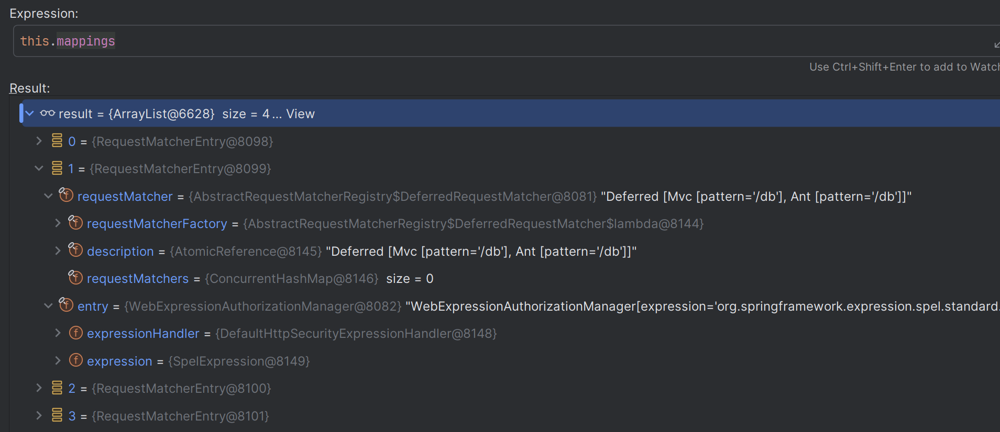

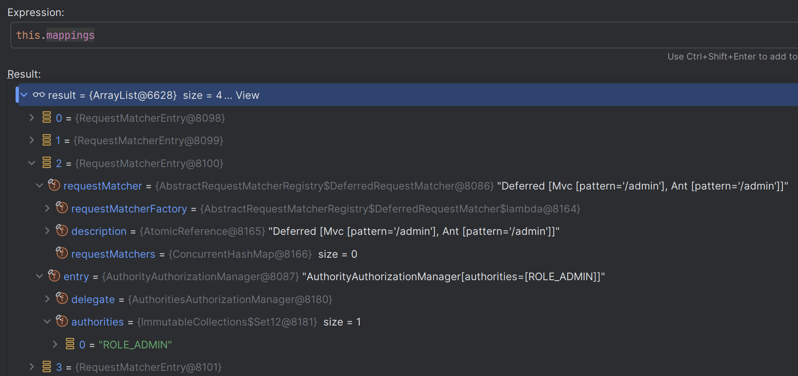

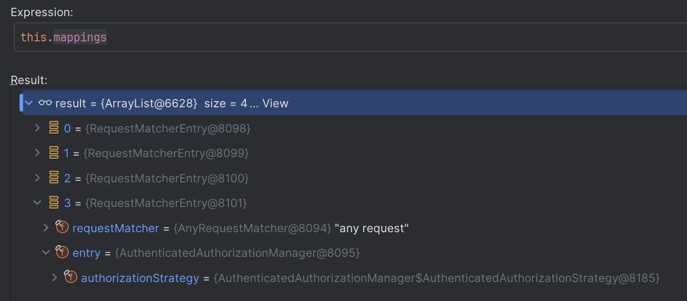

---

# 요청 과정 디버깅

## 1. AuthorizationFilter

- `AuthorizationFilter`는 `SecurityFilterChain` 중에 가장 마지막에 있는 필터로, 이 필터에서 인가 처리가 이루어진다.
- 이 필터는 `AuthorizationManager`에게 인가 처리를 위임한다. 이때 사용되는 `AuthorizationManager`는 
`RequestMatcherDelegatingAuthorizationManager`로, 여기에는 초기화 과정에서 구성된 `RequestMatcherEntry`를 가지고 있다.
- 그리고 인가 처리가 모두 완료되면 `AuthorizationResult`를 반환받고, 반환 결과에 따라 `AuthorizationDeniedException` 예외를 던질지
또는 정상적으로 다음으로 진행할지 결정된다.

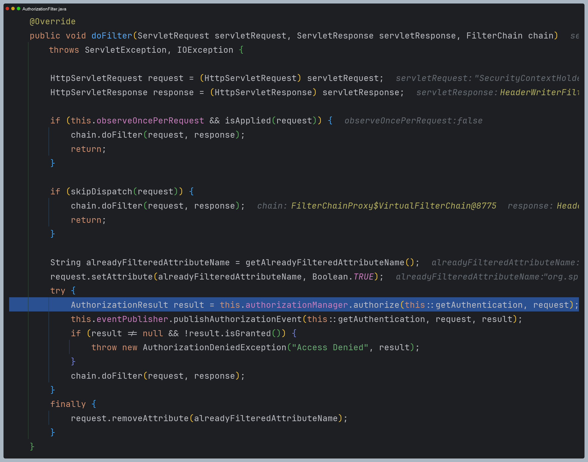

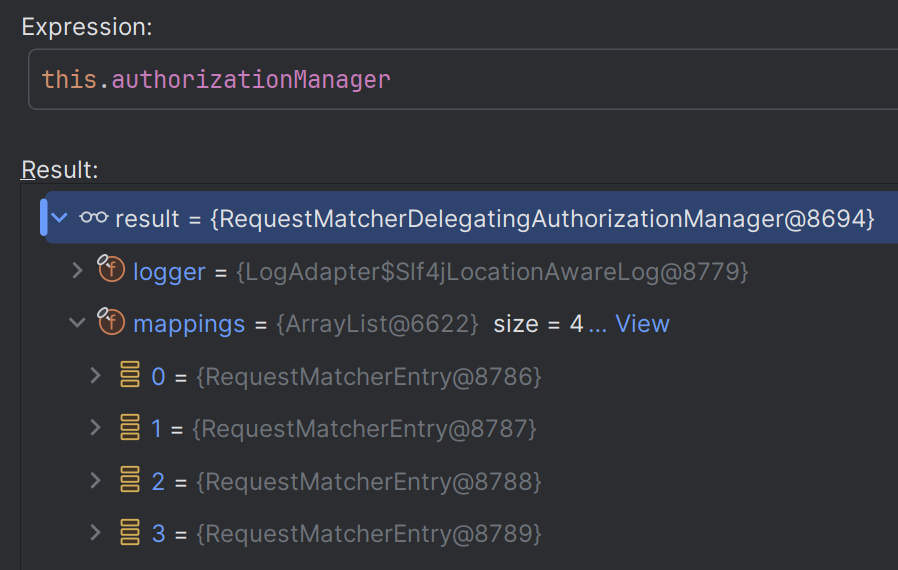

## 2. RequestMatcherDelegatingAuthorizationManager

- 해당 클래스가 가지고 있는 `mappings`, 즉 `RequestMatcherEntry`를 순회하면서 현재 요청 패턴과 일치하는
`RequestMatcherEntry`를 찾는다.
- 일치하는 `RequestMatcherEntry`를 찾았다면, 해당 클래스 안에 있는 `AuthorizationManager`에게 인가 처리를 위임한다.
- 만약 하나도 현재 요청 패턴과 일치하는 `RequestMatcherEntry`가 없다면 기본적으로 `DENY`를 반환한다.

> 🙄 현재 `check()` 메서드는 `Deprecated` 되고 대신 `authorize()`를 사용하라고 하는데 내부적으로 `authorize()`를 호출하고
> 여기서 `check()`를 호출한다.

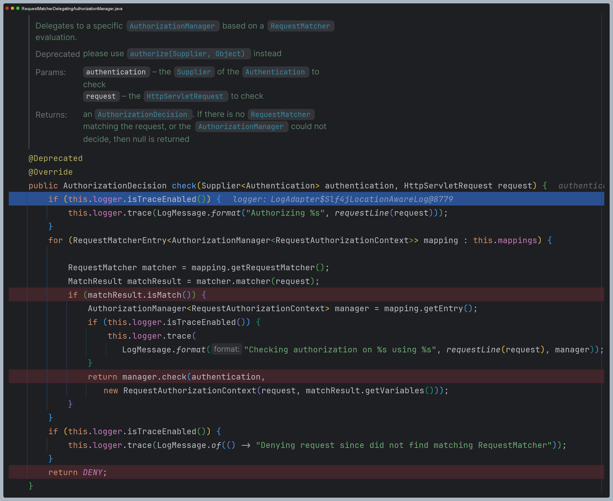

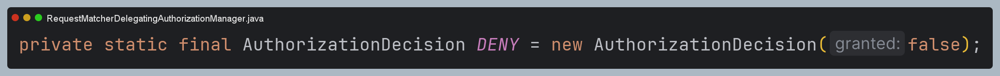

---

## 요청 기반 Custom AuthorizationManager

- 스프링 시큐리티 인가 설정 시 선언적 방식이 아닌 프로그래밍 방식으로 구현할 수 있으며 **access(`AuthorizationManager`)** API를 사용하면 된다.
- `access()`에는 **AuthorizationManager< RequestAuthorizationContext >** 타입의 객체를 전달할 수 있으며 사용자의 요청에 대한 권한 검사를 `access()`에 지정한 **AuthorizationManager**가 처리하게 된다.
- `access()`에 지정한 **AuthorizationManager** 객체는 `RequestMatcherDelegatingAuthorizationManager`의 매핑 속성에 저장된다.

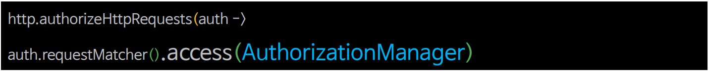

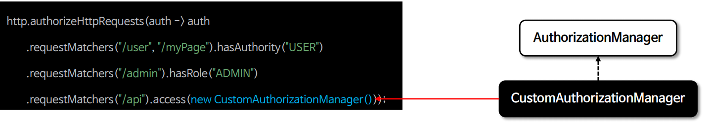

- 특정한 엔드포인트에 대한 권한 검사를 수행하기 위해 `AuthorizationManager`를 구현하여 설정한다.
- `/user`, `/myPage`, `/admin` 요청 패턴의 권한 검사는 `AuthorityAuthorizationManager`가 처리한다.
- `/api` 요청 패턴의 권한 검사는 **CustomAuthorizationManager**가 처리한다.

```java
@Configuration
@EnableWebSecurity
public class SecurityConfig {

    @Bean
    public SecurityFilterChain securityFilterChain(HttpSecurity http) throws Exception {

        http
            .authorizeHttpRequests(authorize -> authorize
                .requestMatchers("/user").hasRole("USER")
                .requestMatchers("/db").access(new WebExpressionAuthorizationManager("hasRole('DB')"))
                .requestMatchers("/admin").hasAuthority("ROLE_ADMIN")
                .requestMatchers("/secure").access(new CustomAuthorizationManager()) //추가
                .anyRequest().authenticated()
            )
            .formLogin(Customizer.withDefaults())
            .csrf(AbstractHttpConfigurer::disable)
        ;
        return http.build();
    }

    @Bean
    public UserDetailsService userDetailsService() {
        UserDetails user = User.withUsername("user")
                .password("{noop}1111")
                .authorities("ROLE_USER")
                .build();

        UserDetails manager = User.withUsername("db")
                .password("{noop}1111")
                .roles("DB")
                .build();

       UserDetails admin = User.withUsername("admin")
               .password("{noop}1111")
               .roles("ADMIN", "SECURE")
               .build();

        return new InMemoryUserDetailsManager(user, manager, admin);
    }
}
```
```java
public class CustomAuthorizationManager implements AuthorizationManager<RequestAuthorizationContext> {

    private static final String REQUIRED_ROLE = "ROLE_SECURE";
    private static final AuthorizationDecision DENY = new AuthorizationDecision(false);

    @Override
    public AuthorizationDecision check(Supplier<Authentication> authentication, RequestAuthorizationContext object) {
        Authentication auth = authentication.get();

        //인증 정보가 없거나 인증되지 않은 경우
        if (auth == null || !auth.isAuthenticated() || auth instanceof AnonymousAuthenticationToken) {
            return DENY;
        }

        //"ROLE_SECURE" 권한을 가진 사용자인지 확인
        boolean hasRequiredRole = auth.getAuthorities()
                                      .stream()
                                      .anyMatch(grantedAuthority ->
                                          REQUIRED_ROLE.equals(grantedAuthority.getAuthority())
                                      );

        return new AuthorizationDecision(hasRequiredRole);
    }
}
```

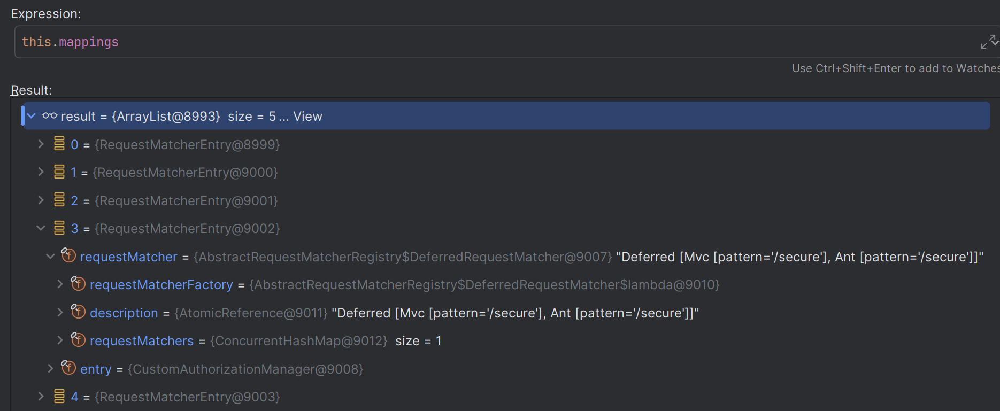

---

[이전 ↩️ - 인가 관리자(`AuthorizationManager`)](https://github.com/genesis12345678/TIL/blob/main/Spring/security/security/AuthorizationProcess/AuthorizationManager.md)

[메인 ⏫](https://github.com/genesis12345678/TIL/blob/main/Spring/security/security/main.md)

[다음 ↪️ - `RequestMatcherDelegatingAuthorizationManager` 인가 설정 응용](https://github.com/genesis12345678/TIL/blob/main/Spring/security/security/AuthorizationProcess/RequestMatcherDelegatingAuthorizationManager.md)