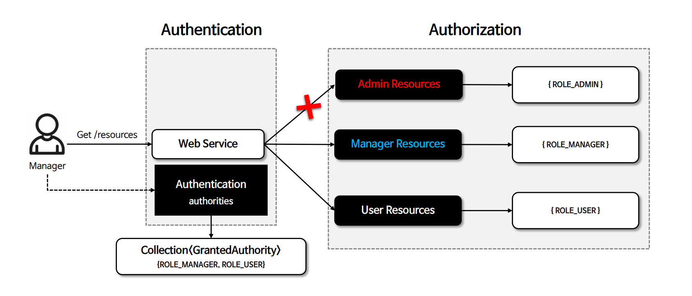
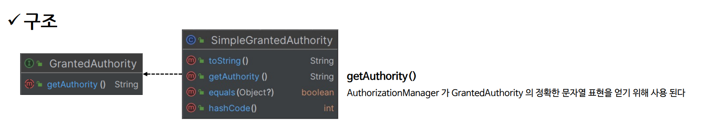

# 인가

## Authorization

- 인가, 즉 권한 부여는 특정 자원에 접근할 수 있는 사람을 결정하는 것을 말한다.
- Spring Security는 `GrantedAuthority` 클래스를 통해 권한 목록을 관리하고 있으며 사용자의 `Authentication` 객체와 연결한다.



---

## GrantAuthority

- 스프링 시큐리티는 `Authentication`에 `GrantedAuthority` 권한 목록을 저장하며 이를 통해 인증 주체에게 부여된 권한을 사용하도록 한다.
- `GrantedAuthority` 객체는 **AuthenticationManager**에 의해 `Authentication` 객체에 삽입되며, 스프링 시큐리티는 인가 결정을 내릴 때 `AuthorizationManager`를 사용하여
    `Authentication`, 즉 인증 주체로부터 `GrantedAuthority` 객체를 읽어들여 처리하게 된다.



### 사용자 정의 역할 접두사

- 기본적으로 역할 기반의 인가 규칙은 역할 앞에 `ROLE_`을 접두사로 사용한다. 즉 `USER` 역할을 가진 보안 컨텍스트가 필요한 인가 규칙이 있다면 스프링 시큐리티는 기본적으로
 `ROLE_USER`를 반환하는 `GrantedAuthority.getAuthority`를 찾는다.
- `GrantedAuthorityDefaults`로 사용자 지정할 수 있으며 `GrantedAuthorityDefaults`는 역할 기반 인가 규칙에 사용할 접두사를 사용자 정의하는 데 사용된다.


---

```java
@Configuration
@EnableWebSecurity
public class SecurityConfig {

    @Bean
    public SecurityFilterChain securityFilterChain(HttpSecurity http) throws Exception {

        http
            .authorizeHttpRequests(authorize -> authorize
                .requestMatchers("/user").hasRole("USER")
                .requestMatchers("/db").hasRole("DB")
                .requestMatchers("/admin").hasRole("ADMIN")
                .anyRequest().authenticated()
            )
            .formLogin(Customizer.withDefaults())
            .csrf(AbstractHttpConfigurer::disable)
        ;
        return http.build();
    }

    @Bean
    public GrantedAuthorityDefaults grantedAuthorityDefaults() {
        return new GrantedAuthorityDefaults("MYPREFIX_");
    }

    @Bean
    public UserDetailsService userDetailsService() {
        UserDetails user = User.withUsername("user")
                .password("{noop}1111")
                .authorities("MYPREFIX_USER")
                .build();

        UserDetails manager = User.withUsername("db")
                .password("{noop}1111")
                .authorities("MYPREFIX_DB")
                .build();

       UserDetails admin = User.withUsername("admin")
               .password("{noop}1111")
               .authorities("MYPREFIX_ADMIN", "MYPREFIX_SECURE")
               .build();

        return new InMemoryUserDetailsManager(user, manager, admin);
    }
}
```

- 여기서 중요한 것은 `GrantedAuthorityDefaults`에서 설정한 사용자 정의 접두어는 요청 기반 권한 부여의 `hasRole()`의
접두어만 변경된다는 점이다.
- 그러니까 `User` 객체를 생성할 때는 사용자 정의 접두어와는 관련이 없다. 즉 일반적인 `roles()` 메서드로 권한을 부여하면
`ROLE_` 접두어를 기본으로 사용하고 사용자 정의 접두어와 다르기 때문에 기대하지 못한 결과를 가질 수 있다.
- 따라서 `GrantedAuthorityDefaults`로 접두어를 변경했다면, 권한을 부여할 때 `roles()` 대신 위 코드와 같이 `authorities()`와 같은
메서드를 사용해 사용자 정의 접두어까지 적용된 권한을 명시적으로 부여해야한다.

---

[메인 ⏫](https://github.com/genesis12345678/TIL/blob/main/Spring/security/security/main.md)

[다음 ↪️ - 인가 관리자(`AuthorizationManager`)](https://github.com/genesis12345678/TIL/blob/main/Spring/security/security/AuthorizationProcess/AuthorizationManager.md)