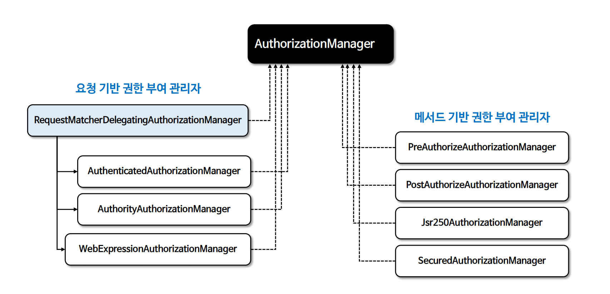

# 인가 관리자

- `AuthorizationManager`는 인증된 사용자가 요청 자원에 접근할 수 있는지 여부를 결정하는 인터페이스로서 인증된 사용자의 권한 정보와 요청 자원의 보안 요구 사항을 기반으로 권한 부여 결정을 내린다.
- `AuthorizationManager`는 스프링 시큐리티의 요청 기반, 메서드 기반의 인가 구성 요소에서 호출되며 최종 액세스 제어 결정을 수행한다.
- `AuthorizationManager`는 스프링 시큐리티의 필수 구성 요소로서 권한 부여 처리는 `AuthorizationFilter`를 통해 이루어지며 `AuthorizationFilter`는 `AuthorizationManager`를 호출하여 권한 부여 결정을 내린다.

- **check()**
  - 권한 부여 결정을 내릴 때 필요한 모든 관련 정보(인증 객체, 체크 대상(권한 정보, 요청 정보, 호출 정보 등))가 전달된다.
  - 액세스가 허용 되면 `true`를 포함하는 **AuthorizationDecision**, 거부되면 `false`를 포함하는 **AuthorizationDecision**, 결정을 내릴 수 없는 경우 `null`을 반환한다.
- **verify()**(디폴트)
  - `check`를 호출해서 반환된 값이 `false`를 가진 **AuthorizationDecision** 인 경우 `AccessDeniedException`을 던진다.

---

## AuthorizationManager 클래스 계층 구조

---

[이전 ↩️ - 인가(`Authorization`)](https://github.com/genesis12345678/TIL/blob/main/Spring/security/AuthorizationProcess/Authorization.md)

[메인 ⏫](https://github.com/genesis12345678/TIL/blob/main/Spring/security/main.md)

[다음 ↪️ - 요청 기반 인가 관리자](https://github.com/genesis12345678/TIL/blob/main/Spring/security/AuthorizationProcess/AuthorityAuthorizationManager.md)