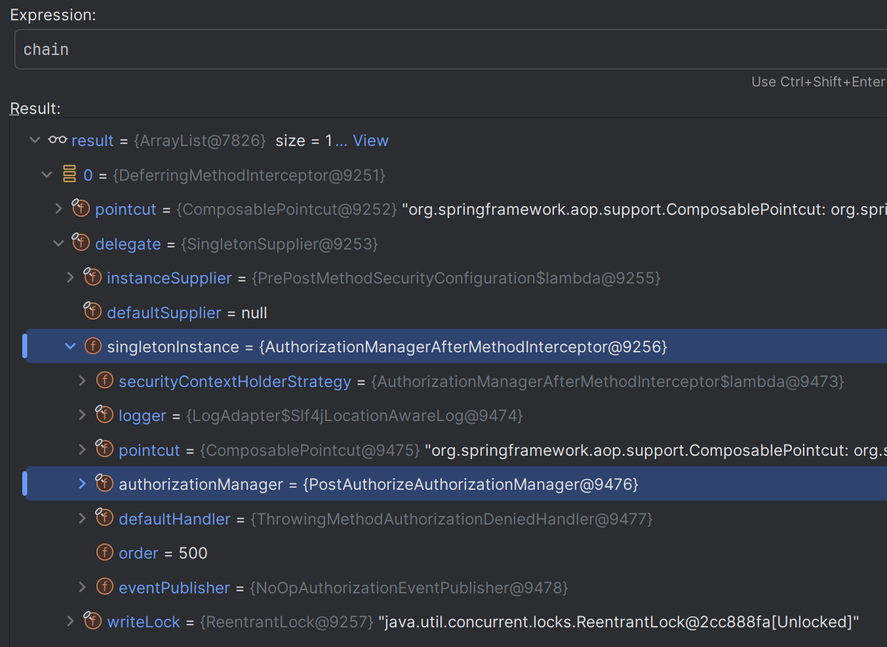

# 메서드 기반 인가 관리자

- 스프링 시큐리티는 메서드 기반의 인증된 사용자 및 특정 권한을 가진 사용자의 자원 접근 허용여부를 결정하는 인가 관리자 클래스들을 제공한다.
- `PreAuthorizeAuthorizationManager`, `PostAuthorizeAuthorizationManager`, `Jsr250AuthorizationManager`, `SecuredAuthorizationManager`가 있다.
- 메서드 기반 권한 부여는 내부적으로 **AOP 방식에 의해 초기화 설정이 이루어지며** 메서드의 호출을 `MethodInterceptor`가 가로 채어 처리하고 있다.


> [참고 - 스프링 시큐리티 공식 문서](https://docs.spring.io/spring-security/reference/servlet/authorization/method-security.html#method-security-architecture)

---

## 메서드 권한 부여 초기화 과정


> 1. 스프링은 초기화 시 생성되는 전체 빈을 검사하면서 **빈이 가진 메서드 중에서 보안이 설정된 메서드가 있는지 탐색한다.**
> 2. 보안이 설정된 메서드가 있다면 스프링은 **그 빈의 프록시 객체를 자동으로 생성한다.** (기본적으로 `CGLIB` 방식)
> 3. 보안이 설정된 메서드에는 **인가처리 기능을 하는 `Advice`를 등록한다.**
> 4. 스프링은 빈 참조 시 실제 빈이 아닌 **프록시 빈 객체를 참조**하도록 처리한다.
> 5. 초기화 과정이 종료된다.
> 6. 사용자는 **프록시 객체를 통해 메서드를 호출**하게 되고, 프록시 객체는 **`Advice`가 등록된 메서드가 있다면 호출하여 작동 시킨다.**
> 7. **`Advice`는 메서드 진입 전 인가 처리**를 하게 되고 인가 처리가 승인되면 **실제 객체의 메서드를 호출**하게 되고 인가 처리가 거부되면 예외가 발생하고 메서드 진입에 실패한다.

---

## 메서드 인터셉터 구조


- **AuthorizationManagerBeforeMethodInterceptor**
  - `@PreAuthorize`
- **AuthorizationManagerAfterMethodInterceptor**
  - `@PostAuthorize`
- **PreFilterAuthorizationMethodInterceptor**
  - `@PreFilter`
- **PostFilterAuthorizationMethodInterceptor**
  - `@PostFilter`


---

# 초기화 과정 디버깅

```java
@Configuration
@EnableWebSecurity
@EnableMethodSecurity(securedEnabled = true, jsr250Enabled = true)
public class SecurityConfig {

    @Bean
    public SecurityFilterChain securityFilterChain(HttpSecurity http) throws Exception {

        http
            .authorizeHttpRequests(authorize -> authorize
                  .anyRequest().authenticated()
            )
            .formLogin(Customizer.withDefaults())
            .csrf(AbstractHttpConfigurer::disable)
        ;
        
        return http.build();
    }

    @Bean
    public UserDetailsService userDetailsService() {
        UserDetails user = User.withUsername("user")
                .password("{noop}1111")
                .roles("USER")
                .build();

        UserDetails manager = User.withUsername("db")
                .password("{noop}1111")
                .roles("DB")
                .build();

        UserDetails admin = User.withUsername("admin")
               .password("{noop}1111")
               .roles("ADMIN", "SECURE")
               .build();

        return new InMemoryUserDetailsManager(user, manager, admin);
    }
}
```
```java
@Getter
@AllArgsConstructor
public class Account {
    private String owner;
    private boolean isSecure;
}
```
```java
@Service
public class DataService {

    @PreAuthorize("hasAnyAuthority('ROLE_USER')")
    public String getUser() {
        return "user";
    }

    @PostAuthorize("returnObject.owner == authentication.name")
    public Account getOwner(String name) {
        return new Account(name, false);
    }

    public String display() {
        return "display";
    }
}
```

- 현재 `this`는 `InfrastructureAdvisorAutoProxyCreator`이며, 이 클래스의 부모 클래스에서 프록시를 생성하는 초기화를 수행한다.
- 먼저 빈으로 등록된 `MethodInterceptor`를 조회한다. 이 빈들은 다른 초기화 과정에서 등록된다.
- 이 `MethodInterceptor`를 보면(`specificInterceptors`) `DataService`에서 설정한 `@PreAuthorize`와 `@PostAuthorize`에 해당하는
포인트컷과 `AuthorizationManager`가 있는 것을 확인할 수 있다.
  - 여기서도 내부적으로 최적화를 위해 `AuthorizationManager`를 모두 `Supplier`로 래핑해서 생성하는 듯 하다.


- `ProxyFactory`에 `Advisor`와 `TargetSource`를 저장하고, 프록시 객체를 생성해서 반환한다.


- 여러 조건들을 확인해 `JdkDynamicProxy` 또는 `CGLIB` 프록시 객체를 생성한다.


- 최종적으로 다음과 같이 `DataService`에 대한 프록시 객체가 만들어진다.
- 생성된 프록시를 보면 콜백 메서드를 가지고 있고, 요청에 따라 AOP가 필요하다면 해당 콜백 메서드를 관리하는
클래스를 호출하는 것이다.


---

# 요청 과정 디버깅

## @PreAuthorize


- 먼저 `@PreAuthorize`의 과정을 알아보자.
- 가장 먼저 프록시 객체에 저장된 콜백 객체 중 첫번째인 `DynamicAdvisedInterceptor`에 온다.


- 다음 과정에서 생성된 `chain`을 보면 `AuthorizationManagerBeforeMethodInterceptor`가 들어있는 것을 확인할 수 있다.


- 드디어 `AuthorizationManagerBeforeMethodInterceptor`로 넘어왔다.
- 지금까지의 과정이 스프링 AOP 영역에서 처리되는 과정이었다면, 이제부터는 스프링 시큐리티 영역에서 권한 심사가 이루어진다.
- 이 코드의 핵심은 `AuthorizationManager`에게 인가 처리를 위임하고, 결과에 따라 `proceed()`를 호출해 실제 객체를 호출할지 아니면
권한 부족으로 예외를 처리할 지 구분하는 것이다.


- 여기서 사용되는 `AuthorizationManager` 구현체는 `PreAuthorizeAuthorizationManager`이다.


- 인가 처리가 모두 정상적으로 수행되어 `proceed()`를 호출하면 드디어 실제 객체가 호출이 된다.


## @PostAuthorize


- 이제 `@PostAuthorize`의 과정을 알아보자. 전반적으로 `@PreAuthorize`와 매우 비슷하다.


- `chain`에 `AuthorizationManagerAfterMethodInterceptor`가 들어있는 것을 확인할 수 있다.




- `@PostAuthroize`는 `@PreAuthorize`와 반대로 먼저 실제 객체를 호출하고, 반환받은 값으로 `attemptAuthorization()`를 호출하여
권한 심사가 이루어진다.


- 여기서도 역시 `AuthorizationManager`에게 인가 처리를 위임하고, 결과(`AuthorizationResult`)에 따라
후속 처리가 달라지는 것을 확인할 수 있다.
- 여기서 사용되는 `AuthorizationManager` 구현체는 `PostAuthorizeAuthorizationManager`이다.


---

## 메서드 기반 Custom AuthorizationManager

- 사용자 정의 `AuthorizationManager` 를 생성해 메서드 보안을 구현할 수 있다.

```java
@Configuration
@EnableMethodSecurity(prePostEnabled = false)//시큐리티가 제공하는 클래스들을 비활성화 한다. 그렇지 않으면 중복해서 검사하게 된다.
public class MethodSecurityConfig {

    @Bean
    @Role(BeanDefinition.ROLE_INFRASTRUCTURE)
    public Advisor preAuthorize() {
        return AuthorizationManagerBeforeMethodInterceptor.preAuthorize(new MyPreAuthorizationManager());
    }

    @Bean
    @Role(BeanDefinition.ROLE_INFRASTRUCTURE)
    public Advisor postAuthorize() {
        return AuthorizationManagerAfterMethodInterceptor.postAuthorize(new MyPostAuthorizationManager());
    }
}
```
```java
public class MyPreAuthorizationManager implements AuthorizationManager<MethodInvocation> {

    @Override
    public AuthorizationDecision check(Supplier<Authentication> authentication, MethodInvocation object) {
        Authentication auth = authentication.get();

        if (auth instanceof AnonymousAuthenticationToken) {
            return new AuthorizationDecision(false);
        }

        return new AuthorizationDecision(auth.isAuthenticated());
    }
}
```
```java
public class MyPostAuthorizationManager implements AuthorizationManager<MethodInvocationResult> {

    @Override
    public AuthorizationDecision check(Supplier<Authentication> authentication, MethodInvocationResult object) {
        Authentication auth = authentication.get();

        if (auth instanceof AnonymousAuthenticationToken) {
            return new AuthorizationDecision(false);
        }

        Account account = (Account) object.getResult();
        boolean isGranted = account.getOwner().equals(auth.getName());

        return new AuthorizationDecision(isGranted);
    }
}
```

> 사용자 정의 `AuthorizationManager`는 여러 개 추가할 수 있으며, 그럴 경우 체인 형태로 연결되어 각각 권한 검사를 하게 된다.

```java
@Service
public class DataService {

    @PreAuthorize("") //특별한 표현식은 필요 없다.
    public String getUser() {
        return "user";
    }

    @PostAuthorize("") //특별한 표현식은 필요 없다.
    public Account getOwner(String name) {
        return new Account(name, false);
    }
}
```

> **👏 참고 - 인터셉터 순서 지정**
> 
> 
>
> - 메서드 보안 어노테이션에 대응하는 AOP 메서드 인터셉터들은 AOP 어드바이저 체인에서 특정 위치를 차지한다.
> - 구체적으로 `@PreFilter` 메서드 인터셉터의 순서는 100, `@PreAuthorize` 의 순서는 200 등으로 설정되어 있다.
> - 이것이 중요한 이유는 **@EnableTransactionManagement** 와 같은 다른 AOP 기반 어노테이션들이 `Integer.MAX_VALUE`로 순서가 설정되어 있는데 기본적으로 이들은
>   어드바이저 체인의 끝에 위치하고 있다.
> - 만약 스프링 시큐리티보다 먼저 다른 어드바이스가 실행 되어야 할 경우, 예를 들어 `@Transactional`과 `@PostAuthorize`가 함께 어노테이션 된 메서드가 있을 때 `@PostAuthorize`가 실행될 때
>   트랜잭션이 여전히 열려 있어서 `AccessDeniedException` 이 발생하면 롤백이 일어나게 하고 싶을 수 있다.
> - 그래서 메서드 인가 어드바이스가 실행되기 전에 트랜잭션을 열기 위해서는 **@EnableTransactionManagement** 의 순서를 설정해야 한다.
> 
> **@EnableTransactionManagement(order = 0)**
> - 위의 `order = 0` 설정은 트랜잭션 관리가 `@PreFilter` 이전에 실행되도록 하며 `@Transactional` 어노테이션이 적용된 메서드가 스프링 시큐리티의 `@PostAuthorize` 와 같은
>   보안 어노테이션이 먼저 실행되어 트랜잭션이 열린 상태에서 보안 검사가 이루어지도록 할 수 있다. 이러한 설정은 트랜잭션 관리와 보안 검사의 순서에 따른 의도하지 않은 사이드 이펙트를 방지할 수 있다.
> - **AuthorizationInterceptorsOrder를 사용하여 인터셉터 간 순서를 지정할 수 있다.**

---

[이전 ↩️ - `RequestMatcherDelegatingAuthorizationManager` 인가 설정 응용](https://github.com/genesis12345678/TIL/blob/main/Spring/security/security/AuthorizationProcess/RequestMatcherDelegatingAuthorizationManager.md)

[메인 ⏫](https://github.com/genesis12345678/TIL/blob/main/Spring/security/security/main.md)

[다음 ↪️ - 포인트컷 메서드 보안](https://github.com/genesis12345678/TIL/blob/main/Spring/security/security/AuthorizationProcess/Pointcut.md)