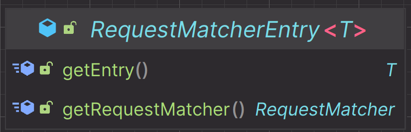
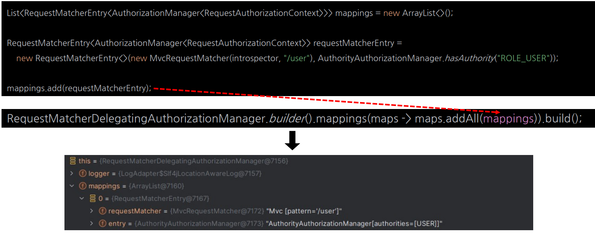
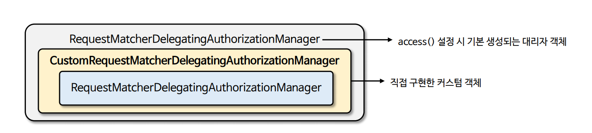
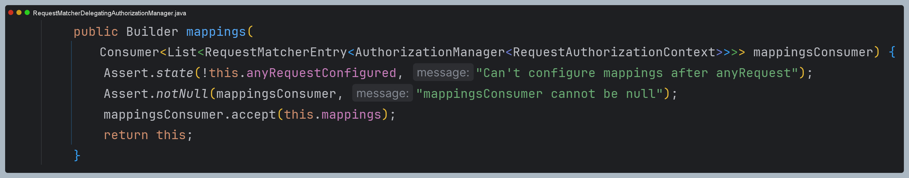
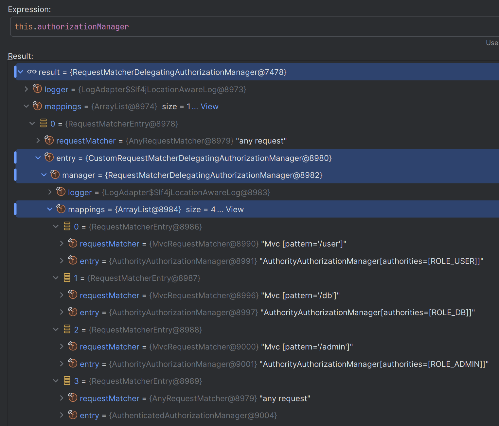

# RequestMatcherDelegatingAuthorizationManager 로 인가 설정 응용

- `RequestMatcherDelegatingAuthorizationManager` 의 **mappings** 속성에 직접 `RequestMatcherEntry` 객체를 생성하고 추가한다.



- `getEntry()`
  - 요청 패턴에 매핑된 `AuthorizationManager` 객체를 반환한다.
- `getRequestMatcher()`
  - 요청 패턴을 저장한 `RequestMatcher` 객체를 반환한다.



---

## 적용

- **RequestMatcherDelegatingAuthorizationManager**를 감싸는 **CustomRequestMatcherDelegatingAuthorizationManager**를 구현할 수 있다.




- 요청에 대한 권한 검사를 `RequestMatcherDelegatingAuthorizationManager` 객체가 수행하도록 한다.
- `RequestMatcherDelegatingAuthorizationManager` > **CustomRequestMatcherDelegatingAuthorizationManager** > `RequestMatcherDelegatingAuthorizationManager`
  구조는 개선이 필요하다.

```java
@Configuration
@EnableWebSecurity
public class SecurityConfig {

    @Bean
    public SecurityFilterChain securityFilterChain(HttpSecurity http) throws Exception {

        http
            .authorizeHttpRequests(authorize -> authorize
                  .anyRequest().access(authorizationManager(null))
            )
            .formLogin(Customizer.withDefaults())
            .csrf(AbstractHttpConfigurer::disable)
        ;
        return http.build();
    }

    @Bean
    public AuthorizationManager<RequestAuthorizationContext> authorizationManager(HandlerMappingIntrospector introspector) {
        List<RequestMatcherEntry<AuthorizationManager<RequestAuthorizationContext>>> mappings = new ArrayList<>();
    
        RequestMatcherEntry<AuthorizationManager<RequestAuthorizationContext>> userEntry =
                new RequestMatcherEntry<>(
                        new MvcRequestMatcher(introspector, "/user"),
                        AuthorityAuthorizationManager.hasAuthority("ROLE_USER")
                );
    
        RequestMatcherEntry<AuthorizationManager<RequestAuthorizationContext>> dbEntry =
                new RequestMatcherEntry<>(
                        new MvcRequestMatcher(introspector, "/db"),
                        AuthorityAuthorizationManager.hasAuthority("ROLE_DB")
                );
    
        RequestMatcherEntry<AuthorizationManager<RequestAuthorizationContext>> adminEntry =
                new RequestMatcherEntry<>(
                        new MvcRequestMatcher(introspector, "/admin"),
                        AuthorityAuthorizationManager.hasAuthority("ROLE_ADMIN")
                );
    
        RequestMatcherEntry<AuthorizationManager<RequestAuthorizationContext>> anyEntry =
                new RequestMatcherEntry<>(
                        AnyRequestMatcher.INSTANCE,
                        new AuthenticatedAuthorizationManager<>()
                );
    
        mappings.add(userEntry);
        mappings.add(dbEntry);
        mappings.add(adminEntry);
        mappings.add(anyEntry);

        return new CustomRequestMatcherDelegatingAuthorizationManager(mappings);
    }
    
    @Bean
    public UserDetailsService userDetailsService() {
        UserDetails user = User.withUsername("user")
                .password("{noop}1111")
                .roles("USER")
                .build();

        UserDetails manager = User.withUsername("db")
                .password("{noop}1111")
                .roles("DB")
                .build();

       UserDetails admin = User.withUsername("admin")
               .password("{noop}1111")
               .roles("ADMIN", "SECURE")
               .build();

       return new InMemoryUserDetailsManager(user, manager, admin);
    }
}
```

> 👏 참고 - [`HandlerMappingIntrospector`관련 스프링 공식 문서](https://docs.spring.io/spring-security/reference/servlet/integrations/mvc.html#mvc-requestmatcher)
> 

```java
public class CustomRequestMatcherDelegatingAuthorizationManager implements AuthorizationManager<RequestAuthorizationContext> {

    private final RequestMatcherDelegatingAuthorizationManager manager;

    public CustomRequestMatcherDelegatingAuthorizationManager(
            List<RequestMatcherEntry<AuthorizationManager<RequestAuthorizationContext>>> mappings) {
        
        this.manager = RequestMatcherDelegatingAuthorizationManager.builder()
                                                                   .mappings(maps -> maps.addAll(mappings))
                                                                   .build();
    }

    @Override
    public AuthorizationDecision check(Supplier<Authentication> authentication, RequestAuthorizationContext object) {
        return manager.check(authentication, object.getRequest());
    }

    @Override
    public void verify(Supplier<Authentication> authentication, RequestAuthorizationContext object) {
        AuthorizationManager.super.verify(authentication, object);
    }
}
```

> 👏 참고 - `RequestMatcherDelegatingAuthorizationManager.builder().mappings()` 메서드는`Consumer`를 인자로 받는다.
> 
> 

- 스프링 시큐리티 초기화 시 생성되는 `RequestMatcherDelegatingAuthorizationManager`가 **CustomRequestMatcherDelegatingAuthorizationManager**에게 위임하고,
또 `RequestMatcherDelegatingAuthorizationManager`에게 위임하는 구조가 되는 것을 확인할 수 있다.



---

[이전 ↩️ - 요청 기반 인가 관리자](https://github.com/genesis12345678/TIL/blob/main/Spring/security/security/AuthorizationProcess/AuthorityAuthorizationManager.md)

[메인 ⏫](https://github.com/genesis12345678/TIL/blob/main/Spring/security/security/main.md)

[다음 ↪️ - 메서드 기반 인가 관리자](https://github.com/genesis12345678/TIL/blob/main/Spring/security/security/AuthorizationProcess/PreAuthorizeAuthorizationManager.md)