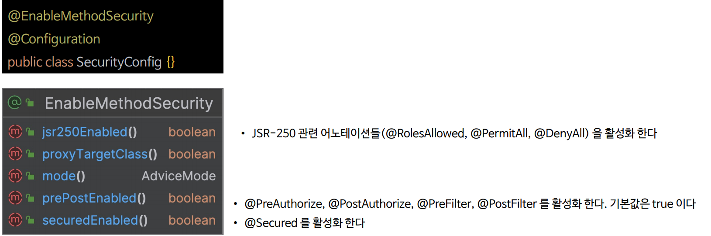

# 메서드 기반 권한 부여

- Spring Security는 요청 수준의 권한 부여뿐만 아니라 메서드 수준에서의 권한 부여를 지원한다.
- 메서드 수준 권한 부여를 활성화 하기 위해서는 설정 클래스에 **EnableMethodSecurity** 어노테이션을 추가해야 한다.
- SpEL(Spring Expression Language) 표현식을 사용하여 다양한 보안 조건을 정의할 수 있다.

---

## @EnableMethodSecurity



---

## @PreAuthorize

- `@PreAuthorize` 어노테이션은 메서드가 실행되기 전에 특정한 보안 조건이 충족되는지 확인하는 데 사용되며 보통 서비스 또는 컨트롤러 레이어의 메서드에 적용되어 
    해당 메서드가 호출되기 전에 사용자의 인증 정보와 권한을 검사한다.


---

## @PostAuthorize

- `@PostAuthorize` 어노테이션은 메서드가 실행된 후에 보안 검사를 수행하는 데 사용된다.
- `@PreAuthorize`와는 달리, `@PostAuthorize`는 메서드 실행 후 결과에 대한 보안 조건을 검사하여 특정 조건을 만족하는 경우에만 사용자가 결과를 받을 수 있도록 한다.


---

```java
@Configuration
@EnableWebSecurity
@EnableMethodSecurity
public class SecurityConfig {

    @Bean
    public SecurityFilterChain securityFilterChain1(HttpSecurity http) throws Exception {

        http
            .authorizeHttpRequests(authorize -> authorize
                .anyRequest().authenticated()
            )
            .formLogin(Customizer.withDefaults())
        ;
        return http.build();
    }
    
    @Bean
    public UserDetailsService userDetailsService() {
        UserDetails user = User.withUsername("user")
                .password("{noop}1111")
                .roles("USER")
                .build();

        UserDetails db = User.withUsername("db")
                .password("{noop}1111")
                .roles("DB")
                .build();

       UserDetails admin = User.withUsername("admin")
               .password("{noop}1111")
               .roles("ADMIN", "SECURE")
               .build();

        return new InMemoryUserDetailsManager(user, db, admin);
    }
}
```
```java
@RestController
public class MethodController {

    @GetMapping("/admin")
    @PreAuthorize("hasAuthority('ROLE_ADMIN')")
    public String admin() {
        return "admin";
    }

    @GetMapping("/user")
    @PreAuthorize("hasAnyAuthority('ROLE_ADMIN', 'ROLE_USER')")
    public String user() {
        return "user";
    }

    @GetMapping("/isAuthenticated")
    @PreAuthorize("isAuthenticated")
    public String isAuthenticated() {
        return "isAuthenticated";
    }

    @GetMapping("/user/{id}")
    @PreAuthorize("#id == authentication.name")
    public String authentication(@P("id") @PathVariable(name = "id") String id) {
        return id;
    }

    @GetMapping("/owner")
    @PostAuthorize("returnObject.owner == authentication.name")
    public Account owner(@RequestParam("name") String name) {
        return new Account(name, false);
    }

    @GetMapping("/isSecured")
    @PostAuthorize("hasAuthority('ROLE_ADMIN') and returnObject.isSecure")
    public Account isSecured(@RequestParam("name") String name,
                             @RequestParam("secure") String secure) {
        return new Account(name, "Y".equals(secure));
    }
}
```
```java
@Getter
@AllArgsConstructor
public class Account {
    private String owner;
    private boolean isSecure;
}
```

> [참고 - `@P` 애노테이션 관련 스프링 공식 문서](https://docs.spring.io/spring-security/reference/servlet/authorization/method-security.html#using_method_parameters)

---

[이전 ↩️ - 요청 기반 권한 부여(`HttpSecurity.securityMatcher()`)](https://github.com/geun-00/TIL/blob/main/Spring/security/security/AuthorizeProcess/SecurityMatcher.md)

[메인 ⏫](https://github.com/genesis12345678/TIL/blob/main/Spring/security/security/main.md)

[다음 ↪️ - 메서드 기반 권한 부여(`@PreFilter`, `@PostFilter`)](https://github.com/genesis12345678/TIL/blob/main/Spring/security/security/AuthorizeProcess/PreFIlter.md)