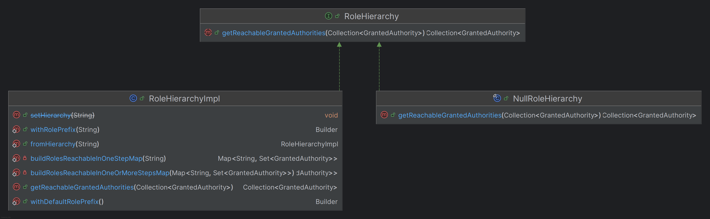
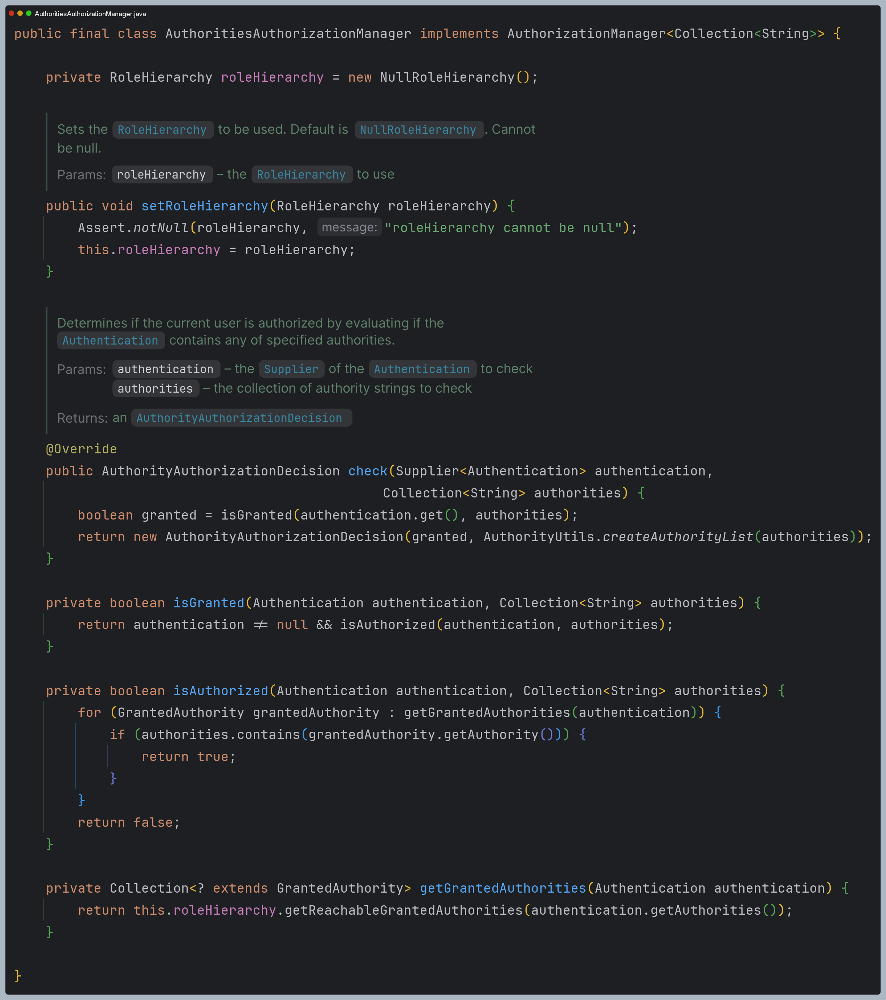

# 계층적 권한

- 기본적으로 스프링 시큐리티에서 권한과 역할은 계층적이거나 상하 관계로 구분하지 않는다. 그래서 인증 주체가 다양한 역할과 권한을 부여 받아야 한다.
- `RoleHirerachy`는 역할 간의 계층 구조를 정의하고 관리하는 데 사용되며 보다 간편하게 역할 간의 계층 구조를 설정하고 이를 기반으로 사용자에 대한 액세스 규칙을 정의할 수 있다.


- `ROLE_A`를 가진 모든 사용자는 `ROLE_B`, `ROLE_C`, `ROLE_D` 도 가지게 된다.
- `ROLE_B`를 가진 모든 사용자는 `ROLE_C`, `ROLE_D` 도 가지게 된다.
- `ROLE_C`를 가진 모든 사용자는 `ROLE_D`도 가지게 된다.
- 계층적 역할을 사용하면 액세스 규칙이 크게 줄어들 뿐만 아니라 더 간결하고 우아한 형태로 규칙을 표현할 수 있다.

---

## 구조



- **`setHierarachy()`** (Deprecated)
  - 역할 계층을 설정하고 각 역할에 대해 해당 역할의 하위 계층에 속하는 모든 역할 집합을 미리 정해 놓는다.
    - 역할 계층 : `ROLE_A` > `ROLE_B` > `ROLE_C`
- **`getReachableGrantedAuthorities()`**
  - 모든 도달 가능한 권한의 배열을 반환한다.
  - 도달 가능한 권한은 직접 할당된 권한에 더해 역할 계층에서 이들로부터 도달 가능한 모든 권한을 의미한다.
    - 직접 할당된 권한 : `ROLE_B`
    - 도달 가능한 권한 : `ROLE_B`, `ROLE_C`


---

```java
@Configuration
@EnableWebSecurity
public class SecurityConfig {

    @Bean
    public SecurityFilterChain securityFilterChain(HttpSecurity http) throws Exception {

        http
            .authorizeHttpRequests(authorize -> authorize
                .requestMatchers("/user").hasRole("USER")
                .requestMatchers("/db").hasRole("DB")
                .requestMatchers("/admin").hasRole("ADMIN")
                .anyRequest().authenticated())
            .formLogin(Customizer.withDefaults())
            .csrf(AbstractHttpConfigurer::disable)
        ;
        return http.build();
    }

  @Bean
  public RoleHierarchy roleHierarchy() {
/*
        //방법 1
        return RoleHierarchyImpl.fromHierarchy(
            """
            ROLE_ADMIN > ROLE_DB
            ROLE_DB > ROLE_USER
            ROLE_USER > ROLE_ANONYMOUS
            """
        );
*/
    //방법 2
    return RoleHierarchyImpl.withDefaultRolePrefix() //Default Role Prefix = "ROLE_"
                            .role("ADMIN").implies("DB")
                            .role("DB").implies("USER")
                            .role("USER").implies("ANONYMOUS")
                            .build();
  }
    
    @Bean
    public UserDetailsService userDetailsService() {
        UserDetails user = User.withUsername("user")
                .password("{noop}1111")
                .roles("USER")
                .build();

        UserDetails manager = User.withUsername("db")
                .password("{noop}1111")
                .roles("DB")
                .build();

       UserDetails admin = User.withUsername("admin")
               .password("{noop}1111")
               .roles("ADMIN", "SECURE")
               .build();

        return new InMemoryUserDetailsManager(user, manager, admin);
    }
}
```
```java
@RestController
public class IndexController {

    @GetMapping("/")
    public String index() {
        return "index";
    }

    @GetMapping("/user")
    public String user() {
        return "user";
    }

    @GetMapping("/db")
    public String db() {
        return "db";
    }

    @GetMapping("/admin")
    public String admin() {
        return "admin";
    }
}
```

- 다음 클래스에서 인가 처리를 진행하면서 빈으로 등록한 `RoleHierarchyImpl`이 사용된다.
- 등록하지 않으면 기본값으로 `NullRoleHierarchy`를 사용하며 아무런 처리도 하지 않는다.



---

[이전 ↩️ - 정적 자원 관리](https://github.com/genesis12345678/TIL/blob/main/Spring/security/security/AuthorizeProcess/StaticResource.md)

[메인 ⏫](https://github.com/genesis12345678/TIL/blob/main/Spring/security/security/main.md)