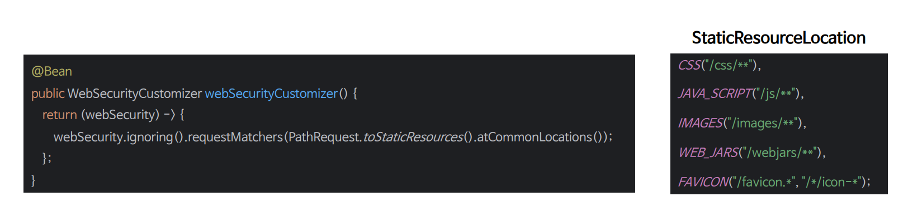

# 정적 자원 관리

- 스프링 시큐리티에서 `RequestMatcher` 인스턴스를 등록하여 무시해야 할 요청을 지정할 수 있다.
- 주로 정적 자원(이미지, CSS, JavaScript 파일 등) 에 대한 요청이나 특정 엔드포인트가 보안 필터를 거치지 않도록 설정할 때 사용된다.



- **Ignoring 보단 permitAll 권장**
  - 이전에는 모든 요청마다 세션을 확인해야 해서 성능 저하가 있었지만 스프링 시큐리티 6 부터는 **권한 부여 규칙에서 필요한 경우를 제외하고는 세션을 확인하지 않는다.**
  - 성능 문제가 해결되었기 때문에 모든 요청에 대해서 `permitAll`을 사용할 것을 권장하며 정적 자원에 대한 요청일지라도 **안전한 헤더를 작성할 수 있어 더 안전하다.**

---

```java
@Configuration
@EnableWebSecurity
@EnableMethodSecurity
public class SecurityConfig {

    @Bean
    public WebSecurityCustomizer webSecurityCustomizer() {
        return web -> {
            web.ignoring().requestMatchers(PathRequest.toStaticResources().atCommonLocations());
        };
    }

    @Bean
    public SecurityFilterChain securityFilterChain(HttpSecurity http) throws Exception {

        http
                .authorizeHttpRequests(authorize -> authorize
                        .anyRequest().authenticated())
                .formLogin(Customizer.withDefaults())
                .csrf(AbstractHttpConfigurer::disable)
        ;
        return http.build();
    }


   @Bean
    public UserDetailsService userDetailsService() {
        UserDetails user = User.withUsername("user")
                .password("{noop}1111")
                .roles("USER")
                .build();

        UserDetails manager = User.withUsername("db")
                .password("{noop}1111")
                .roles("DB")
                .build();

       UserDetails admin = User.withUsername("admin")
               .password("{noop}1111")
               .roles("ADMIN", "SECURE")
               .build();

        return new InMemoryUserDetailsManager(user, manager, admin);
    }
}
```

---

[이전 ↩️ - 메서드 기반 권한 부여(`@Secured`, `JSR-250`)](https://github.com/genesis12345678/TIL/blob/main/Spring/security/AuthorizeProcess/Secured.md)

[메인 ⏫](https://github.com/genesis12345678/TIL/blob/main/Spring/security/main.md)

[다음 ↪️ - 계층적 권한(`RoleHirerachy`)](https://github.com/genesis12345678/TIL/blob/main/Spring/security/AuthorizeProcess/RoleHirerachy.md)