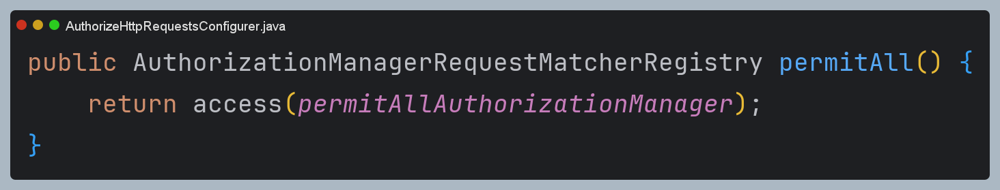

# 정적 자원 관리

- 스프링 시큐리티에서 `RequestMatcher` 인스턴스를 등록하여 무시해야 할 요청을 지정할 수 있다.
- 주로 정적 자원(이미지, CSS, JavaScript 파일 등) 에 대한 요청이나 특정 엔드포인트가 보안 필터를 거치지 않도록 설정할 때 사용된다.


- **Ignoring 보단 permitAll 권장**
  - 이전에는 모든 요청마다 세션을 확인해야 해서 성능 저하가 있었지만 스프링 시큐리티 6 부터는 **권한 부여 규칙에서 필요한 경우를 제외하고는 세션을 확인하지 않는다.**
  - 성능 문제가 해결되었기 때문에 모든 요청에 대해서 `permitAll`을 사용할 것을 권장하며 정적 자원에 대한 요청일지라도 **안전한 헤더를 작성할 수 있어 더 안전하다.**

```java
/**
 * 정적 자원 관리
 */
@Configuration
@EnableWebSecurity
public class SecurityConfig {

  /*
   * 권장되지 않는 방법
   */
  @Bean
  public WebSecurityCustomizer webSecurityCustomizer() {
    return web -> web.ignoring()
                     .requestMatchers(PathRequest.toStaticResources().atCommonLocations());
  }

  @Bean
  public SecurityFilterChain securityFilterChain(HttpSecurity http) throws Exception {

    http
        .authorizeHttpRequests(authorize -> authorize
            /* 권장되는 방법 1 */
            .requestMatchers("/css/**", "/images/**", "/js/**", "/webjars/**", "/favicon.*", "/*/icon-*").permitAll()
            /* 권장되는 방법 2 */
            .requestMatchers(PathRequest.toStaticResources().atCommonLocations()).permitAll()
            .anyRequest().authenticated()
        )
        .formLogin(Customizer.withDefaults())
        .csrf(AbstractHttpConfigurer::disable)
    ;
    return http.build();
  }
}
```

---

# 초기화 과정 디버깅

## 1. WebSecurity에 정적 리소스 정보 저장


## 2. WebSecurity 초기화

- 다음 코드는 `WebSecurity` 클래스의 `performBuild()` 메서드 일부이다.
- `WebSecurity`가 초기화 되는 과정에서 `SecurityFilterChain`이 `FilterChainProxy`에 등록된다.


- 각각의 `SecurityFilterChain`은 `RequestMatcher`와 여러 개의 `Filter`를 가질 수 있다. `RequestMatcher`로 해당 요청을
처리할 수 있는지 판단하고 필터들을 호출해서 요청을 처리하는 것이다.
- 그런데 보면 정적 리소스를 처리하는 `SecurityFilterChain`은 `Filter`를 하나도 가지고 있지 않다.
- 즉 정적 리소스 요청은 스프링 시큐리티에서 아무런 처리도 하지 않는 것이다.


---

# 정적 리소스 처리 과정 디버깅

## FilterChainProxy

- `FilterChainProxy`는 가장 먼저 요청을 받아서 해당 요청을 처리할 수 있는 `SecurityFilterChain`을 가져온다.
- 그런데 정적 리소스의 경우 `Filter`를 하나도 가지고 있지 않아 `filters.isEmpty()`가 된다.
- 그래서 스프링 시큐리티 인증 과정이 모두 생략되어 바로 스프링 MVC에서 처리되는 것이다.


---

## 참고 - permitAll()을 권장하는 이유

- `permitAll()`을 설정하면 초기화 과정에서 다음과 같이 `permitAllAuthorizationManager`로 초기화된다.
- 인증이 필요한 요청의 경우 인증 및 인가 처리를 위해 `Authentication`이 필요하다. 그래서 `Authentication`이 필요한 시점에
`Supplier`로 래핑되어 있는 인증 객체를 꺼내어서(기본적으로 세션에서) 참조해야 한다.
- 그런데 `permitAllAuthorizationManager`은 어떤 경우에든 항상 `true`를 반환한다.
- 따라서 세션에서 인증 객체를 찾는 과정이 생략되기 때문에 성능상 이점이 있어 권장되는 것이다.




---

[이전 ↩️ - 메서드 기반 권한 부여(`@Secured`, `JSR-250`)](https://github.com/genesis12345678/TIL/blob/main/Spring/security/security/AuthorizeProcess/Secured.md)

[메인 ⏫](https://github.com/genesis12345678/TIL/blob/main/Spring/security/security/main.md)

[다음 ↪️ - 계층적 권한(`RoleHirerachy`)](https://github.com/genesis12345678/TIL/blob/main/Spring/security/security/AuthorizeProcess/RoleHirerachy.md)