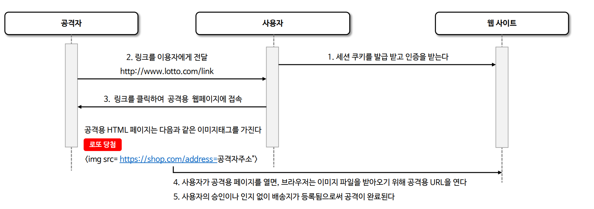
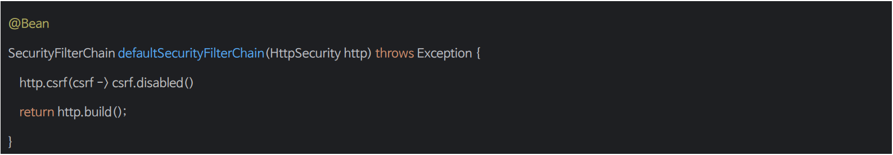

# CSRF

- **Cross Site Request Forgery, 사이트 간 요청 위조**
- 웹 애플리케이션의 보안 취약점으로 공격자가 사용자로 하여금 이미 인증된 다른 사이트에 대해 원치 않는 작업을 수행하게 만드는 기법을 말한다.
- 이 공격은 사용자의 브라우저가 자동으로 보낼 수 있는 인증 정보, 예를 들어 쿠키가 기본 인증 세션을 이용하여 사용자가 의도하지 않은 요청을 서버로 전송하게 만든다.
- 이는 사용자가 로그인한 상태에서 악의적인 웹 사이트를 방문하거나 이메일 등을 통해 악의적인 링크를 클릭할 때 발생할 수 있다.



--- 

## CSRF 기능 활성화


- 토큰(CSRF 토큰)은 서버에 의해 생성되어 클라이언트의 세션에 저장되고 폼을 통해 서버로 전성되는 모든 **변경 요청**에 포함되어야 하며 서버는 이 토큰을 검증하여 요청의 유효성을 확인한다.
- 기본 설정은 `GET`, `HEAD`, `TRACE`, `OPTIONS`와 같은 안전한 메서드를 무시하고 `POST`, `PUT`, `DELETE` 와 같은 변경 요청 메서드에 대해서만 CSRF 토큰 검사를 수행한다.
- 중요한 점은 실제 CSRF 토큰이 브라우저에 의해 자동으로 포함되지 않는 요청 부분에 위치해야 한다는 것으로, HTTP 매개변수나 헤더에 실제 CSRF 토큰을 요구하는 것이
    CSRF 공격을 방지하는 데 효과적이라 할 수 있다.
- 반면 쿠키에 토큰을 요구하는 것은 브라우저가 쿠키를 자동으로 요청에 포함시키기 대문에 효과적이지 않다고 볼 수 있다.

---

## CSRF 기능 비활성화

### CSRF 기능 전체 비활성화



### CSRF 보호가 필요하지 않은 특정 엔드포인트만 비활성화


---

```java
@Configuration
@EnableWebSecurity
public class SecurityConfig {

    @Bean
    public SecurityFilterChain securityFilterChain(HttpSecurity http) throws Exception {

        http
                .authorizeHttpRequests(auth -> auth
                        .requestMatchers("/csrf").permitAll()
                        .anyRequest().authenticated())
                .formLogin(Customizer.withDefaults())
        ;

        return http.build();
    }
}
```
```java
@PostMapping("/csrf")
public String csrf() {
    return "csrf 적용됨";
}
```
```http request
POST http://localhost:8080/csrf
Content-Type: application/json
```

- 응답
```html
<!DOCTYPE html>
<html lang="en">
<head>
   ...
</head>
<body>
<div class="container">
    <form class="form-signin" method="post" action="/login">
        <h2 class="form-signin-heading">Please sign in</h2>
        <p>
            <label for="username" class="sr-only">Username</label>
            <input type="text" id="username" name="username" class="form-control" placeholder="Username" required
                   autofocus>
        </p>
        <p>
            <label for="password" class="sr-only">Password</label>
            <input type="password" id="password" name="password" class="form-control" placeholder="Password" required>
        </p>
        <input name="_csrf" type="hidden"
               value="WKchhLlCr4tuBo1reqc5KruDwHRBbf-BWDyi5mbN1OihFt0ubsQTsoEhnL9DM7pYT4oNEtm37RV4DMasYQqU1V7444ySdbwe"/>
        <button class="btn btn-lg btn-primary btn-block" type="submit">Sign in</button>
    </form>
</div>
</body>
</html>
```

- 별다른 CSRF 설정을 하지 않았지만 컨트롤러 응답을 반환하지 않고 인증을 위한 로그인 화면을 스프링 시큐리티에서 출력해준다.
- 보면 `input` 태그에 `name=_csrf`, `hidden` 타입으로 CSRF 토큰 값을 스프링 시큐리티가 만들어 주는 것을 확인할 수 있다.

```http request
POST http://localhost:8080/csrf
Content-Type: application/x-www-form-urlencoded

_csrf = WKchhLlCr4tuBo1reqc5KruDwHRBbf-BWDyi5mbN1OihFt0ubsQTsoEhnL9DM7pYT4oNEtm37RV4DMasYQqU1V7444ySdbwe
```


```java
@Configuration
@EnableWebSecurity
public class SecurityConfig {

    @Bean
    public SecurityFilterChain securityFilterChain(HttpSecurity http) throws Exception {

        http
                .authorizeHttpRequests(auth -> auth
                        .requestMatchers("/csrf").permitAll()
                        .anyRequest().authenticated())
                .formLogin(Customizer.withDefaults())
                .csrf(csrf -> csrf.ignoringRequestMatchers("/csrf"))
        ;

        return http.build();
    }
}
```

- 위 방식이나 `csrf.disable()`을 통해 CSRF 기능을 비활성화 하면 `POST` 요청에도 CSRF 토큰 없이 요청에 대한 응답을 받을 수 있다.

> 스프링 시큐리티는 CSRF 설정을 직접 해주지 않아도 초기화 되면서 자동으로 CSRF 기능이 활성화되기 때문에 `permitAll()`로 설정을 해도 접근 거부가 발생할 수 있다.
> 
> 이때는 CSRF 기능이 활성화 되어 있는지에 대해 한 번 확인해보자.

---

[이전 ↩️ - CORS](https://github.com/genesis12345678/TIL/blob/main/Spring/security/security/Cors_Csrf/Cors.md)

[메인 ⏫](https://github.com/genesis12345678/TIL/blob/main/Spring/security/security/main.md)

[다음 ↪️ - CSRF 토큰 유지 및 검증](https://github.com/genesis12345678/TIL/blob/main/Spring/security/security/Cors_Csrf/CsrfToken.md)