# CSRF 토큰 유지 및 검증

## CSRF 토큰 유지 - CsrfTokenRepository

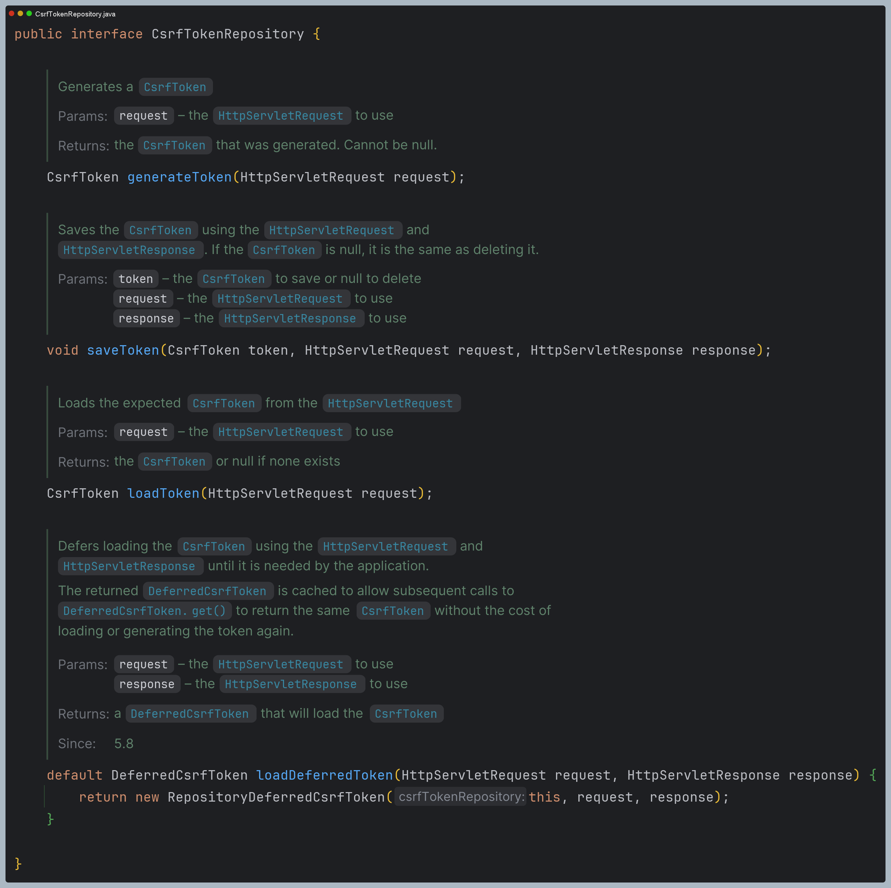

- `CsrfToken`은 **CsrfTokenRepository**를 사용하여 영속화하며 `HttpSessionCsrfTokenRepository`와 `CookieCsrfTokenRepository`를 지원한다.
- 두 군제 중 원하는 위치에 토큰을 저장하도록 설정을 통해 지정할 수 있다.

### 1. 세션에 토큰 저장 - HttpSessionCsrfTokenRepository


- 기본적으로 토큰을 세션에 저장하기 위해 `HttpSessionCsrfTokenRepository`를 사용한다.(기본값)
- `HttpSessionCsrfTokenRepository`는 기본적으로 HTTP 요청 헤더인 `X-CSRF-TOKEN` 또는 요청 매개변수인 `_csrf` 에서 토큰을 읽는다.


### 2. 쿠키에 토큰 저장 - CookieCsrfTokenRepository


- 설정하는 방식이 두 가지로, 하나만 선택해야 한다.
- JavaScript 기반 애플리케이션을 지원하기 위해 `CsrfToken`을 쿠키에 유지할 수 있으며 구현체로 **CookieCsrfTokenRepository**를 사용할 수 있다.
- **CookieCsrfTokenRepository**는 기본적으로 `XSRF-TOKEN` 명을 가진 쿠키에 작성하고 HTTP 요청 헤더인 `X-XSRF-TOKEN` 또는 요청 매개변수인 `_csrf` 에서 읽는다.


- JavaScript 에서 쿠키를 읽을 수 있도록 `HttpOnly`를 명시적으로 `false`로 설정할 수 있다.
- JavaScript 로 직접 쿠키를 읽을 필요가 없는 경우 보안을 개선하기 위해 `HttpOnly`를 생략하는 것이 좋다.

---

## CSRF 토큰 처리 - CsrfTokenRequestHandler


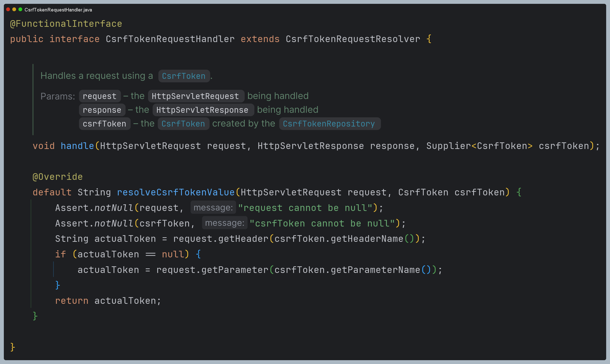

- `CsrfToken`은 **CsrfTokenRequestHandler**를 사용하여 토큰을 생성 및 응답하고 HTTP 헤더 또는 요청 매개변수로부터 토큰의 유효성을 검증하도록 한다.
- `XorCsrfTokenRequestAttributeHandler`와 `CsrfTokenRequestAttributeHandler`를 제공하며 사용자 정의 핸들러를 구현할 수 있다.
- `XorCsrfTokenRequestAttributeHandler`는 복잡한 XOR 연산을 추가로 거쳐 보안 측면에서 이점이 있다.


- `_csrf` 및 `CsrfToken.class.getName()` 명으로 **HttpServletRequest** 속성에 `CsrfToken` 을 저장하며 **HttpServletRequest**로부터 `CsrfToken`을 꺼내어 참조할 수 있다.
- 토큰 값을 요청 헤더(기본적으로 `X-CSRF-TOKEN`(세션) 또는 `X-XSRF-TOKEN`(쿠키) 중 하나) 또는 요청 매개변수(`_csrf`) 중 하나로부터 토큰의 유효성 비교 및 검증을 해결한다.
- 클라이언트의 매 요청마다 CSRF 토큰 값(`UUID`)에 난수를 인코딩하여 변경한 `CsrfToken`이 반환 되도록 보장한다. **세션에 저장된 원본 토큰 값은 그대로 유지한다.**
- 헤더 값 또는 요청 매개변수로 전달된 인코딩 된 토큰을 원본 토큰을 얻기 위해 디코딩되며, 그런 다음 세션 또는 쿠키에 저장된 영구적인 `CsrfToken`과 비교된다.

---

## CSRF 토큰 지연 로딩

- 기본적으로 Spring Security는 `CsrfToken`을 필요할 때까지 로딩을 지연시키는 전략을 사용한다. 그러므로 `CsrfToken`은 **HttpSession**에 저장되어 있기 때문에 매 요청마다
    세션으로부터 `CsrfToken`을 로드할 필요가 없어져 성능을 향상시킬 수 있다.
- `CsrfToken`은 **POST**와 같이 안전하지 않은 HTTP 메서드를 사용하여 요청이 발생할 때와 CSRF 토큰을 응답에 렌더링하는 모든 요청에서 필요하기 때문에 그 외 요청에는 지연로딩 하는 것이 권장된다.

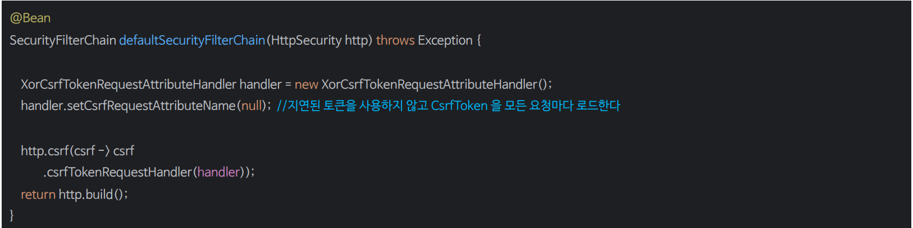

> 🙄 `setCsrfRequestAttributeName(null)`로 하면 지연 로딩을 하지 않는 이유
> - `csrfRequestAttributeName`을 `null`로 설정하면 다음과 같이 `csrfAttrName`을 가져올 때 `csrfToken.getParameterName()`을
> 호출한다.
> - 이때 지연되었던 `CsrfToken`이 모두 호출되어 초기화가 발생한다.
> 
> 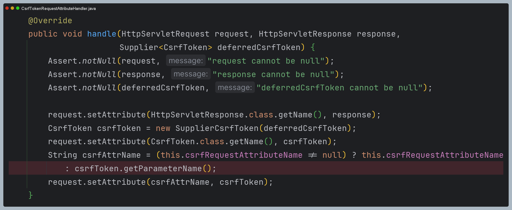

---

```java
@Configuration
@EnableWebSecurity
public class SecurityConfig {

    @Bean
    public SecurityFilterChain securityFilterChain(HttpSecurity http) throws Exception {

        CookieCsrfTokenRepository csrfTokenRepository = new CookieCsrfTokenRepository();

        http
                .authorizeHttpRequests(auth -> auth
                        .requestMatchers("/csrf", "/csrfToken").permitAll()
                        .anyRequest().authenticated())
                .formLogin(Customizer.withDefaults())
                .csrf(csrf -> csrf.csrfTokenRepository(csrfTokenRepository))
        ;

        return http.build();
    }
}
```

- 쿠키에 CSRF 토큰을 저장했다.
- `XSRF-TOKEN` 이름과 `HttpOnly` 속성을 갖는 `UUID`로 생성된 쿠키를 확인할 수 있다.

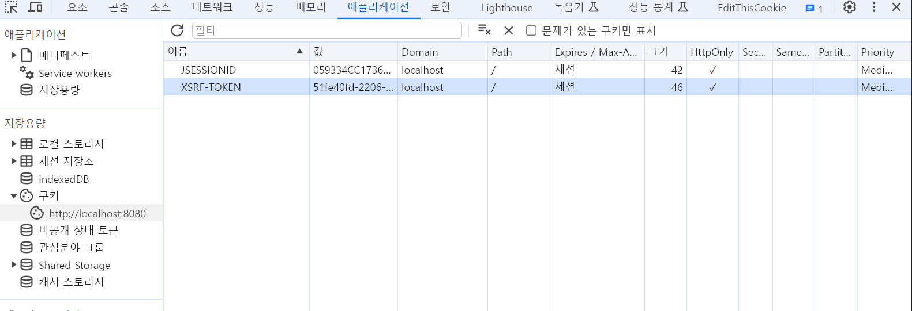

```java
.csrf(csrf -> csrf.csrfTokenRepository(CookieCsrfTokenRepository.withHttpOnlyFalse())
```
- 이렇게 설정하면 `HttpOnly` 속성이 해제되어 JavaScript 에서도 참조가 가능해진다.
- 보안상 좋은 방법은 아니다.

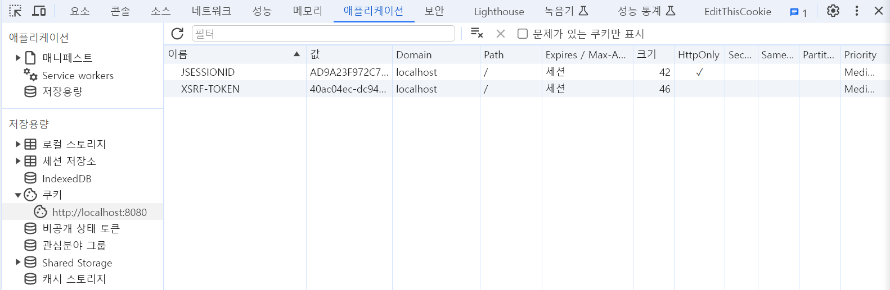

```java
@GetMapping("/csrfToken")
public String csrfToken(HttpServletRequest request) {
    CsrfToken csrfToken1 = (CsrfToken) request.getAttribute(CsrfToken.class.getName());
    CsrfToken csrfToken2 = (CsrfToken) request.getAttribute("_csrf");

    return csrfToken1.getToken();
}
```

- CSRF 토큰은 `HttpSerlvetRequest`에 저장되기 때문에 참조할 수 있다.
- 그리고 위 API는 CSRF 보호가 필요하지 않은 요청이기 때문에 조회된 `CsrfToken`는 모두 여러 겹의 `Supplier`로
래핑되어 있다.
- `getToken()`을 시작하는 순간 `get()`을 호출하여 실제 토큰을 생성한다.

---

# CsrfFilter 디버깅

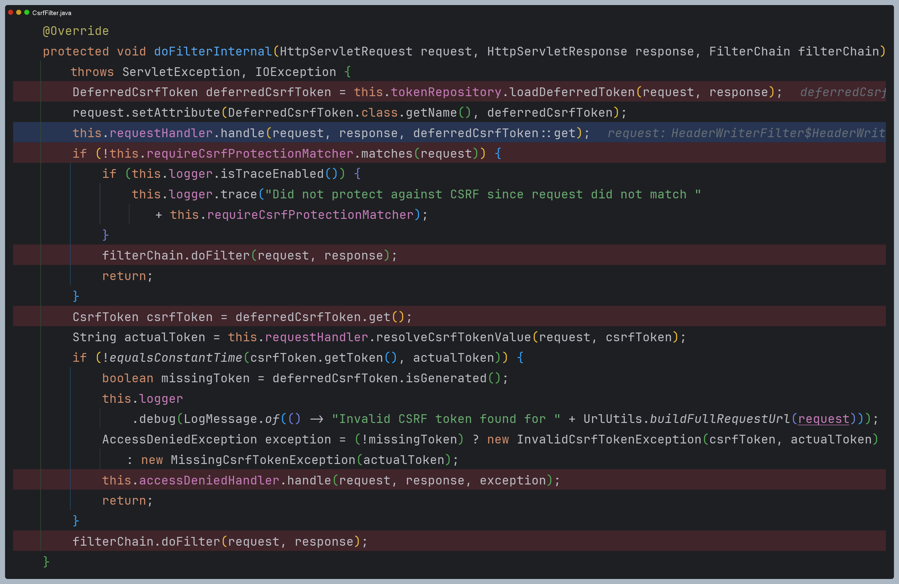

## 1. DeferredCsrfToken 로드

- `CsrfFilter`는 가장 먼저 `DeferredCsrfToken`을 로드한다.
- `DeferredCsrfToken`은 성능 향상을 위해 필요할 때까지 `CsrfToken`을 생성하지 않는다.

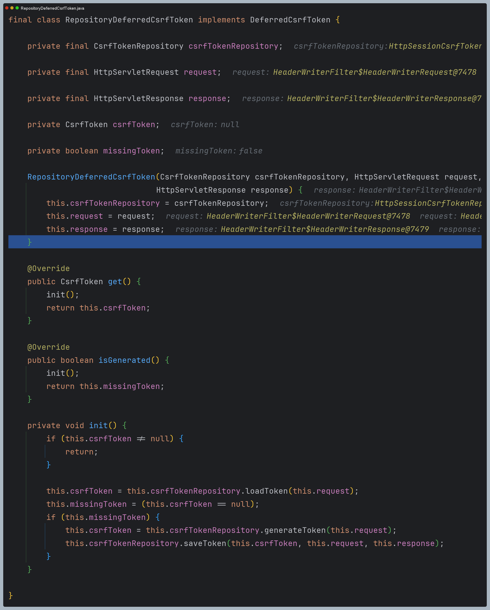

## 2. CsrfTokenRequestHandler 호출

- 여기서도 성능 향상을 위해 한번 더 `Supplier`로 래핑하는 것을 확인할 수 있다.

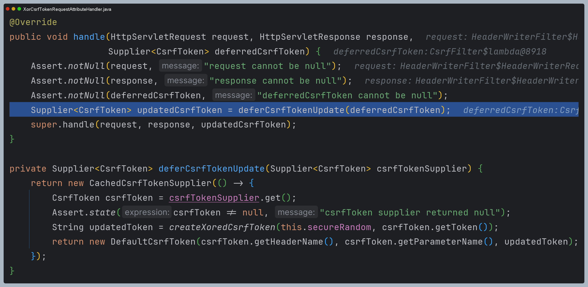

- 다음으로 부모 클래스의 `handle()` 메서드를 호출한다.
- 이 메서드에서는 `HttpServletRequest`에 `CsrfToken` 정보를 저장한다.
- 필요시 스프링 시큐리티 또는 개발자가 `HttpServletRequest`에서 `CsrfToken`을 얻을 수 있는 것이다.

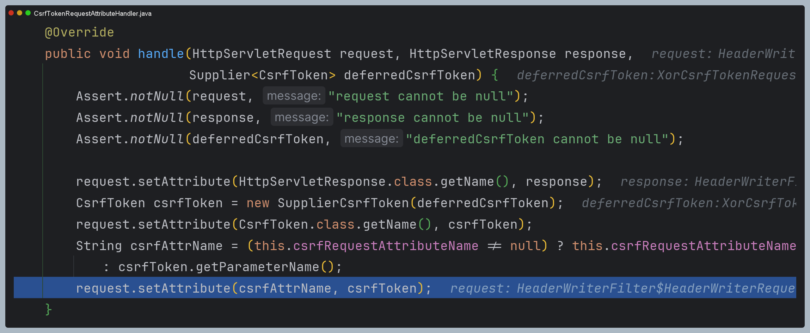

## 3. CSRF 보호 요청 확인

- 현재 요청이 CSRF 보호가 필요한 요청인지 확인한다.
- 만약 CSRF 보호가 필요하지 않은 요청이면 바로 다음 필터로 넘어간다.
- 중요한 것은 이때까지 `CsrfToken`을 생성하는 로직은 아직 `Supplier`로 래핑되어 있다.
즉 `CsrfToken`이 필요하지 않은 요청이기 때문에 `CsrfToken`을 생성하는 과정이 생략되는 것이다.

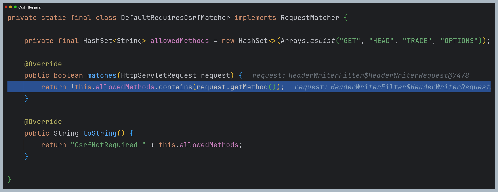

## 4. CSRF 보호가 필요한 요청

- 드디어 `CsrfToken`이 필요한 시점이 되어서야 지금까지 지연 처리된 `CsrfToken`을 생성하는 과정이 시작된다.
- 현재까지 아직 세션도 만들어진 상태가 아니기 때문에 `CsrfToken`을 생성하고 저장하는 것을 확인할 수 있다.
- 생성된 `CsrfToken`은 세션에 저장되어 세션이 유지될 때까지 서버에서 언제든지 참조할 수 있다.

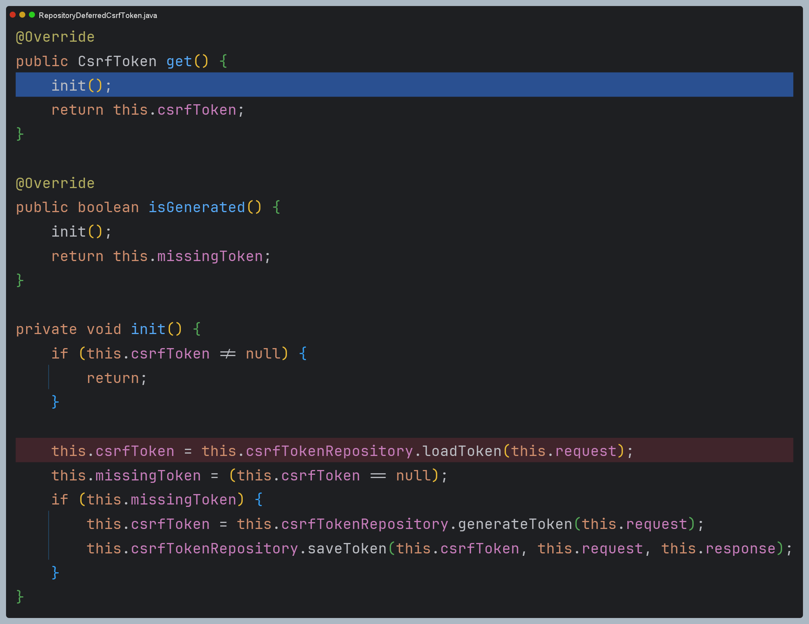

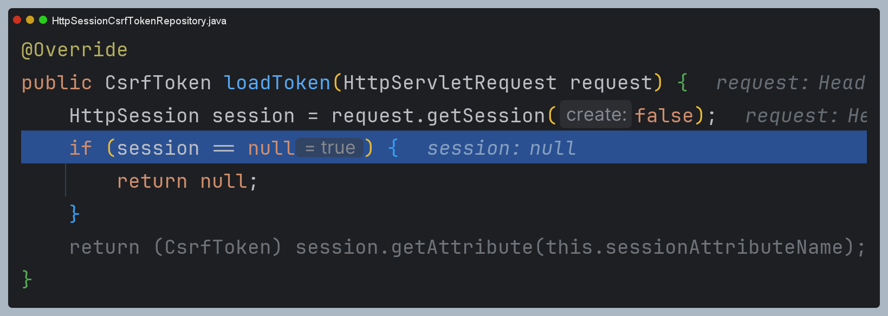

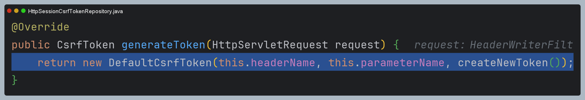

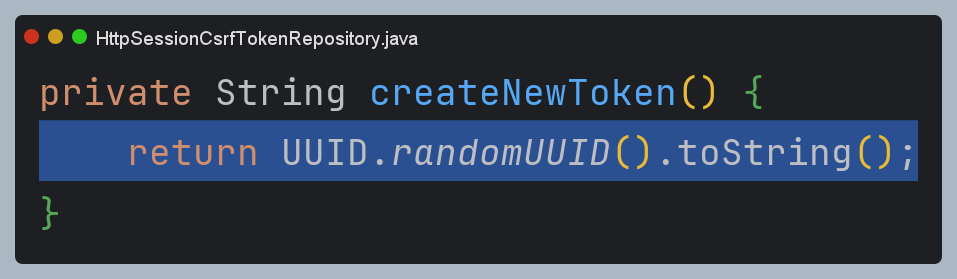

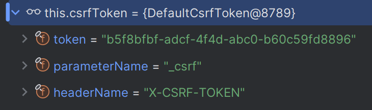

## 5. 클라이언트 CSRF 토큰과 비교

- 우선 클라이언트가 헤더 또는 매개변수로 보낸 CSRF 토큰을 얻어와 디코딩하여 세션 또는 쿠키에 저장된 `CsrfToken`과 비교한다.
- 만약 토큰 값이 같다면 문제 없이 다음 필터로 넘어간다.
- 하지만 토큰 값이 같지 않다면 `AccessDeniedException`을 `AccessDeniedHandler`에 넘겨 예외 처리를 수행하고 
다음 필터로 넘어가지 못한다.

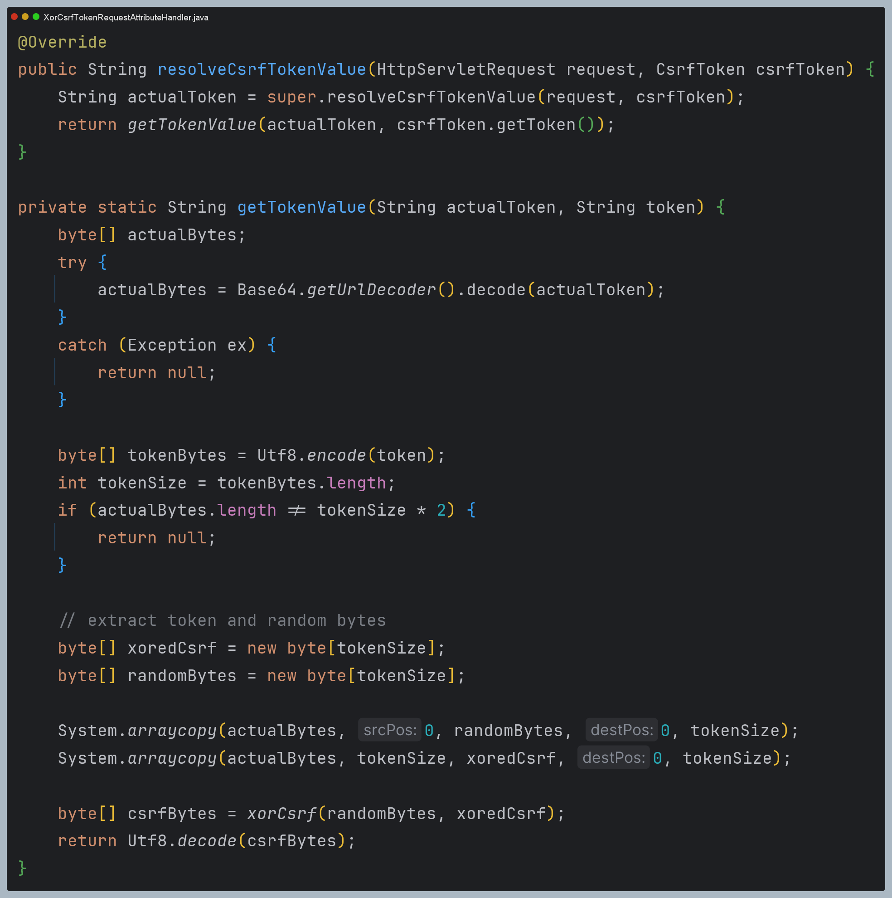

---

[이전 ↩️ - CSRF](https://github.com/genesis12345678/TIL/blob/main/Spring/security/security/Cors_Csrf/Csrf.md)

[메인 ⏫](https://github.com/genesis12345678/TIL/blob/main/Spring/security/security/main.md)

[다음 ↪️ - CSRF 통합](https://github.com/genesis12345678/TIL/blob/main/Spring/security/security/Cors_Csrf/CsrfAggregation.md)