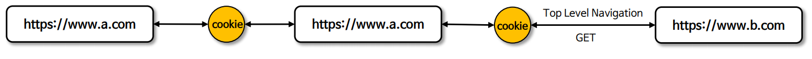
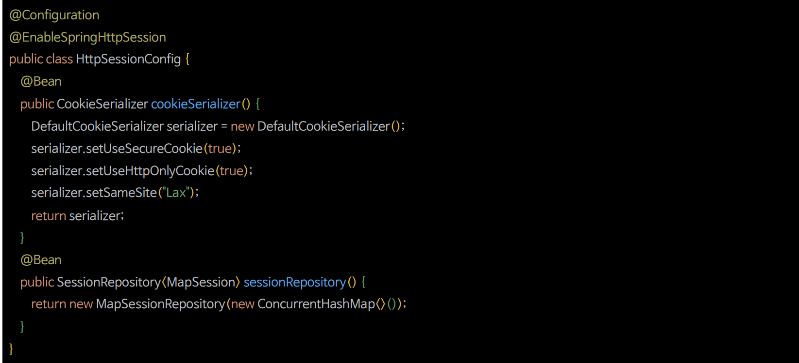
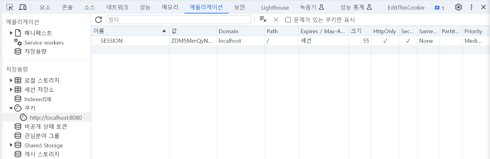

# SameSite

- `SameSite`는 최신 방식의 `CSRF` 공격 방어 방법 중 하나로, 서버가 쿠키를 설정할 때 `SameSite` 속성을 지정하여 크로스 사이트 간 쿠키 전송에 대한 제어를 핸들링 할 수 있다.
- Spring Security 는 세션 쿠키의 생성을 직접 제어하지 않기 때문에 `SameSite` 속성에 대한 지원을 제공하지 않지만 **Spring Session**은 `SameSite` 속성을 지원한다.

---

## SameSite 속성

### Strict

- 동일 사이트에서 오는 모든 요청에 쿠키가 포함되고, 크로스 사이트간 HTTP 요청에 쿠키가 포함되지 않는다.


### Lax(기본 설정)

- 동일 사이트에서 오거나 **Top Level Navigation** 에서 오는 요청 및 메서드가 읽기 전용인 경우 쿠키가 전송되고 그렇지 않으면 HTTP 요청에 쿠키가 포함되지 않는다.
- 예를 들어 사용자가 링크(`<a>`)를 클릭하거나 `window.location.replace`, 302 리다이렉트 등의 이동이 포함된다. 그러나 `<iframe>`이나 `` 를 문서에 삽입, AJAX 통신 등은 쿠키가 전송되지 않는다.



### None

- 동일 사이트 및 클로스 사이트 요청의 경우에도 쿠키가 전송된다. 이 모드에서는 HTTPS에 의한 `Secure` 쿠키로 설정되어야 한다.


---


- 대부분의 현재 브라우저는 `SameSite` 속성을 지원하지만, 여전히 사용 중인 오래된 브라우저는 지원하지 않을 수 있다.
- `SameSite`를 `CSRF` 공격에 대한 유일한 방어 수단으로서가 아닌, 심층적으로 강화된 방어의 일환으로 사용하는 것을 권장하고 있다.

---

## Spring Session 으로 SameSite 적용

```text
 implementation 'org.springframework.session:spring-session-core:3.2.1'
```



---

```java
@Configuration
@EnableSpringHttpSession
public class HttpSessionConfig {

    @Bean
    public CookieSerializer cookieSerializer() {
        DefaultCookieSerializer cookieSerializer = new DefaultCookieSerializer();
        cookieSerializer.setUseHttpOnlyCookie(true);
        cookieSerializer.setUseSecureCookie(true);
        cookieSerializer.setSameSite("None");

        return cookieSerializer;
    }

    @Bean
    public SessionRepository<MapSession> sessionRepository() {
        return new MapSessionRepository(new ConcurrentHashMap<>());
    }
}
```
```java
@Configuration
@EnableWebSecurity
public class SecurityConfig {
    @Bean
    public SecurityFilterChain securityFilterChain(HttpSecurity http) throws Exception {

        http
                .authorizeHttpRequests(auth -> auth
                        .anyRequest().authenticated())
                .formLogin(Customizer.withDefaults())
        ;

        return http.build();
    }
}
```



- 이름 `SESSION`, `HttpOnly`와 `Secure`, `SameSite`는 `None`으로 쿠키가 생성된 것을 확인할 수 있다.

---

[이전 ↩️ - CSRF 통합](https://github.com/genesis12345678/TIL/blob/main/Spring/security/security/Cors_Csrf/CsrfAggregation.md)

[메인 ⏫](https://github.com/genesis12345678/TIL/blob/main/Spring/security/security/main.md)