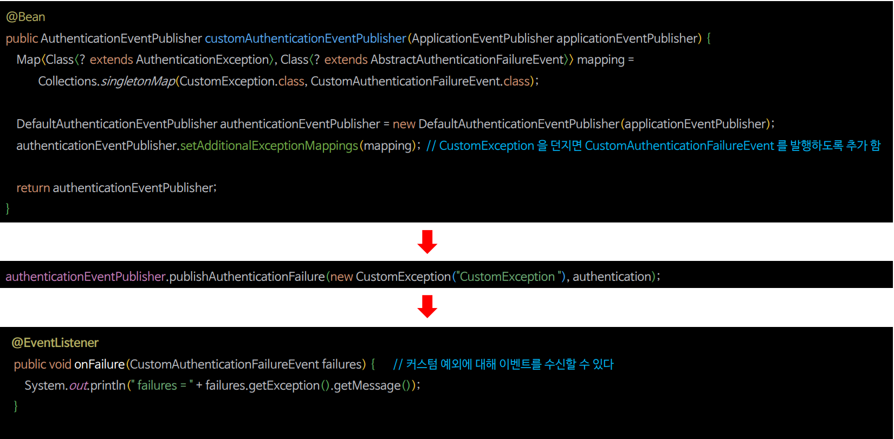

# 인증 이벤트

---

## 커스텀 예외, 이벤트 추가



---

## 기본 이벤트 설정

- `AuthenticationException`이 발생했을 때 해당 예외에 매핑된 이벤트가 발행이 안되어 있을 경우 기본 `AuthenticationFailureEvent`를 발행 및 수신할 수 있다.


- `CustomAuthenticationException`에 발행된 이벤트가 없지만 기본 이벤트인 `CustomAuthenticationFailureEvent`를 수신하고 있다.

---

```java
@Configuration
@EnableWebSecurity
public class SecurityConfig {
    
    @Bean
    public SecurityFilterChain securityFilterChain(HttpSecurity http) throws Exception {

        http
                .authorizeHttpRequests(authorize -> authorize
                        .requestMatchers("/user").hasAuthority("ROLE_USER")
                        .requestMatchers("/db").hasAuthority("ROLE_DB")
                        .requestMatchers("/admin").hasAuthority("ROLE_ADMIN")
                        .anyRequest().authenticated())
                .formLogin(Customizer.withDefaults())
                .csrf(AbstractHttpConfigurer::disable)
                .authenticationProvider(customAuthenticationProvider())
        ;
        return http.build();
    }

    @Bean
    public AuthenticationProvider customAuthenticationProvider() {
        return new CustomAuthenticationProvider(customAuthenticationProviderEventPublisher(null));
    }

    @Bean
    public AuthenticationEventPublisher customAuthenticationProviderEventPublisher(ApplicationEventPublisher applicationEventPublisher) {
        Map<Class<? extends AuthenticationException>, Class<? extends AbstractAuthenticationFailureEvent>> mapping =
                Collections.singletonMap(CustomException.class, CustomAuthenticationFailureEvent.class);

        DefaultAuthenticationEventPublisher authenticationEventPublisher = new DefaultAuthenticationEventPublisher();
        authenticationEventPublisher.setAdditionalExceptionMappings(mapping);
        authenticationEventPublisher.setDefaultAuthenticationFailureEvent(DefaultAuthenticationFailureEvent.class);

        return authenticationEventPublisher;
    }

   @Bean
    public UserDetailsService userDetailsService() {
        UserDetails user = User.withUsername("user")
                .password("{noop}1111")
                .roles("USER")
                .build();

        UserDetails manager = User.withUsername("db")
                .password("{noop}1111")
                .roles("DB")
                .build();

       UserDetails admin = User.withUsername("admin")
               .password("{noop}1111")
               .roles("ADMIN", "SECURE")
               .build();

        return new InMemoryUserDetailsManager(user, manager, admin);
    }

}
```
```java
public class CustomException extends AuthenticationException {

    public CustomException(String explanation) {
        super(explanation);
    }
}
```
```java
public class DefaultAuthenticationException extends AuthenticationException {

    public DefaultAuthenticationException(String explanation) {
        super(explanation);
    }
}
```
```java
public class DefaultAuthenticationFailureEvent extends AbstractAuthenticationFailureEvent {

    public DefaultAuthenticationFailureEvent(Authentication authentication, AuthenticationException exception) {
        super(authentication, exception);
    }
}
```
```java
public class CustomAuthenticationProvider implements AuthenticationProvider {

    private final AuthenticationEventPublisher authenticationEventPublisher;

    public CustomAuthenticationProvider(AuthenticationEventPublisher authenticationEventPublisher) {
        this.authenticationEventPublisher = authenticationEventPublisher;
    }

    @Override
    public Authentication authenticate(Authentication authentication) throws AuthenticationException {
        if (authentication.getName().equals("admin")) {

           authenticationEventPublisher.publishAuthenticationFailure(
                   new CustomException("CustomException"), authentication
           );

            throw new CustomException("CustomException");

        } else if (authentication.getName().equals("db")) {

            authenticationEventPublisher.publishAuthenticationFailure(
                    new DefaultAuthenticationException("DefaultAuthenticationException"), authentication
            );

            throw new DefaultAuthenticationException("DefaultAuthenticationException");
        }

        UserDetails user = User.withUsername("user").password("{noop}1111").roles("USER").build();
        return new UsernamePasswordAuthenticationToken(user, user.getPassword(), user.getAuthorities());
    }

    @Override
    public boolean supports(Class<?> authentication) {
        return true;
    }
}
```

- `CustomException`은 `CustomAuthenticationFailureEvent`에 매핑이 되어 `CustomAuthenticationFailureEvent`에서 수신할 수 있다.
- `DefaultAuthenticationException`은 매핑된 이벤트가 없기 때문에 기본값으로 설정한 `DefaultAuthenticationFailureEvent`에서 수신할 수 있다.

```java
@Component
@Slf4j
public class AuthenticationEvents {

    /*
            ...
     */

    @EventListener
    public void onFailure(CustomAuthenticationFailureEvent failures) {
        log.info("failures = {}", failures.getException().getMessage());
    }

    @EventListener
    public void onFailure(DefaultAuthenticationFailureEvent  failures) {
        log.info("failures = {}", failures.getException().getMessage());
    }
}
```

---

[이전 ↩️ - 인증 이벤트(`Authentication Events`)](https://github.com/genesis12345678/TIL/blob/main/Spring/security/Event/AuthenticationEvents.md)

[메인 ⏫](https://github.com/genesis12345678/TIL/blob/main/Spring/security/main.md)

[다음 ↪️ - 인가 이벤트(`AuthorizationEvent`)](https://github.com/genesis12345678/TIL/blob/main/Spring/security/Event/AuthorizationEvent.md)