# 인증 이벤트

- 스프링 시큐리티는 인증이 성공하거나 실패하게 되면 `AuthenticationSuccessEvent` 또는 `AuthenticationFailureEvent`를 발생시킨다.
- 이벤트를 수신하려면 `ApplicationEventPublisher`를 사용하거나 시큐리티에서 제공하는 `AuthenticationEventPublisher`를 사용해서 발행해야 한다.
- `AuthenticationEventPublisher`의 구현체로 **DefaultAuthenticationEventPublisher**가 제공된다.

**이벤트 발행 방법**
1. `ApplicationEventPublisher` 사용
   - **applicationEventPublisher.publishEvent(ApplicationEvent)**
2. `AuthenticationEventPublisher` 사용
   - **authenticationEventPublisher.publishAuthenticationSuccess(Authentication)**
   - **authenticationEventPublisher.publishAuthenticationFailure(AuthenticationException, Authentication)**

**이벤트 수신 방법**

```java
@Component
public class AuthenticationEvents {
    
    @EventListener
    public void onSuccess(AuthenticationSuccessEvent success) {
		// ...
    }

    @EventListener
    public void onFailure(AbstractAuthenticationFailureEvent failures) {
		// ...
    }
}
```

- 빈 등록
- 메서드 이름 자유
- `@EventListener` 필수

---

## 인증 이벤트 종류

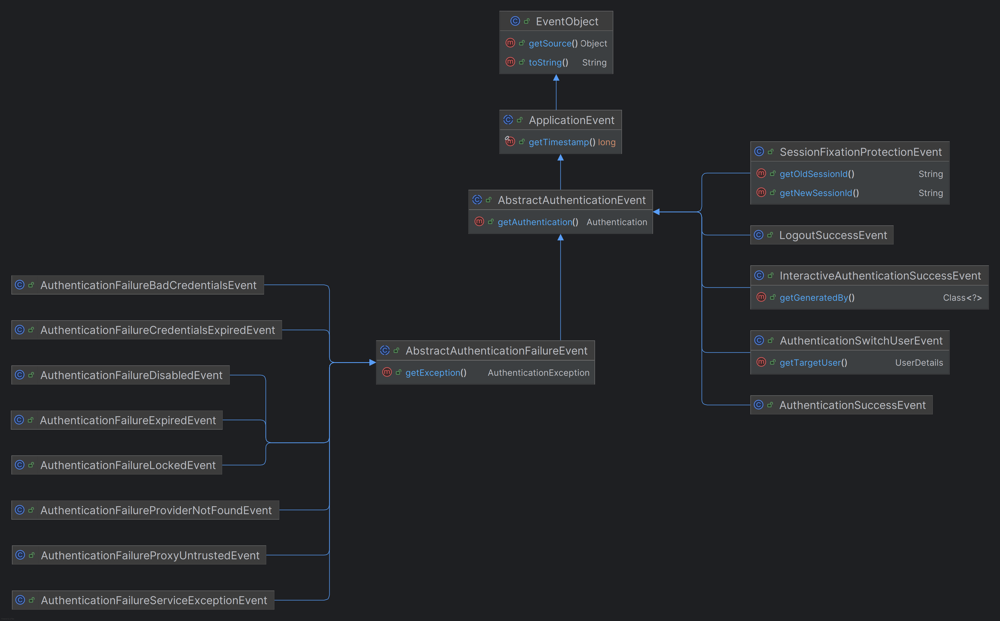


- 스프링의 이벤트 리스닝 메커니즘은 자바의 클래스 상속 구조를 따르기 때문에 특정 이벤트의 리스너는 해당 이벤트 뿐만 아니라 그 이벤트의 부모 클래스들로부터 발생하는 이벤트도 처리할 수 있다.

---

## 인증 성공 이벤트 발행 및 수신


- `@EventListener`를 적용한 메서드 파라미터에는 수신 받아서 처리하고자 하는 이벤트를 넣어준다.
- 주석처리 된 코드처럼 이미 정의된 이벤트 같은 경우는 스프링 시큐리티 내부적으로 이벤트를 발행하고 있으므로 사용자는 수신만 하면 된다.
- 커스텀 이벤트인 경우 직접 명시적으로 이벤트를 발행해야 한다.

---

## 인증 실패 이벤트 발행 및 수신


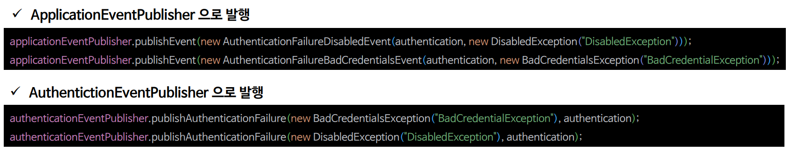

---

# 예제 코드 및 디버깅

- 각 이벤트를 처리하는 클래스
```java
@Slf4j
@Component
public class AuthenticationEvents {

    /*==인증 성공==*/
    @EventListener
    public void onSuccess(AuthenticationSuccessEvent success) {
        log.info("AuthenticationSuccessEvent = {}", success.getAuthentication().getName());
    }

    @EventListener
    public void onSuccess(InteractiveAuthenticationSuccessEvent success) {
        log.info("InteractiveAuthenticationSuccessEvent = {}", success.getAuthentication().getName());
    }

    @EventListener
    public void onSuccess(CustomAuthenticationSuccessEvent success) {
        log.info("CustomAuthenticationSuccessEvent = {}", success.getAuthentication().getName());
    }
    /*==인증 성공==*/

    /*==인증 실패==*/
    @EventListener
    public void onFailure(AbstractAuthenticationFailureEvent failures) {
        log.info("AbstractAuthenticationFailureEvent = {}", failures.getException().getMessage());
    }

    @EventListener
    public void onFailure(AuthenticationFailureBadCredentialsEvent failures) {
        log.info("AuthenticationFailureBadCredentialsEvent = {}", failures.getException().getMessage());
    }

    @EventListener
    public void onFailure(CustomAuthenticationFailureEvent failures) {
        log.info("CustomAuthenticationFailureEvent = {}", failures.getException().getMessage());
    }
    /*==인증 실패==*/
}
```
```java
public class CustomAuthenticationSuccessEvent extends AbstractAuthenticationEvent {

    public CustomAuthenticationSuccessEvent(Authentication authentication) {
        super(authentication);
    }
}
```
```java
public class CustomAuthenticationFailureEvent extends AbstractAuthenticationFailureEvent {

    public CustomAuthenticationFailureEvent(Authentication authentication, AuthenticationException exception) {
        super(authentication, exception);
    }
}
```
```java
@Configuration
@EnableWebSecurity
public class SecurityConfig {

    @Bean
    public SecurityFilterChain securityFilterChain(HttpSecurity http) throws Exception {

        http
            .authorizeHttpRequests(authorize -> authorize
                .anyRequest().authenticated()
            )
            .formLogin(form -> form
                 .successHandler((request, response, authentication) -> {
                     eventPublisher.publishEvent(new CustomAuthenticationSuccessEvent(authentication)); //이벤트 발행
                     response.sendRedirect("/");
                 })
            )
            .csrf(AbstractHttpConfigurer::disable)
        ;
        
        return http.build();
    }

    @Bean
    public UserDetailsService userDetailsService() {
        UserDetails user = User.withUsername("user")
                               .password("{noop}1111")
                               .roles("USER")
                               .build();

        return new InMemoryUserDetailsManager(user);
    }
}
```

## 인증 성공 이벤트 발행 과정 디버깅

- `ProviderManager`가 적절한 `AuthenticationProvider`에게 인증 요청을 위임하고 정상적으로 인증이 되었다면
인증 성공 이벤트를 발행한다.

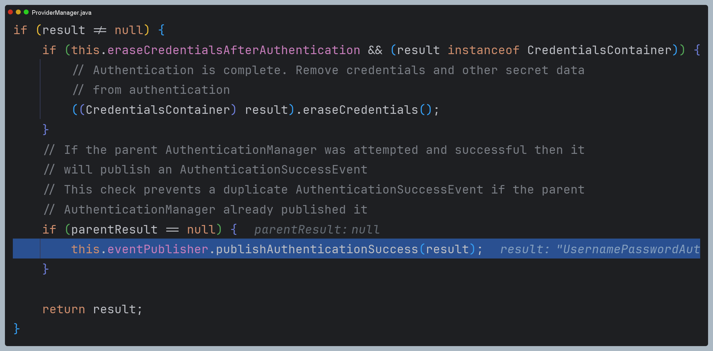

- 기본적으로 `DefaultAuthenticationEventPublisher`에서 이벤트를 발행한다.
- 여기서 인증에 성공했다는 `AuthenticationSuccessEvent`를 발행한다. 

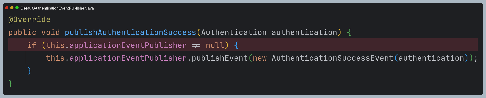

- 그러면 해당 이벤트를 수신하는 메서드에서 이벤트를 받게 된다.
- 해당 이벤트 클래스에는 인증 객체에 대한 정보가 들어있어 이것을 활용할 수 있는 것이다.

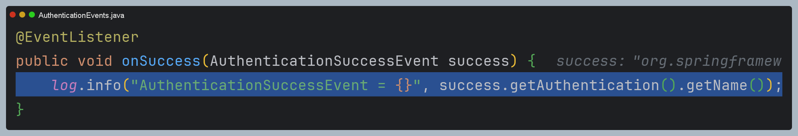

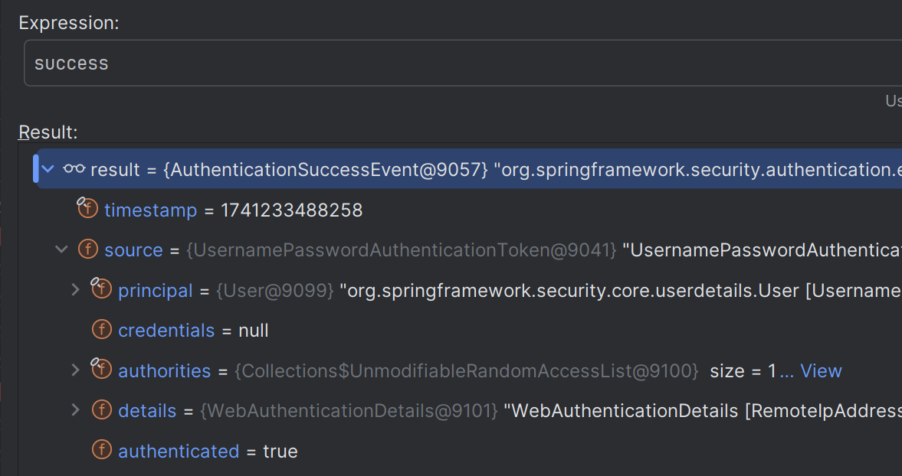

- 그 다음 인증 필터에서 또 다른 이벤트를 발행한다.

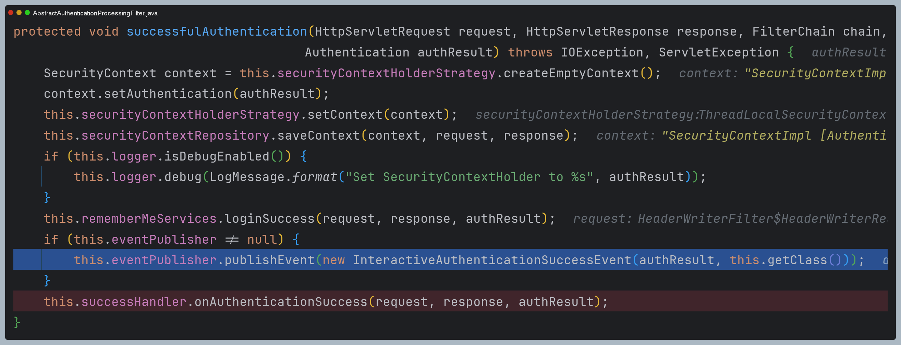

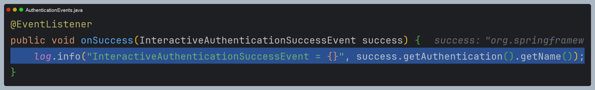

- 그리고 람다식으로 정의한 `AuthenticationSuccessHandler`에서 직접 만든 이벤트를 발행한다.


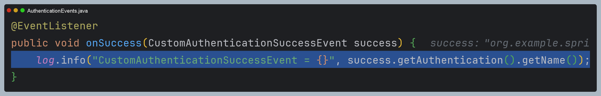

## 인증 실패 이벤트 발행 과정 디버깅

- `ProviderManager`가 적절한 `AuthenticationProvider`에게 인증 요청을 위임하고 정상적으로 인증이 되지 않았다면
인증 실패 이벤트를 발행한다.

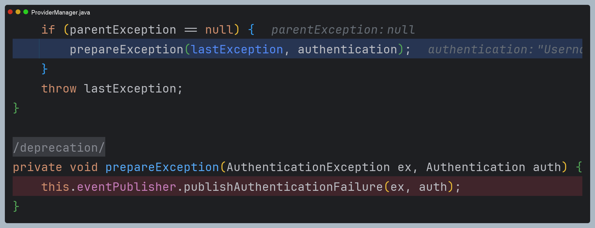

- 역시 `DefaultAuthenticationEventPublisher` 이벤트 발행이 처리된다.

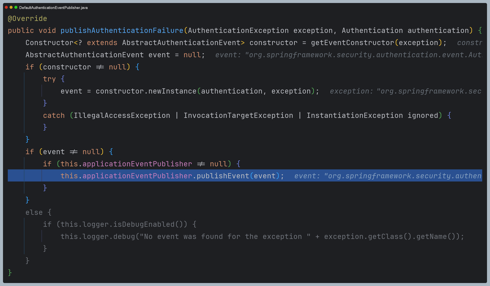

- 현재 이벤트는 `AuthenticationFailureBadCredentialsEvent`이지만, 먼저 실패 이벤트 클래스의 상위 이벤트 클래스부터 수신한다.
- 그 다음에 자식 클래스가 수신한다.


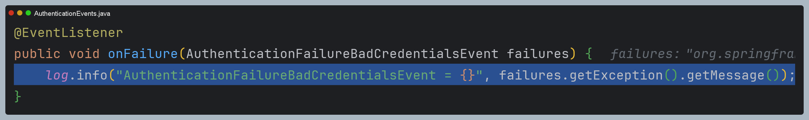

### 👏 참고 - AuthenticationEventPublisher와 ApplicationEventPublisher 차이

- 우선 `AuthenticationEventPublisher`, `ApplicationEventPublisher` 모두 인터페이스이며, 스프링 부트 초기화 과정에서
빈이 자동으로 생성된다.
- `ApplicationEventPublisher`는 수 많은 구현체 중 하나로 생성되며, `AuthenticationEventPublisher`는 
`DefaultAuthenticationEventPublisher`로 생성된다.

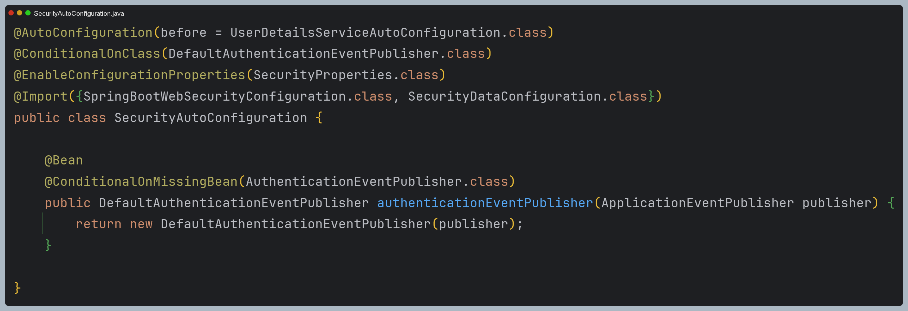

- 그런데 `DefaultAuthenticationEventPublisher` 생성자에서 `ApplicationEventPublisher`을 주입받는 것을 볼 수 있다.
- `DefaultAuthenticationEventPublisher`는 내부적으로 `ApplicationEventPublisher`에게 위임한다.

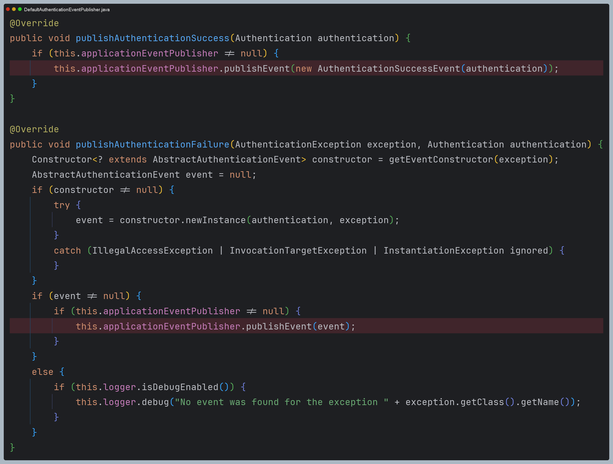

- 그런데 인증 실패 이벤트를 발행하는 메서드를 보면 조금 특이한 것을 알 수 있다.
- 리플렉션을 사용해서 특정 이벤트를 골라서 발행한다.
- 여기서 차이점이 보여지며, `DefaultAuthenticationEventPublisher`는 생성이 될 때 특정 예외에 대한 이벤트가 
이미 정의가 된다.
- 예를 들어 `BadCredentialsException` 예외가 발생하면 `AuthenticationFailureBadCredentialsEvent`가 발행이 된다는 의미다.

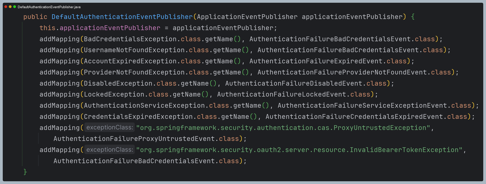

- 그래서 `AuthenticationEventPublisher`와 `ApplicationEventPublisher`를 사용하는 코드를 보면 차이가 있다.
- `ApplicationEventPublisher`는 발행할 이벤트와 함께 예외를 같이 전달한다면, `AuthenticationEventPublisher`는
예외만 전달하면 `DefaultAuthenticationEventPublisher`에서 이미 정의된 이벤트를 발행하게 되는 것이다.

```java
@Component
@RequiredArgsConstructor
public class CustomAuthenticationProvider implements AuthenticationProvider {

    //두 클래스 모두 빈으로 주입 받을 수 있다.
    private final ApplicationEventPublisher applicationEventPublisher;
    private final AuthenticationEventPublisher authenticationEventPublisher;

    @Override
    public Authentication authenticate(Authentication authentication) throws AuthenticationException {
        if (!authentication.getName().equals("user")) {

            BadCredentialsException ex = new BadCredentialsException("BadCredentialsException");

            /*ApplicationEventPublisher*/
            applicationEventPublisher.publishEvent(
                new CustomAuthenticationFailureEvent(authentication, ex)
            );

            /*AuthenticationEventPublisher*/
            authenticationEventPublisher.publishAuthenticationFailure(
                ex, authentication
            );

            throw ex;
        }

        UserDetails user = User.withUsername("user").password("{noop}1111").roles("USER").build();
        return new UsernamePasswordAuthenticationToken(user, user.getPassword(), user.getAuthorities());
    }

    @Override
    public boolean supports(Class<?> authentication) {
        return true;
    }
}
```

- 그렇다면 `AuthenticationEventPublisher`를 사용하면서 직접 만든 이벤트를 발행하게 할 순 없을까?
- `DefaultAuthenticationEventPublisher`를 직접 스프링 빈으로 등록한다면 구현할 수 있다.

```java
@Bean
public AuthenticationEventPublisher authenticationEventPublisher(ApplicationEventPublisher applicationEventPublisher) {

  Map<Class<? extends AuthenticationException>, Class<? extends AbstractAuthenticationFailureEvent>> mapping = new HashMap<>();

  mapping.put(BadCredentialsException.class, CustomAuthenticationFailureEvent.class);

  DefaultAuthenticationEventPublisher authenticationEventPublisher = new DefaultAuthenticationEventPublisher(applicationEventPublisher);
  authenticationEventPublisher.setAdditionalExceptionMappings(mapping);

  return authenticationEventPublisher;
}
```

- 이렇게 하면 `DefaultAuthenticationEventPublisher`의 생성자에서 기본적으로 초기화되는 매핑과 함께
직접 정의한 예외 및 이벤트도 저장이 된다.
- 기존에 정의된 예외 및 이벤트를 변경하거나, 아예 새로운 예외 및 이벤트를 저장할 수 있게 되는 것이다.

---

[메인 ⏫](https://github.com/genesis12345678/TIL/blob/main/Spring/security/security/main.md)

[다음 ↪️ - 인증 이벤트(`AuthenticationEventPublisher` 활용)](https://github.com/genesis12345678/TIL/blob/main/Spring/security/security/Event/AuthenticationEventPublisher.md)