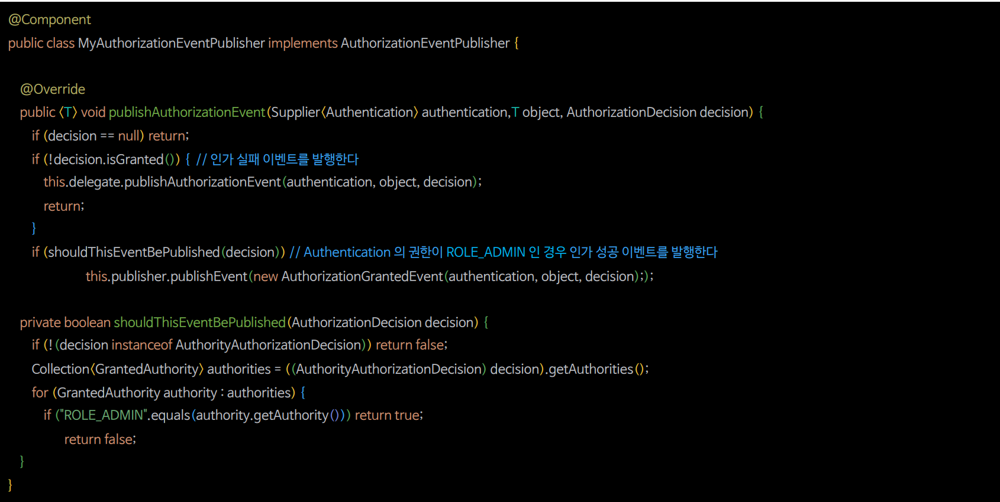

# 인가 이벤트

- 스프링 시큐리티는 권한 부여 이벤트 처리를 지원하며 권한이 부여되거나 거부된 경우에 발생하는 이벤트를 수신할 수 있다.
- 이벤트를 수신하려면 `ApplicationEventPublisher`를 사용하거나 시큐리티에서 제공하는 `AuthorizationEventPublisher`를 사용해서 발행해야 한다.
- `AuthorizationEventPublisher`의 구현체로 **SpringAuthorizationEventPublisher**가 제공된다.

**이벤트 발행 방법**
- `ApplicationEventPublisher.publishEvent(ApplicationEvent)`
- `AuthorizationEventPublisher.publishAuthorizationEvent(Supplier<Authentication>, T, AuthorizationDecistion)`

**이벤트 수신 방법**


- 빈 등록
- 메서드 이름 자유
- `@EventListener` 필수

---

## 인가 이벤트 발행 및 수신

- 인가 이벤트를 발행 하기 위해서는 **SpringAuthorizationEventPublisher**를 빈으로 정의해야 한다.


---

## 커스텀 AuthorizationEventPublisher

- **SpringAuthorizationEventPublisher**는 인가에 실패했을 때만 이벤트를 발행하고, 인가에 성공했을 때는 이벤트를 발행하지 않는다.
- 인가에 성공했을 때도 이벤트를 발행할 수 있도록 커스텀하게 구현할 수 있다.



---

```java
@Configuration
@EnableWebSecurity
@RequiredArgsConstructor
public class SecurityConfig {

    @Bean
    public SecurityFilterChain securityFilterChain(HttpSecurity http) throws Exception {

        http
                .authorizeHttpRequests(authorize -> authorize
                        .requestMatchers("/user").hasAuthority("ROLE_USER")
                        .requestMatchers("/db").hasAuthority("ROLE_DB")
                        .requestMatchers("/admin").hasAuthority("ROLE_ADMIN")
                        .anyRequest().authenticated())
                .formLogin(Customizer.withDefaults())
                .csrf(AbstractHttpConfigurer::disable)
        ;
        return http.build();
    }

//    @Bean
//    public AuthorizationEventPublisher authorizationEventPublisher(ApplicationEventPublisher applicationEventPublisher) {
//        return new SpringAuthorizationEventPublisher(applicationEventPublisher);
//    }

    @Bean
    public AuthorizationEventPublisher authorizationEventPublisher(ApplicationEventPublisher applicationEventPublisher) {
        return new MyAuthorizationEventPublisher(
                new SpringAuthorizationEventPublisher(applicationEventPublisher),
                applicationEventPublisher
        );
    }

   @Bean
    public UserDetailsService userDetailsService() {
        UserDetails user = User.withUsername("user")
                .password("{noop}1111")
                .roles("USER")
                .build();

        UserDetails manager = User.withUsername("db")
                .password("{noop}1111")
                .roles("DB")
                .build();

       UserDetails admin = User.withUsername("admin")
               .password("{noop}1111")
               .roles("ADMIN", "SECURE")
               .build();

        return new InMemoryUserDetailsManager(user, manager, admin);
    }
}
```
```java
public class MyAuthorizationEventPublisher implements AuthorizationEventPublisher {

    private final AuthorizationEventPublisher delegate;
    private final ApplicationEventPublisher eventPublisher;

    public MyAuthorizationEventPublisher(AuthorizationEventPublisher delegate, ApplicationEventPublisher eventPublisher) {
        this.delegate = delegate;
        this.eventPublisher = eventPublisher;
    }

    @Override
    public <T> void publishAuthorizationEvent(Supplier<Authentication> authentication, T object, AuthorizationDecision decision) {
        if (decision == null) {
            return;
        }

        if (!decision.isGranted()) {
            delegate.publishAuthorizationEvent(authentication, object, decision);
            return;
        }

        if (shouldThisEventBePublished(decision)) {
            AuthorizationGrantedEvent<T> granted = new AuthorizationGrantedEvent<>(
                    authentication, object, decision
            );
            eventPublisher.publishEvent(granted);
        }
    }

    private boolean shouldThisEventBePublished(AuthorizationDecision decision) {
        if (decision instanceof AuthorityAuthorizationDecision authorityAuthorizationDecision) {

            Collection<GrantedAuthority> authorities =
                    authorityAuthorizationDecision.getAuthorities();

            for (GrantedAuthority authority : authorities) {
                if ("ROLE_ADMIN".equals(authority.getAuthority())) {
                    return true;
                }
            }
        }

        return false;
    }
}
```
```java
@Component
@Slf4j
public class AuthorizationEvents {

    @EventListener
    public void onAuthorization(AuthorizationEvent event) {
      log.info("event = {}", event.getAuthentication().get().getAuthorities());
    }

    @EventListener
    public void onAuthorization(AuthorizationDeniedEvent failure) {
        log.info("failure = {}", failure.getAuthentication().get().getAuthorities());
    }

    @EventListener
    public void onAuthorization(AuthorizationGrantedEvent success) {
        log.info("success = {}", success.getAuthentication().get().getAuthorities());
    }
}
```

- `MyAuthorizationEventPublisher`을 빈으로 등록할 경우 `ADMIN` 계정으로 `/admin`에 접근하는 경우에만 `AuthorizationGrantedEvent`를 수신할 수 있다.

---

[이전 ↩️ - 인증 이벤트(`AuthenticationEventPublisher` 활용)](https://github.com/genesis12345678/TIL/blob/main/Spring/security/security/Event/AuthenticationEventPublisher.md)

[메인 ⏫](https://github.com/genesis12345678/TIL/blob/main/Spring/security/security/main.md)