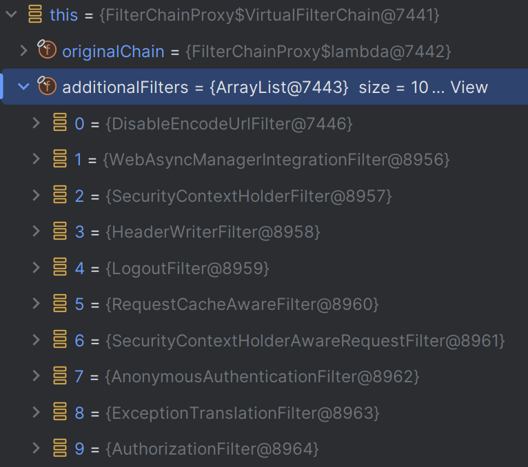
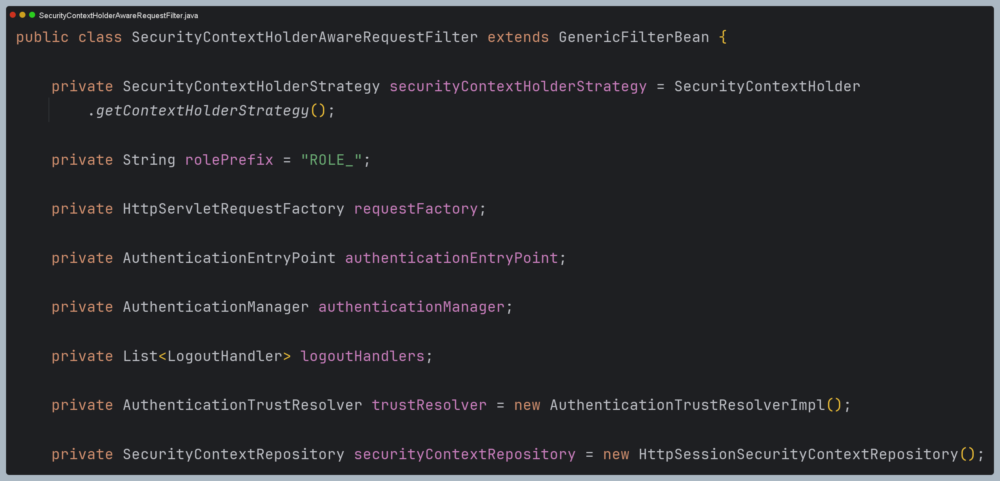
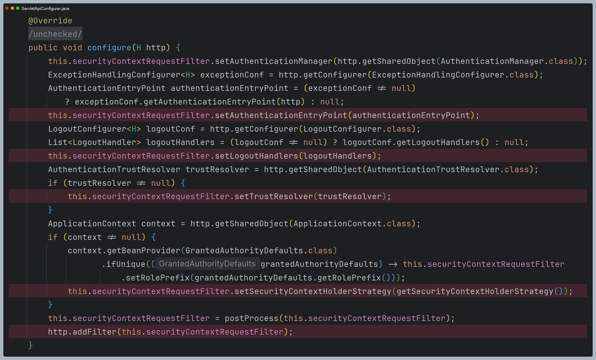
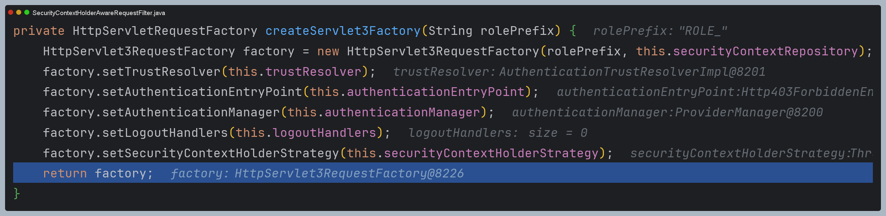
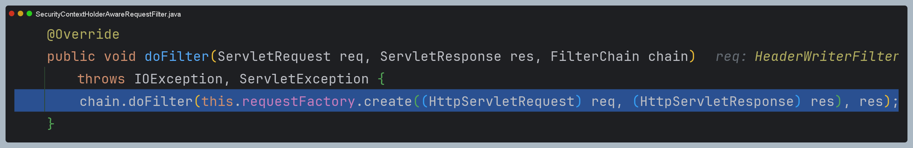
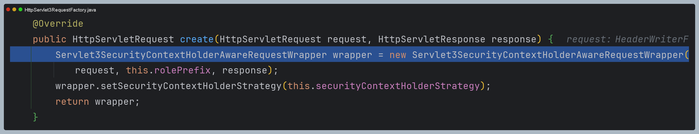
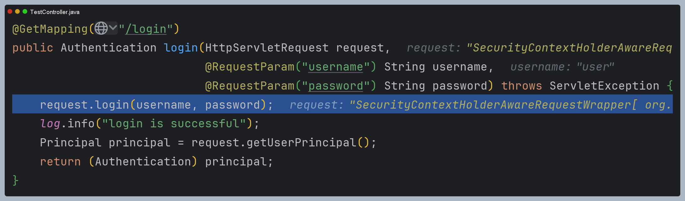
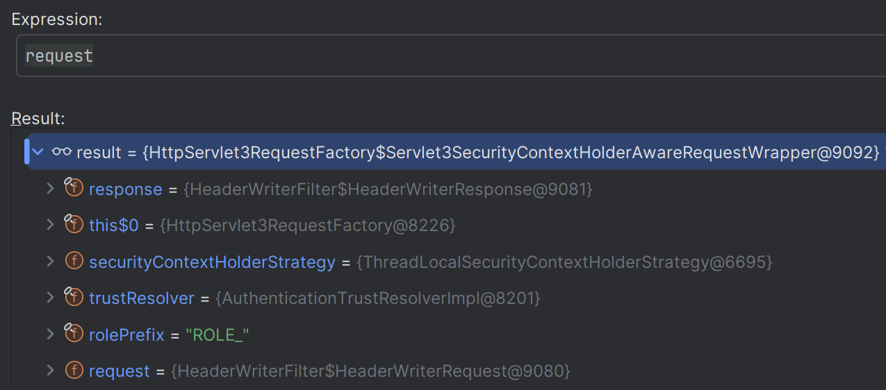
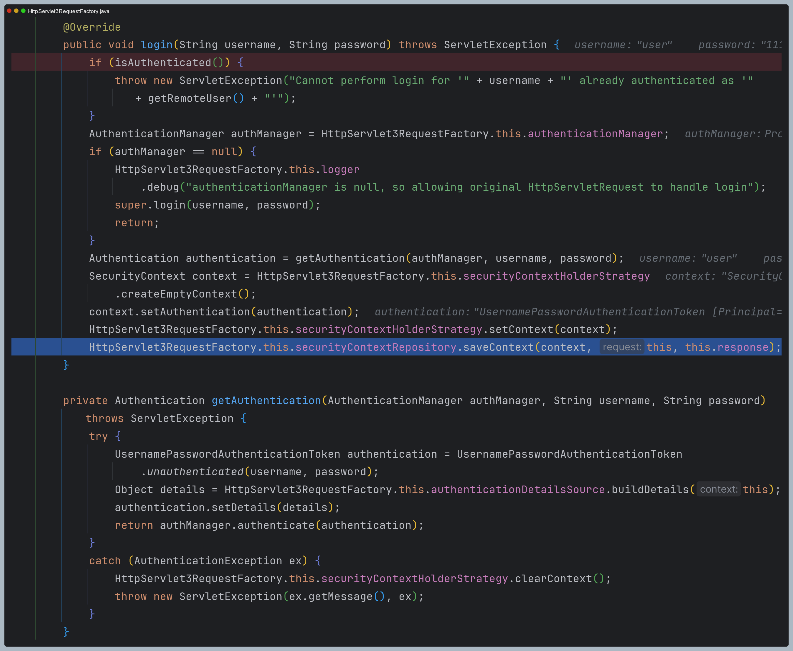

# Servlet API 통합

- 스프링 시큐리티는 다양한 프레임워크 및 API 와의 통합을 제공하고 있으며 **Servlet 3**과 **Spring MVC** 와 통합을 통해 여러 편리한 기능들을 사용할 수 있다.
- 인증 관련 기능들을 필터가 아닌 서블릿 영역에서 처리할 수 있다.

---

## Servlet 3+ 통합

### SecurityContextHolderAwareRequestFilter
- HTTP 요청이 처리될 때 `HttpServletRequest`에 보안 관련 메서드를 추가적으로 제공하는 래퍼 클래스(`SecurityContextHolderAwareRequestWrapper`)를 적용한다.
- 이를 통해 개발자는 서블릿 API의 보안 메서드를 사용하여 인증, 로그인, 로그아웃 등의 작업을 수행할 수 있다.

### HttpServlet3RequestFactory
- **Servlet 3** API와의 통합을 제공하기 위한 `Servlet3SecurityContextHolderAwareRequestWrapper` 객체를 생성한다.
- `SecurityContextHolderAwareRequestWrapper` : `Servlet3SecurityContextHolderAwareRequestWrapper`의 부모 클래스


### Servlet3SecurityContextHolderAwareRequestWrapper
- `HttpServletRequest` 의 래퍼 클래스로서 **Servlet 3.0**의 기능을 지원하면서 동시에 `SecurityContextHolder`와의 통합을 제공한다.
- 이 래퍼를 사용함으로써 `SecurityContext`에 쉽게 접근할 수 있고 **Servlet 3.0**의 비동기 처리와 같은 기능을 사용하는 동안 보안 컨텍스트를 올바르게 관리할 수 있다.

---

## 구조 및 API


---

# 초기화 과정 디버깅

- 현재 설정을 보면 폼 인증이나 기본 인증 등의 인증 관련 설정을 전혀 하지 않았기 때문에 필터 체인 인증 과정에서
인증 처리가 전혀 이루어지지 않는다.

```java
@Configuration
@EnableWebSecurity
public class SecurityConfig {

    @Bean
    public SecurityFilterChain securityFilterChain(HttpSecurity http) throws Exception {

        http
            .authorizeHttpRequests(authorize -> authorize
                .requestMatchers("/user").hasAuthority("ROLE_USER")
                .requestMatchers("/db").hasAuthority("ROLE_DB")
                .requestMatchers("/admin").hasAuthority("ROLE_ADMIN")
                .anyRequest().permitAll()
            )
            .csrf(AbstractHttpConfigurer::disable)
        ;
        return http.build();
    }

    @Bean
    public UserDetailsService userDetailsService() {
        UserDetails user = User.withUsername("user")
                .password("{noop}1111")
                .roles("USER")
                .build();

        UserDetails manager = User.withUsername("db")
                .password("{noop}1111")
                .roles("DB")
                .build();

        UserDetails admin = User.withUsername("admin")
               .password("{noop}1111")
               .roles("ADMIN", "SECURE")
               .build();

        return new InMemoryUserDetailsManager(user, manager, admin);
    }
}
```



- `SecurityContextHolderAwareRequestFilter`에는 인증 처리, 인증 유지, 로그아웃 등의 인증과 관련된 속성들을 갖고 있다.
- 스프링 시큐리티 초기화 과정에서 이 속성들의 값을 주입 시켜 주고 있다.





- 그리고 `HttpServletRequestFactory`를 생성하고 이 속성 값들을 전달하면서 초기화한다.



---

# 요청 과정 디버깅

```java
@GetMapping("/login")
public Authentication login(HttpServletRequest request,
                            @RequestParam("username") String username,
                            @RequestParam("password") String password) throws ServletException {
    request.login(username, password);
    log.info("login is successful");
    Principal principal = request.getUserPrincipal();
    return (Authentication) principal;
}
```

- `SecurityContextHolderAwareRequestFilter`는 이전 필터에서 넘어온 `request`, `response`를
`Servlet3SecurityContextHolderAwareRequestWrapper`로 감싸서 다음 필터로 전달하는 역할만 갖는 필터이다.





- 이렇게 해서 마지막 필터까지 가고 스프링 MVC까지 왔을 때 래핑된 객체가 전달된다.





- `request.login()` 과정을 보면 앞서 `HttpServletRequestFactory`에 저장된 속성들을 사용해 처리하는 것을 알 수 있다.
- 즉 서블릿 단에서 스프링 시큐리티 기술을 사용하는 것이다.



---

[메인 ⏫](https://github.com/genesis12345678/TIL/blob/main/Spring/security/security/main.md)

[다음 ↪️ - Spring MVC 통합](https://github.com/genesis12345678/TIL/blob/main/Spring/security/security/Integration/SpringMVC.md)