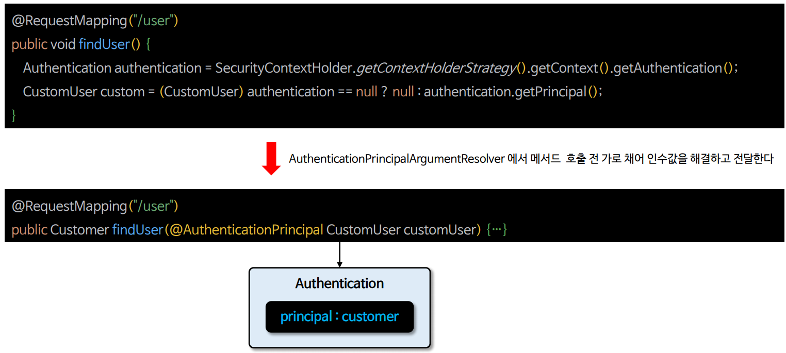
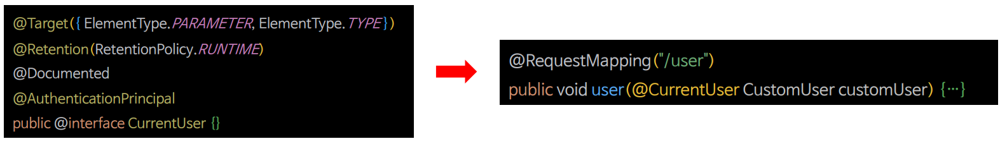
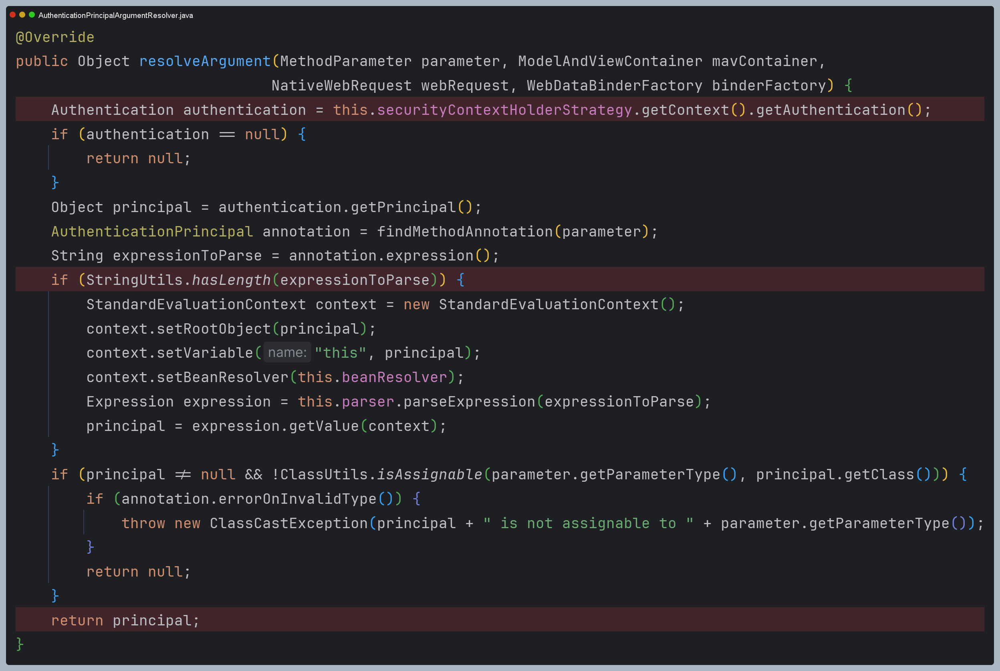
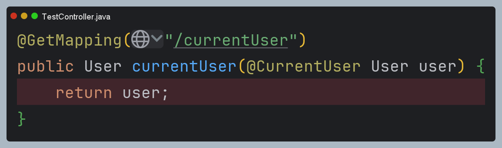
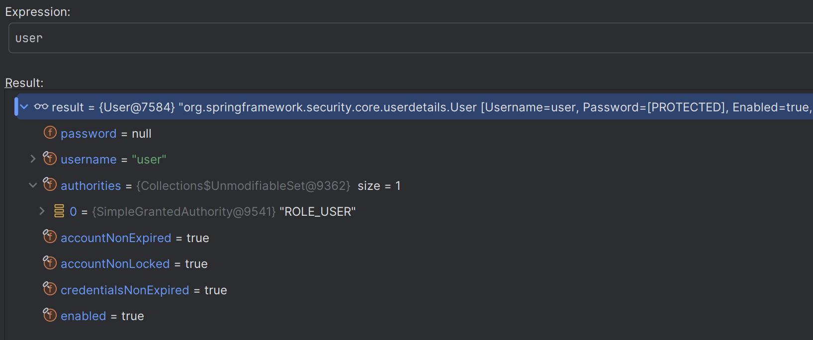
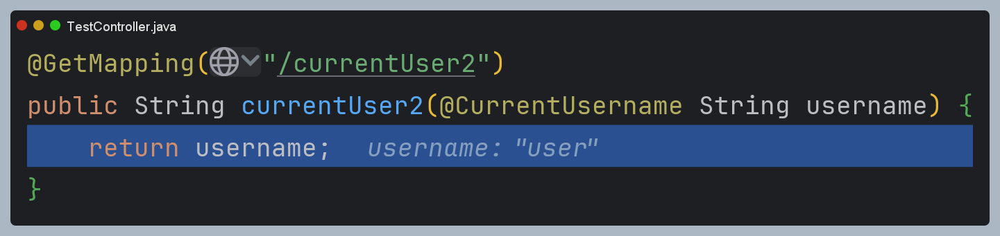

# Spring MVC 통합

## @AuthenticationPrincipal

- 스프링 시큐리티는 Spring MVC 인수에 대한 현재 `Authentication.getPrincipal()`을 자동으로 해결할 수 있는 **AuthenticationPrincipalArgumentResolver**를 제공한다.
- Spring MVC에서 `@AuthenticationPrincipal`을 메서드 인수에 선언하게 되면 스프링 시큐리티와 독립적으로 사용할 수 있다.



---

## @AuthenticationPrincipal(expression = "표현식")

- `Principal` 객체 내부에서 특정 필드나 메서드에 접근하고자 할 때 사용할 수 있으며 사용자 세부 정보가 `Principal` 내부의 중첩된 객체에 있는 경우 유용하다.


---

## @AuthenticationPrincipal 메타 주석



- `@AuthenticationPrincipal`을 자체 주석으로 메타 주석화하여 스프링 시큐리티에 대한 종속성을 제거할 수도 있다.

---

## 예제 코드

```java
@Configuration
@EnableWebSecurity
public class SecurityConfig {

    @Bean
    public SecurityFilterChain securityFilterChain(HttpSecurity http) throws Exception {

        http
            .authorizeHttpRequests(authorize -> authorize
                .requestMatchers("/user").hasAuthority("ROLE_USER")
                .requestMatchers("/db").hasAuthority("ROLE_DB")
                .requestMatchers("/admin").hasAuthority("ROLE_ADMIN")
                .anyRequest().permitAll()
            )
            .formLogin(Customizer.withDefaults())
            .csrf(AbstractHttpConfigurer::disable)
        ;
        
        return http.build();
    }

    @Bean
    public UserDetailsService userDetailsService() {
        UserDetails user = User.withUsername("user")
                .password("{noop}1111")
                .roles("USER")
                .build();

        UserDetails manager = User.withUsername("db")
                .password("{noop}1111")
                .roles("DB")
                .build();

        UserDetails admin = User.withUsername("admin")
               .password("{noop}1111")
               .roles("ADMIN", "SECURE")
               .build();

        return new InMemoryUserDetailsManager(user, manager, admin);
    }
}
```
```java
import org.springframework.security.core.userdetails.User;

@RestController
public class IndexController {

    AuthenticationTrustResolver trustResolver = new AuthenticationTrustResolverImpl();

    @GetMapping("/")
    public String index() {
        Authentication authentication = SecurityContextHolder.getContextHolderStrategy().getContext().getAuthentication();
        return trustResolver.isAnonymous(authentication) ? "anonymous" : "authenticated";
    }

    @GetMapping("/user")
    public User user(@AuthenticationPrincipal User user) {
        return user;
    }

    @GetMapping("/user2")
    public String user2(@AuthenticationPrincipal(expression = "username") String username) {
        return username;
    }

    @GetMapping("/currentUser")
    public User currentUser(@CurrentUser User user) {
        return user;
    }

    @GetMapping("/currentUser2")
    public String currentUser2(@CurrentUsername String username) {
        return username;
    }
}
```
```java
@Target({ ElementType.PARAMETER, ElementType.ANNOTATION_TYPE })
@Retention(RetentionPolicy.RUNTIME)
@Documented
@AuthenticationPrincipal
public @interface CurrentUser {}
```
```java
@Target({ ElementType.PARAMETER, ElementType.ANNOTATION_TYPE })
@Retention(RetentionPolicy.RUNTIME)
@Documented
@AuthenticationPrincipal(expression = "#this == 'anonymousUser' ? null : username") //this = Principal, null 미체크 시 오류
public @interface CurrentUsername {}
```

- `/` : 스프링 시큐리티에 종속적인 코드
- `/user` : 바로 `Principal` 객체 가져오기
- `/user2` : `Principal` 객체를 바로 가져와서 내부 필드 꺼내기(없는 필드 선언 시 예외 발생)
- `/currentUser`, `/currentUser2` : 스프링 시큐리티에 전혀 종속적이지 않으면서 스프링 시큐리티 기술 사용

애노테이션을 사용한 4개의 메서드 모두 `AuthenticationPrincipalArgumentResolver`에 의해 바인딩된다. `"/user2"`나 `"/currentUser2"`
의 경우는 표현식이 있으므로 추가적인 처리를 하고 바인딩을 해준다.









---

[이전 ↩️ - Servlet API 통합](https://github.com/genesis12345678/TIL/blob/main/Spring/security/security/Integration/Servlet.md)

[메인 ⏫](https://github.com/genesis12345678/TIL/blob/main/Spring/security/security/main.md)

[다음 ↪️ - Spring MVC 비동기 통합](https://github.com/genesis12345678/TIL/blob/main/Spring/security/security/Integration/SpringMVCAsync.md)