# 스프링 MVC 비동기 통합

- 스프링 시큐리티는 **Spring MVC Controller**에서 `Callable`을 실행하는 비동기 스레드에 `SecurityContext`를 자동으로 설정하도록 지원한다.
- 스프링 시큐리티는 `WebAsyncManager`와 통합하여 `SecurityContextHolder`에서 사용 가능한 `SecurityContext`를 **Callable**에서 접근 가능하도록 해준다.

---

## WebAsyncManagerIntegrationFilter

- **SecurityContext**와 `WebAsyncManager` 사이의 통합을 제공하며 `WebAsyncManager`를 생성하고 **SecurityContextCallableProcessingInterceptor**를 `WebAsyncManager`에 등록한다.

---

## WebAsyncManager

- 스레드 풀의 비동기 스레드를 생성하고 `Callable`을 받아 실행시키는 주체로서 등록된 **SecurityContextCallableProcessingInterceptor**를 통해 현재 스레드(부모 스레드)가
    보유하고 있는 `SecurityContext` 객체를 비동시 스레드(자식 스레드)의 `ThreadLocal`에 저장시킨다.

---

## 예제 코드

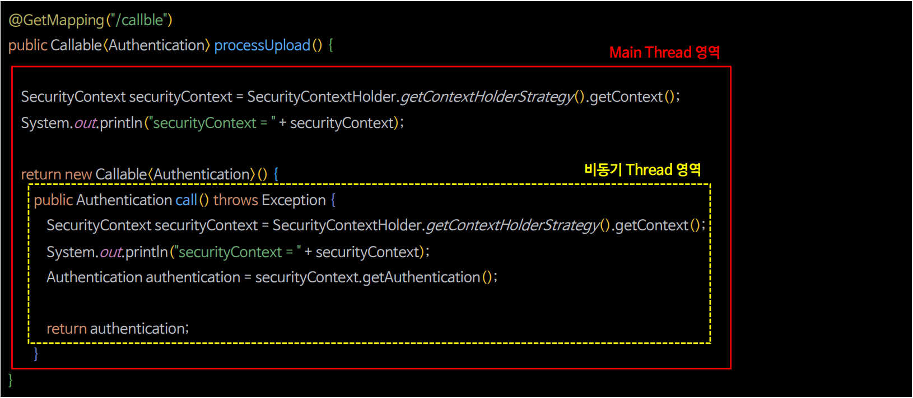

- 비동기 스레드(자식 스레드)가 수행하는 `Callable` 영역 내에서 자신의 **ThreadLocal**에 저장된 `SecurityContext`를 참조할 수 있으며 이는 부모 스레드가 가지고 있는 `SecurityContext`와 동일한 객체이다.
- `@Async`나 다른 비동기 기술은 스프링 시큐리티와 통합되어 있지 않기 때문에 비동기 스레드에 `SecurityContext`가 적용되지 않는다.

### 흐름도

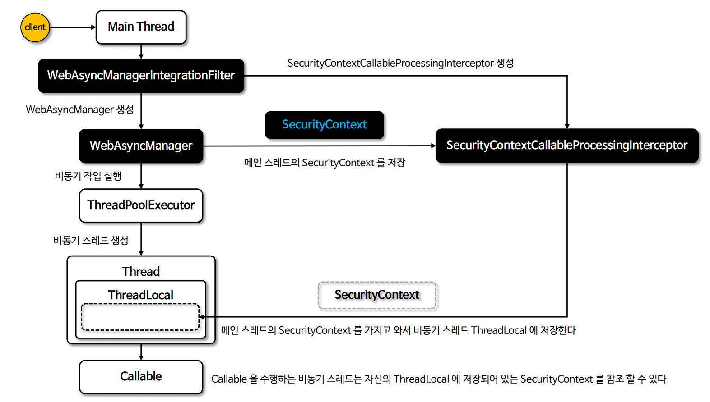

```java
@Slf4j
@RestController
public class IndexController {
    
    @GetMapping("/callable")
    public Callable<Authentication> call() {
        SecurityContext context = SecurityContextHolder.getContextHolderStrategy().getContext();
        log.info("context = {}", context);
        log.info("Parent Thread = {}", Thread.currentThread().getName());

        return new Callable<Authentication>() {
            @Override
            public Authentication call() throws Exception {
                SecurityContext context = SecurityContextHolder.getContextHolderStrategy().getContext();
                log.info("context = {}", context);
                log.info("Child Thread = {}", Thread.currentThread().getName());

                return context.getAuthentication();
            }
        };
    }
}
```
```text
context = SecurityContextImpl [Authentication=UsernamePasswordAuthenticationToken [Principal=org.springframework.security.core.userdetails.User [Username=user, Password=[PROTECTED], Enabled=true, AccountNonExpired=true, CredentialsNonExpired=true, AccountNonLocked=true, Granted Authorities=[ROLE_USER]], Credentials=[PROTECTED], Authenticated=true, Details=WebAuthenticationDetails [RemoteIpAddress=0:0:0:0:0:0:0:1, SessionId=null], Granted Authorities=[ROLE_USER]]]
Parent Thread = http-nio-8080-exec-4
context = SecurityContextImpl [Authentication=UsernamePasswordAuthenticationToken [Principal=org.springframework.security.core.userdetails.User [Username=user, Password=[PROTECTED], Enabled=true, AccountNonExpired=true, CredentialsNonExpired=true, AccountNonLocked=true, Granted Authorities=[ROLE_USER]], Credentials=[PROTECTED], Authenticated=true, Details=WebAuthenticationDetails [RemoteIpAddress=0:0:0:0:0:0:0:1, SessionId=null], Granted Authorities=[ROLE_USER]]]
Child Thread = task-1
```

- 스레드는 다르지만, `SecurityContext`는 같은 것을 확인할 수 있다.

### 과정 디버깅

- 일단 `WebAsyncManagerIntegrationFilter`는 `HttpSecurity` 빈을 생성하는 과정에서 초기화된다.

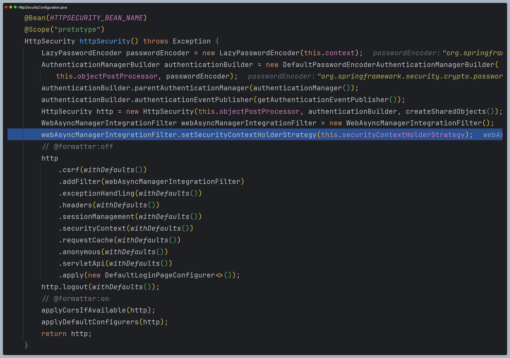

- 그리고 `"/callable"`로 요청을 했을 때 `WebAsyncManagerIntegrationFilter`로 온다.

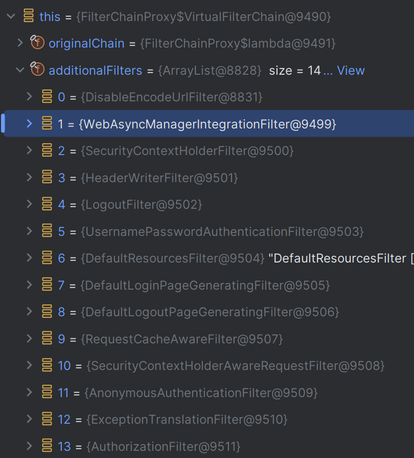

- 이 필터에서는 `WebAsyncManager`를 생성하고 `SecurityContextCallableProcessingInterceptor`에 
`securityContextHolderStrategy`를 저장한다.
- 그리고 `WebAsyncManager`에 `SecurityContextCallableProcessingInterceptor`를 등록한다.

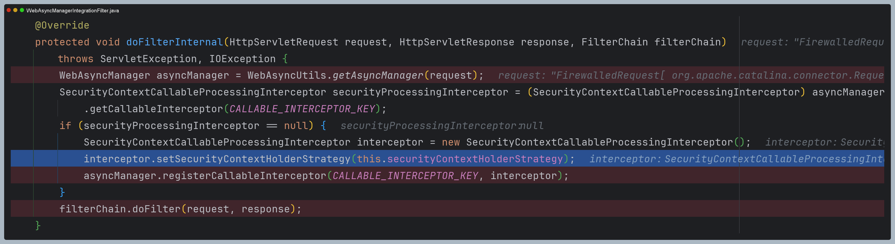

- 이후 필터들을 모두 거치고 스프링 MVC로 왔다.
- 이제 `callable`이 반환되면서 비동기 스레드에서 `call()`이 실행될 것이다.

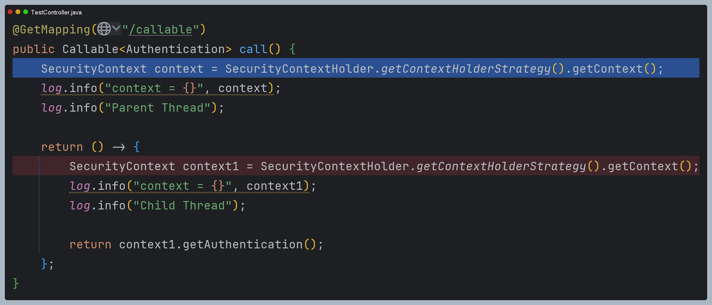

- 현재 스레드는 메인 스레드로, 비동기 실행을 하기 전에 `SecurityContext`를 저장하는 것을 확인할 수 있다.

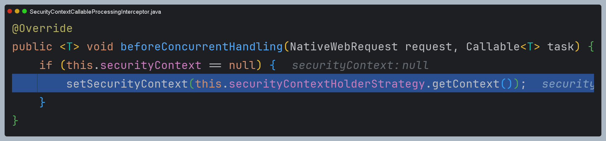

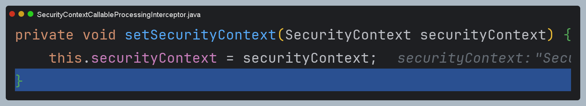


- 그리고 `WebAsyncManager`에서 스레드 풀을 이용해 별도의 스레드에서 비동기로 `Callable`을 실행한다.

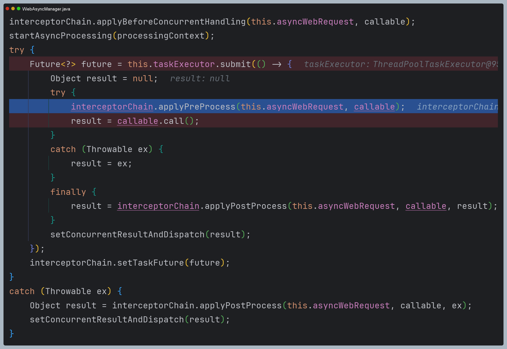


- 이때 `Callable`을 실행하기 전에 부모 스레드에서 저장해놓았던 `SecurityContext`를 현재 비동기 스레드에 저장한다.
- 참고로 `SecurityContext` 필드는 `volatile` 필드이다.

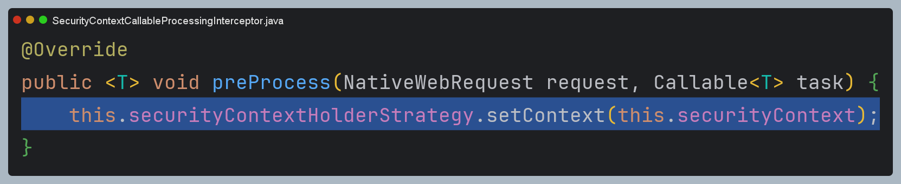

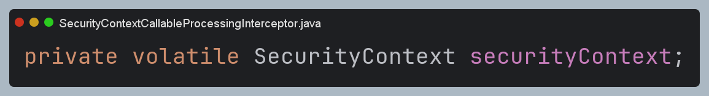

- 이렇게 하고 나서 `Callable`을 호출하면 당연히 메인 스레드와 비동기 스레드가 같은 `SecurityContext`를 참조할 수 있는 것이다.

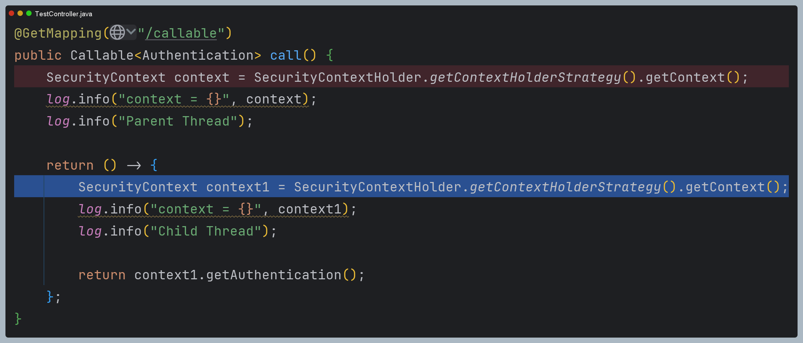

- 마지막으로 비동기 수행을 모두 마치고 나서 스레드 세이프를 위해 다시 비워주는 작업을 한다.

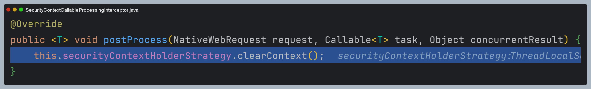

## 다른 비동기 기술 적용

```java
@Service
@Slf4j
public class AsyncService {

    @Async
    public void asyncMethod() {
        SecurityContext context = SecurityContextHolder.getContextHolderStrategy().getContext();
        log.info("context = {}", context);
        log.info("Child Thread = {}", Thread.currentThread().getName());
    }
}
```
```java
@RestController
@RequiredArgsConstructor
@Slf4j
public class IndexController {

    private final AsyncService asyncService;

    @GetMapping("/async")
    public Authentication async() {

        //부모 쓰레드
        SecurityContext context = SecurityContextHolder.getContextHolderStrategy().getContext();
        log.info("context = {}", context);
        log.info("Parent Thread = {}", Thread.currentThread().getName());

        //자식 쓰레드
        asyncService.asyncMethod();

        return context.getAuthentication();
    }
}
```
```java
@SpringBootApplication
@EnableAsync //추가
public class SpringsecuritymasterApplication {

    public static void main(String[] args) {
        SpringApplication.run(SpringsecuritymasterApplication.class, args);
    }

}
```

- `@EnableAsync`를 활성화해야 `@Async`가 적용이 된다.

```text
context = SecurityContextImpl [Authentication=AnonymousAuthenticationToken [Principal=anonymousUser, Credentials=[PROTECTED], Authenticated=true, Details=WebAuthenticationDetails [RemoteIpAddress=0:0:0:0:0:0:0:1, SessionId=null], Granted Authorities=[ROLE_ANONYMOUS]]]
Parent Thread = http-nio-8080-exec-1
context = SecurityContextImpl [Null authentication]
Child Thread = task-1
```

- 스레드 간 `SecurityContext`가 공유하지 못하는 것을 확인할 수 있다.
- `Callable`을 사용해야 스레드 간의 `SecurityContext`를 공유할 수 있다.

`Callable`이 아닌 다른 기술로 비동기 통합을 하려면 다음과 같이 설정할 수 있다.

```java
@Configuration
@EnableWebSecurity
public class SecurityConfig {

    @Bean
    public SecurityFilterChain securityFilterChain(HttpSecurity http) throws Exception {

        http
            .authorizeHttpRequests(authorize -> authorize
                .requestMatchers("/user").hasAuthority("ROLE_USER")
                .requestMatchers("/db").hasAuthority("ROLE_DB")
                .requestMatchers("/admin").hasAuthority("ROLE_ADMIN")
                .anyRequest().permitAll()
            )
            .formLogin(Customizer.withDefaults())
            .csrf(AbstractHttpConfigurer::disable)
        ;

        //부모 스레드로부터 자식 스레드로 보안 컨텍스트가 상속하는 설정
        SecurityContextHolder.setStrategyName(SecurityContextHolder.MODE_INHERITABLETHREADLOCAL);
        return http.build();
    }
}
```

---

[이전 ↩️ - Spring MVC 통합](https://github.com/genesis12345678/TIL/blob/main/Spring/security/security/Integration/SpringMVC.md)

[메인 ⏫](https://github.com/genesis12345678/TIL/blob/main/Spring/security/security/main.md)