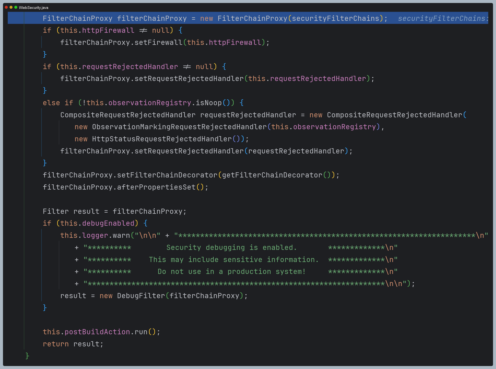
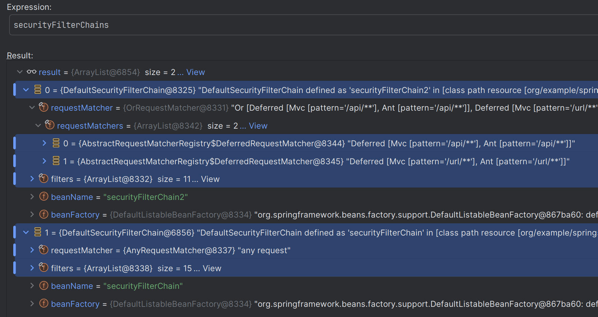
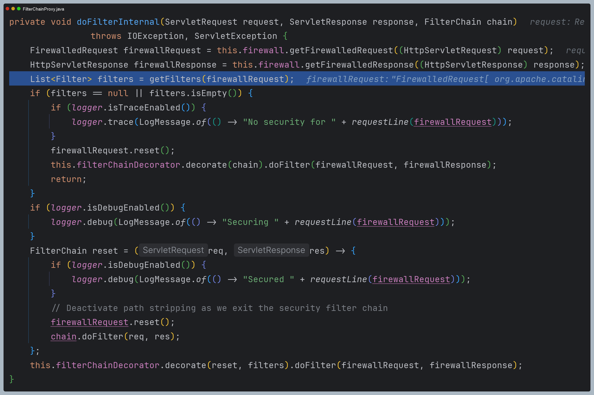
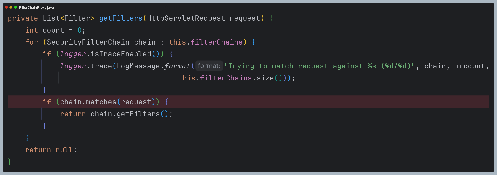

# 다중 보안 설정

- 스프링 시큐리티는 여러 `SecurityFilerChain` 빈을 등록해서 다중 보안 기능을 구성할 수 있다.


---

## 다중 보안 설정 초기화 구성


---

## 다중 보안 설정 요청 흐름도


- `HttpSecurity` 인스턴스 별로 보안 기능이 작동한다.
- 요청에 따라 `RequestMatcher`와 매칭되는 필터가 작동된다.

---

## 예제 코드

```java
@Configuration
@EnableWebSecurity
public class SecurityConfig {

    @Bean
    @Order
    public SecurityFilterChain securityFilterChain(HttpSecurity http) throws Exception {

        http
            .authorizeHttpRequests(authorize -> authorize
                .requestMatchers("/user").hasAuthority("ROLE_USER")
                .requestMatchers("/db").hasAuthority("ROLE_DB")
                .requestMatchers("/admin").hasAuthority("ROLE_ADMIN")
                .anyRequest().authenticated()
            )
            .formLogin(Customizer.withDefaults())
        ;

        return http.build();
    }

    @Bean
    @Order(1)
    public SecurityFilterChain securityFilterChain2(HttpSecurity http) throws Exception {

        http
            .securityMatchers(matchers -> matchers
                .requestMatchers("/api/**", "/url/**")
            )
            .authorizeHttpRequests(authorize -> authorize
                .anyRequest().permitAll()
            )
        ;

        return http.build();
    }

    @Bean
    public UserDetailsService userDetailsService() {
        UserDetails user = User.withUsername("user")
                .password("{noop}1111")
                .roles("USER")
                .build();

        UserDetails manager = User.withUsername("db")
                .password("{noop}1111")
                .roles("DB")
                .build();

        UserDetails admin = User.withUsername("admin")
               .password("{noop}1111")
               .roles("ADMIN", "SECURE")
               .build();

        return new InMemoryUserDetailsManager(user, manager, admin);
    }
}
```

## 초기화 과정 디버깅



- `FilterChainProxy`에 저장된 `SecurityFilterChain`을 확인해보면 두 개의 필터 체인이 생성된 것을 확인할 수 있다.
- 첫 번째로 생성된 필터 체인을 보면 두 개의 `RequestMatcher`가 생성되었고, 두 번째로 만들어진 필터 체인은 `AntRequestMather`로 생성되었다.
- 즉 `"/api"`나 `"/url"`의 하위 경로는 첫 번째 필터 체인에서 처리되고, 그 외 모든 경로는 두 번째 필터 체인에서 처리가 되는 것이다.
- 여기서 헷갈린 것이 있었는데, 두 번째 필터 체인에 `.requestMatchers("/user").hasAuthority("ROLE_USER")`와 같은 설정을 했기 때문에
해당 `RequestMatcher`도 생성되는 줄 알았지만 `securityMatcher()`로 설정하지 않은 필터 체인은 항상 `AnyRequestMatcher`로 생성되고,
  `.requestMatchers("/user").hasAuthority("ROLE_USER")`와 같은 설정은 내부의 인가 필터에서 사용되는 것이었다.
- 그리고 두 개의 필터 체인은 각각 처리하는 방식이 다르기 때문에 초기화되는 필터도 다른 것을 확인할 수 있다.



## 요청 처리 과정 디버깅

- 먼저 요청을 `FilterChainProxy`에서 받아서 해당 요청을 처리할 수 있는 `SecurityFilterChain`을 찾아야 한다.



- 갖고 있는 `SecurityFilterChain`중 현재 요청과 일치하는 패턴을 가진 필터 체인을 찾아 반환하는 것을 확인할 수 있다.



> 만약 `@Order`를 통해 넓은 범위의 URL을 먼저 설정했을 경우 의도하지 않게 동작할 수 있다는 점을 주의해야 한다.

---

[메인 ⏫](https://github.com/genesis12345678/TIL/blob/main/Spring/security/security/main.md)

[다음 ↪️ - Custom DSL](https://github.com/genesis12345678/TIL/blob/main/Spring/security/security/MultiSecurity/CustomDSL.md)