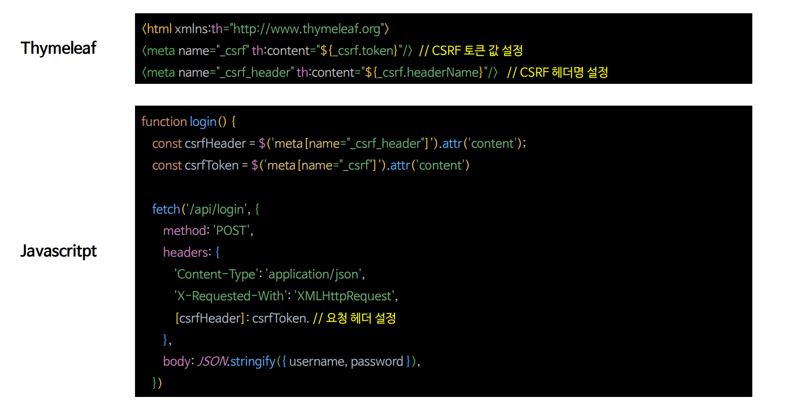

# 비동기 인증 - Rest CSRF 구현

---

> 타임리프를 사용하면 자동으로 CSRF 토큰을 생성해 주기 때문에 별도의 코드가 필요 없지만, 자바스크립트를 사용하면 위와 같이 CSRF 토큰을 명시적으로 설정해 주어야 한다.
> 
> [참고](https://github.com/genesis12345678/TIL/blob/main/Spring/security/security/Cors_Csrf/CsrfAggregation.md)

---

[이전 ↩️ - 비동기 인증 - Rest 로그아웃 구현](https://github.com/genesis12345678/TIL/blob/main/Spring/security/security/Projects/%EB%B9%84%EB%8F%99%EA%B8%B0_%EC%9D%B8%EC%A6%9D/%EB%A1%9C%EA%B7%B8%EC%95%84%EC%9B%83/Main.md)

[메인 ⏫](https://github.com/genesis12345678/TIL/blob/main/Spring/security/security/main.md)

[다음 ↪️ - 비동기 인증 - Rest DSLs 구현](https://github.com/genesis12345678/TIL/blob/main/Spring/security/security/Projects/%EB%B9%84%EB%8F%99%EA%B8%B0_%EC%9D%B8%EC%A6%9D/DSLs/Main.md)